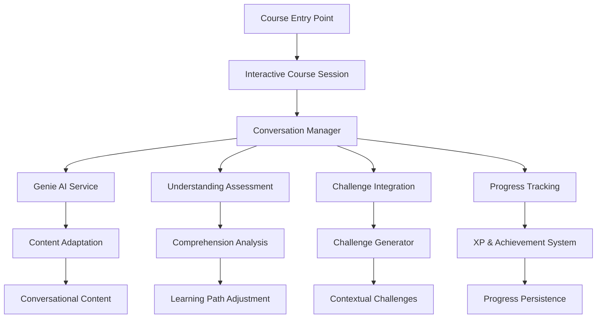

# Interactive Course Experience Design Document

## Overview

The Interactive Course Experience transforms traditional static course content into a dynamic, conversational learning journey with Genie. This system replaces the current course page structure with an adaptive, AI-driven interface that combines explanation, assessment, and practice in a continuous learning loop.

The design leverages the existing Genie AI assistant, challenge generation system, and feed architecture to create a seamless conversational learning experience that adapts to individual learner needs and progress.

## Architecture

### High-Level Architecture



### System Components

1. **Interactive Course Session Manager**: Orchestrates the conversational learning experience
2. **Conversation Engine**: Manages dialogue flow and context
3. **Understanding Assessment System**: Evaluates learner comprehension through interactive elements
4. **Challenge Integration Service**: Delivers targeted challenges based on current learning context
5. **Progress Tracking Service**: Monitors and persists learning progress
6. **Content Adaptation Engine**: Transforms static course content into conversational format

## Components and Interfaces

### Core Components

#### InteractiveCourseSession
```typescript
interface InteractiveCourseSession {
  id: string;
  courseId: string;
  userId: string;
  currentTopic: string;
  conversationHistory: ConversationMessage[];
  learningContext: LearningContext;
  progressState: CourseProgressState;
  sessionStartTime: Date;
  lastInteraction: Date;
}

interface ConversationMessage {
  id: string;
  role: 'genie' | 'learner';
  content: string;
  messageType: 'explanation' | 'question' | 'assessment' | 'challenge' | 'feedback';
  timestamp: Date;
  metadata?: MessageMetadata;
}

interface LearningContext {
  currentConcepts: string[];
  masteredConcepts: string[];
  strugglingAreas: string[];
  comprehensionLevel: number; // 0-1 scale
  preferredLearningStyle: string;
}
```

#### ConversationEngine
```typescript
interface ConversationEngine {
  initializeSession(courseId: string, userId: string): Promise<InteractiveCourseSession>;
  processLearnerInput(sessionId: string, input: string): Promise<GenieResponse>;
  generateExplanation(topic: string, context: LearningContext): Promise<string>;
  createAssessmentQuestion(concept: string, difficulty: DifficultyLevel): Promise<AssessmentQuestion>;
  adaptConversationFlow(sessionId: string, comprehensionData: ComprehensionData): Promise<void>;
}

interface GenieResponse {
  content: string;
  responseType: 'explanation' | 'question' | 'encouragement' | 'challenge_intro';
  nextAction: 'continue_explanation' | 'assess_understanding' | 'deliver_challenge' | 'move_to_next_topic';
  suggestedFollowUp?: string;
}
```

#### UnderstandingAssessment
```typescript
interface UnderstandingAssessment {
  createQuickCheck(concept: string, difficulty: DifficultyLevel): Promise<QuickCheckQuestion>;
  evaluateResponse(questionId: string, response: string): Promise<ComprehensionResult>;
  generateAdaptiveQuestions(context: LearningContext): Promise<AssessmentQuestion[]>;
}

interface QuickCheckQuestion {
  id: string;
  type: 'multiple_choice' | 'short_answer' | 'true_false' | 'drag_drop';
  question: string;
  options?: string[];
  correctAnswer: string;
  explanation: string;
  concept: string;
}

interface ComprehensionResult {
  correct: boolean;
  confidenceLevel: number; // 0-1 scale
  conceptMastery: number; // 0-1 scale
  suggestedAction: 'proceed' | 'review' | 'practice' | 'challenge';
  feedback: string;
}
```

#### ChallengeIntegration
```typescript
interface ChallengeIntegration {
  generateContextualChallenge(
    sessionId: string, 
    currentConcepts: string[], 
    difficulty: DifficultyLevel
  ): Promise<ContextualChallenge>;
  evaluateChallenge(challengeId: string, submission: string): Promise<ChallengeEvaluation>;
  provideChallengeHints(challengeId: string, attemptCount: number): Promise<string>;
}

interface ContextualChallenge extends GeneratedChallenge {
  conversationalIntro: string;
  connectionToCurrentTopic: string;
  successCriteria: string[];
  adaptiveHints: string[];
}

interface ChallengeEvaluation {
  success: boolean;
  score: number;
  feedback: string;
  masteryIndicators: string[];
  nextSteps: 'advance' | 'practice_more' | 'review_concept';
}
```

## Data Models

### Course Session Data
```typescript
interface CourseProgressState {
  completedTopics: string[];
  currentTopicProgress: number; // 0-1 scale
  overallCourseProgress: number; // 0-1 scale
  masteredSkills: string[];
  strugglingSkills: string[];
  totalTimeSpent: number; // minutes
  challengesCompleted: number;
  assessmentsCompleted: number;
}

interface MessageMetadata {
  conceptsCovered: string[];
  difficultyLevel: DifficultyLevel;
  learnerEngagement: number; // 0-1 scale
  responseTime: number; // seconds
  hintsUsed: number;
}
```

### Assessment Data
```typescript
interface AssessmentQuestion {
  id: string;
  concept: string;
  question: string;
  type: QuestionType;
  difficulty: DifficultyLevel;
  expectedAnswer: string;
  rubric: AssessmentRubric;
}

interface AssessmentRubric {
  fullCredit: string[];
  partialCredit: string[];
  commonMistakes: string[];
  hints: string[];
}

type QuestionType = 'multiple_choice' | 'short_answer' | 'true_false' | 'drag_drop' | 'code_completion';
```

### Learning Analytics
```typescript
interface LearningAnalytics {
  sessionId: string;
  userId: string;
  courseId: string;
  interactionEvents: InteractionEvent[];
  comprehensionMetrics: ComprehensionMetrics;
  engagementMetrics: EngagementMetrics;
}

interface InteractionEvent {
  timestamp: Date;
  eventType: 'message_sent' | 'assessment_completed' | 'challenge_attempted' | 'hint_requested';
  data: Record<string, any>;
}

interface ComprehensionMetrics {
  averageResponseTime: number;
  correctAnswerRate: number;
  conceptMasteryScores: Record<string, number>;
  strugglingIndicators: string[];
}

interface EngagementMetrics {
  sessionDuration: number;
  messageCount: number;
  questionsAsked: number;
  challengesAttempted: number;
  hintsRequested: number;
}
```

## Correctness Properties

*A property is a characteristic or behavior that should hold true across all valid executions of a system-essentially, a formal statement about what the system should do. Properties serve as the bridge between human-readable specifications and machine-verifiable correctness guarantees.*

### Property Reflection

After analyzing all acceptance criteria, several properties can be consolidated to eliminate redundancy:

- Properties 2.3 and 2.4 (comprehension-based behavior) can be combined into a single adaptive response property
- Properties 3.4 and 3.5 (challenge result handling) can be unified into a challenge outcome property
- Properties 4.1 and 4.2 (learning loop behavior) overlap and can be merged
- Properties 6.1, 6.2, 6.3, and 6.4 (system integration) can be consolidated into a comprehensive integration property

### Core Properties

**Property 1: Conversational Format Consistency**
*For any* concept explanation generated by Genie, the output should contain natural conversational elements and interactive components
**Validates: Requirements 1.2**

**Property 2: Contextual Response Relevance**
*For any* learner question within a learning session, Genie's response should be contextually relevant to the current learning topic
**Validates: Requirements 1.3**

**Property 3: Session Context Preservation**
*For any* conversation progression within a course session, the system should maintain and reference previously discussed concepts
**Validates: Requirements 1.4**

**Property 4: Session Resumption Continuity**
*For any* course session that is interrupted and resumed, the system should restore the exact state from the interruption point
**Validates: Requirements 1.5**

**Property 5: Understanding Assessment Trigger**
*For any* completed concept explanation, the system should present interactive understanding gauges
**Validates: Requirements 2.1**

**Property 6: Comprehension Evaluation Consistency**
*For any* understanding gauge response, the system should evaluate it and determine a comprehension level
**Validates: Requirements 2.2**

**Property 7: Adaptive Response to Comprehension**
*For any* comprehension level determination, the system should provide appropriate responses: additional explanations for low comprehension, advanced content for high comprehension
**Validates: Requirements 2.3, 2.4**

**Property 8: Learning Path Adaptation**
*For any* understanding gauge result, the system should adapt the learning path based on performance data
**Validates: Requirements 2.5**

**Property 9: Contextual Challenge Relevance**
*For any* challenge delivered when learner readiness is determined, the challenge should directly relate to the current learning context
**Validates: Requirements 3.1**

**Property 10: Conversational Challenge Integration**
*For any* challenge presentation, it should be seamlessly integrated into the conversational flow
**Validates: Requirements 3.2**

**Property 11: Immediate Challenge Feedback**
*For any* completed challenge, Genie should provide immediate feedback and solution explanation
**Validates: Requirements 3.3**

**Property 12: Challenge Outcome Handling**
*For any* challenge result, the system should respond appropriately: progress to next concept for mastery, provide targeted remediation for gaps
**Validates: Requirements 3.4, 3.5**

**Property 13: Learning Loop Sequence Adherence**
*For any* learning loop iteration, the system should follow the sequence: concept explanation → understanding assessment → targeted challenge → evaluation → next iteration
**Validates: Requirements 4.1, 4.2**

**Property 14: Synthesis Challenge Provision**
*For any* learning session with multiple covered concepts, the system should occasionally provide synthesis challenges combining previously learned material
**Validates: Requirements 4.3**

**Property 15: Session Persistence**
*For any* learning session ending, the system should save progress and prepare for seamless continuation
**Validates: Requirements 4.4**

**Property 16: Mastery-Based Advancement**
*For any* learning loop showing consistent mastery, the system should advance to more complex topics
**Validates: Requirements 4.5**

**Property 17: Universal Interface Consistency**
*For any* course content access, the system should present it through the Interactive Course Experience interface
**Validates: Requirements 5.1**

**Property 18: Static Content Transformation**
*For any* static course material, Genie should transform and present it conversationally
**Validates: Requirements 5.2**

**Property 19: Navigation Continuity**
*For any* course section navigation, the system should maintain conversational continuity across different topics
**Validates: Requirements 5.3**

**Property 20: Multimedia Integration**
*For any* course content containing multimedia elements, Genie should incorporate them naturally into the conversational flow
**Validates: Requirements 5.4**

**Property 21: Course Completion Recognition**
*For any* completed course, the system should provide conversational summary and achievement recognition through Genie
**Validates: Requirements 5.5**

**Property 22: System Integration Compatibility**
*For any* system operation (data access, progress tracking, challenge generation, achievements, analytics), the Interactive Course Experience should integrate seamlessly with existing systems
**Validates: Requirements 6.1, 6.2, 6.3, 6.4, 6.5**

## Error Handling

### Error Categories

1. **Conversation Flow Errors**
   - Context loss during session
   - Invalid state transitions
   - Message processing failures

2. **Assessment Errors**
   - Question generation failures
   - Response evaluation errors
   - Comprehension calculation issues

3. **Challenge Integration Errors**
   - Challenge generation failures
   - Evaluation service unavailability
   - Context mismatch between challenge and learning state

4. **Session Management Errors**
   - Session persistence failures
   - Resume state corruption
   - Concurrent session conflicts

5. **External Service Errors**
   - Genie AI service unavailability
   - Challenge generator service failures
   - Progress tracking service errors

### Error Recovery Strategies

```typescript
interface ErrorRecoveryStrategy {
  errorType: string;
  recoveryAction: 'retry' | 'fallback' | 'graceful_degradation' | 'user_notification';
  maxRetries: number;
  fallbackBehavior?: string;
}

const errorRecoveryStrategies: ErrorRecoveryStrategy[] = [
  {
    errorType: 'genie_service_unavailable',
    recoveryAction: 'fallback',
    maxRetries: 3,
    fallbackBehavior: 'use_template_responses'
  },
  {
    errorType: 'challenge_generation_failed',
    recoveryAction: 'fallback',
    maxRetries: 2,
    fallbackBehavior: 'use_predefined_challenges'
  },
  {
    errorType: 'session_persistence_failed',
    recoveryAction: 'graceful_degradation',
    maxRetries: 1,
    fallbackBehavior: 'continue_without_persistence'
  }
];
```

### Graceful Degradation

When core services are unavailable, the system should:

1. **Genie Service Down**: Use pre-generated conversational templates
2. **Challenge Generator Down**: Fall back to static challenge pool
3. **Assessment Service Down**: Use simplified true/false questions
4. **Progress Tracking Down**: Store progress locally and sync when available

## Testing Strategy

### Dual Testing Approach

The Interactive Course Experience requires both unit testing and property-based testing to ensure comprehensive coverage:

- **Unit tests** verify specific examples, edge cases, and integration points
- **Property tests** verify universal properties that should hold across all inputs
- Together they provide comprehensive coverage: unit tests catch concrete bugs, property tests verify general correctness

### Unit Testing Requirements

Unit tests will cover:
- Specific conversation flow scenarios
- Integration points between Genie and challenge systems
- Error handling for known failure cases
- Session state management edge cases
- API endpoint behavior with specific inputs

### Property-Based Testing Requirements

Property-based testing will use **fast-check** (JavaScript/TypeScript property testing library) with a minimum of 100 iterations per test. Each property-based test will be tagged with a comment explicitly referencing the correctness property from this design document using the format: **Feature: interactive-course-experience, Property {number}: {property_text}**

Each correctness property will be implemented by a single property-based test that:
- Generates random valid inputs for the system component
- Executes the system behavior
- Verifies the property holds across all generated inputs
- Provides counterexamples when properties fail

Property tests will validate:
- Conversational format consistency across all concept explanations
- Contextual relevance across all question-response pairs
- Session state preservation across all conversation progressions
- Challenge relevance across all learning contexts
- Learning loop sequence adherence across all iterations
- System integration compatibility across all operations

### Test Data Generation

Property tests will use intelligent generators that:
- Create realistic course content and learning contexts
- Generate varied learner inputs and responses
- Simulate different comprehension levels and learning patterns
- Produce edge cases like empty content, extreme performance metrics
- Create concurrent session scenarios for race condition testing

### Integration Testing

Integration tests will verify:
- End-to-end conversation flows from course start to completion
- Cross-service communication between Genie, challenge generator, and progress tracking
- Session persistence and resumption across browser sessions
- Real-time adaptation based on learner performance
- Multimedia content integration in conversational contexts

### Performance Testing

Performance tests will validate:
- Response times for Genie interactions under load
- Session state management with concurrent users
- Challenge generation performance with complex learning contexts
- Memory usage during extended learning sessions
- Database query performance for progress tracking

The testing strategy ensures that the Interactive Course Experience maintains high quality, reliability, and performance while providing the adaptive, conversational learning experience specified in the requirements.