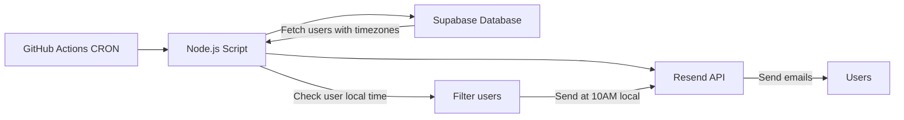

# GitHub Actions Daily Streak Reminder Email Job

## Overview
Migrate the Deno-based Supabase Edge Function to GitHub Actions for reliable daily execution.

## Architecture



## Key Changes from Original Deno Script

1. **Timezone-Aware Scheduling**: Send emails at 10:00 AM in each user's local time zone
2. **Removed email_logs Check**: No duplicate prevention table (table doesn't exist)
3. **Node.js/TypeScript**: Converted from Deno to use existing project dependencies
4. **Hourly CRON**: Run every hour to catch users in different time zones

## Components

### 1. Node.js Script (`scripts/send-streak-reminders.ts`)
- Replaces the Deno script with TypeScript/Node.js
- Uses existing `@supabase/supabase-js` and `resend` dependencies
- Maintains core functionality:
  - Batch processing (100 emails per batch)
  - Retry logic with exponential backoff
  - Timezone-aware filtering (sends at 10:00 AM user's local time)
  - Email validation
  - Personalized streak messages

### 2. GitHub Actions Workflow (`.github/workflows/daily-streak-reminder.yml`)
- CRON schedule: `0 * * * *` (runs every hour)
- Runs on Ubuntu latest
- Uses Node.js 20
- Executes the TypeScript script
- Filters users based on their local time

### 3. GitHub Secrets Required
```
SUPABASE_URL
SUPABASE_SERVICE_ROLE_KEY
RESEND_API_KEY
```

## Implementation Steps

### Step 1: Create the Node.js Script
- Convert Deno syntax to Node.js/TypeScript
- Use `process.env` instead of `Deno.env`
- Replace `Deno.serve` with direct execution
- **Add timezone-aware filtering**: Check each user's local time to send at 10:00 AM
- **Remove email_logs check**: No duplicate prevention table
- Keep all business logic intact (batching, retries, email validation)

### Step 2: Create GitHub Actions Workflow
- Set up hourly CRON trigger (`0 * * * *`)
- Configure environment variables from secrets
- Add error handling and logging
- Set up workflow notifications (optional)

### Step 3: Database Verification
- Verify `profiles_with_streaks` view exists
- Check `timezone` column exists in profiles
- Verify `opt_out_emails` column exists

### Step 4: GitHub Repository Setup
- Push code to GitHub (if not already done)
- Add secrets to repository settings
- Enable GitHub Actions
- Test the workflow manually

## Configuration Options

### Environment Variables
```bash
SEND_HOUR_LOCAL=10       # Target hour in user's local time (10 AM)
BATCH_SIZE=100           # Emails per batch
BATCH_DELAY_MS=2000      # Delay between batches
MAX_RETRIES=3            # Retry attempts
```

### CRON Schedule Options
- `0 * * * *` - Every hour (recommended for timezone-aware sending)
- `0 9-17 * * *` - Every hour from 9 AM to 5 PM UTC
- `0 10 * * *` - Daily at 10:00 UTC (if all users are in same timezone)

**Note**: With timezone-aware sending, hourly CRON is recommended to catch users in different time zones at their 10:00 AM.

## Benefits Over Supabase Edge Functions

1. **Reliability**: GitHub Actions has proven CRON execution
2. **Visibility**: Better logs and execution history
3. **Control**: Manual trigger capability
4. **Monitoring**: Built-in workflow status tracking
5. **Cost**: Free for public repositories, generous limits for private

## Testing Plan

1. **Local Testing**: Run script locally with test data
2. **Manual Trigger**: Test workflow via GitHub UI
3. **Dry Run**: Test with logging only (no actual emails)
4. **Full Run**: Execute with small batch first

## Monitoring

- GitHub Actions workflow runs history
- Resend dashboard for email delivery status
- Supabase logs for database queries
- Optional: Add Slack/Discord webhook notifications
- Optional: Create a simple `email_logs` table for tracking (future enhancement)

## Rollback Plan

If issues occur:
1. Disable workflow in GitHub Actions settings
2. Revert to Supabase Edge Function if needed
3. Check logs for error diagnosis
4. Fix and redeploy

## Files Created

1. ✅ `scripts/send-streak-reminders.ts` - Main email script (Node.js/TypeScript)
2. ✅ `.github/workflows/daily-streak-reminder.yml` - Workflow definition
3. ✅ `docs/email-job-setup.md` - Setup documentation
4. ✅ `scripts/README.md` - Quick reference guide

## Implementation Status

### Completed ✅
- [x] Converted Deno script to Node.js/TypeScript
- [x] Added timezone-aware filtering (sends at 10:00 AM user's local time)
- [x] Removed email_logs check (table doesn't exist)
- [x] Created GitHub Actions workflow with hourly CRON
- [x] Added comprehensive documentation
- [x] Included batch processing and retry logic
- [x] Added manual trigger capability

### Next Steps for User
1. **Push code to GitHub** (if not already done)
2. **Add GitHub Secrets**:
   - `SUPABASE_URL`
   - `SUPABASE_SERVICE_ROLE_KEY`
   - `RESEND_API_KEY`
3. **Verify database** has `timezone` column in profiles table
4. **Test workflow** manually via GitHub Actions UI
5. **Monitor first few runs** to ensure emails are sending correctly
