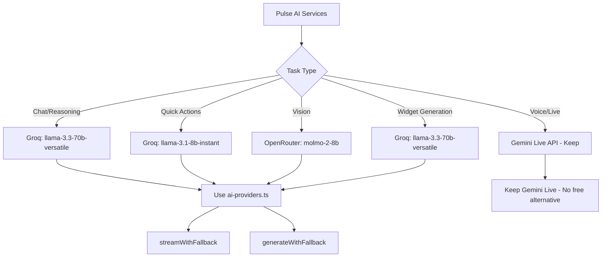
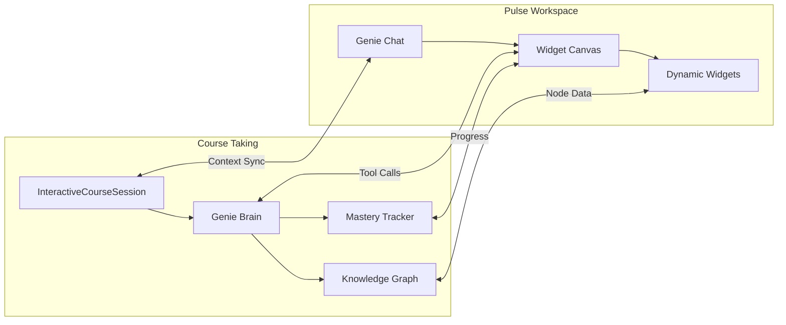
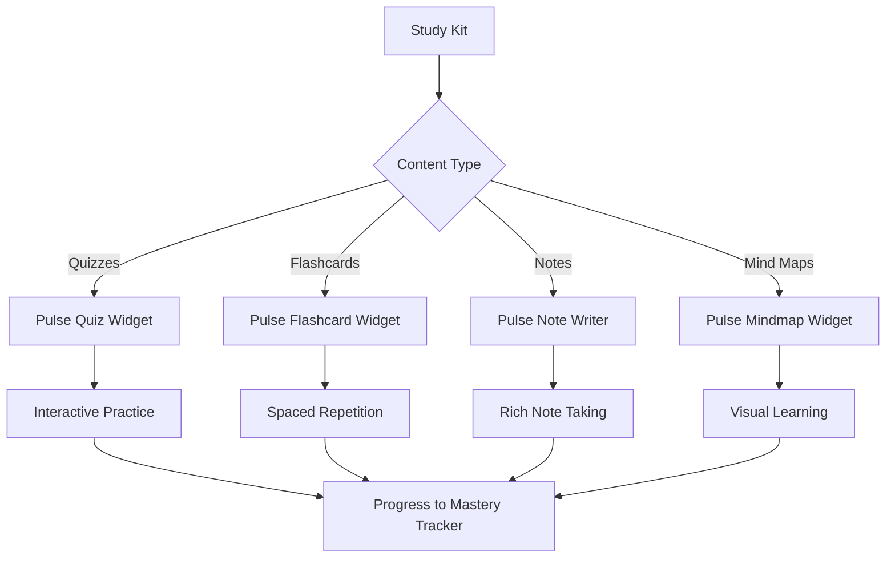
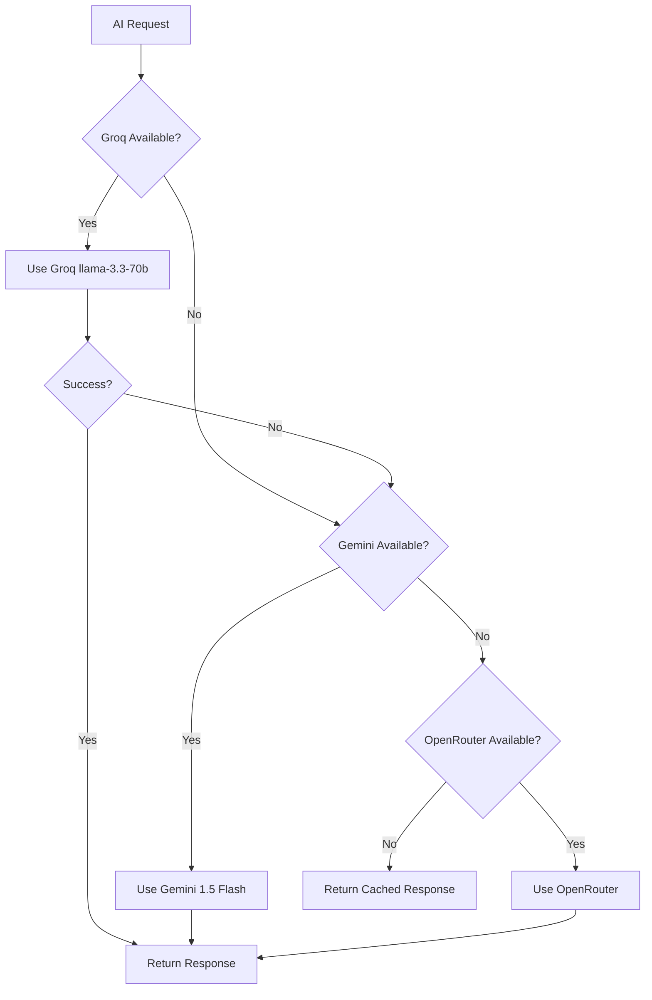

# Pulse Integration Plan: Course-Taking, Study Kits & AI Model Migration

## Executive Summary

This document outlines the strategy for integrating the **Pulse** immersive learning workspace with EdBox's existing course-taking experience, study kits, and replacing Gemini models with free alternatives (Groq and others) while maintaining quality, speed, and fluidity.

---

## 1. Pulse Architecture Analysis

### 1.1 Current Structure

```
src/app/pulse/
├── App.tsx                    # Main workspace orchestrator
├── types.ts                   # WindowType enum (50+ widget types)
├── constants.ts               # Widget configurations
├── components/
│   ├── Genie/
│   │   ├── Chat.tsx          # AI chat interface with voice
│   │   └── Orb.tsx           # Visual AI avatar
│   ├── Widgets/
│   │   ├── DynamicWidget.tsx # AI-generated custom widgets
│   │   ├── Blackboard.tsx    # Drawing/writing surface
│   │   ├── CodeEditor.tsx    # Multi-file code execution
│   │   ├── NeuronVisualizer.tsx
│   │   └── NoteWriter.tsx
│   └── Workspace/
│       ├── Canvas.tsx        # Widget container
│       └── WindowFrame.tsx   # Draggable windows
├── services/
│   ├── genie-chat.ts         # Chat service (Gemini)
│   ├── genie-tooling.ts      # Tool definitions
│   ├── live.ts               # Voice session (Gemini Live API)
│   └── interaction-tracker.ts
└── utils/
    └── audioUtils.ts
```

### 1.2 Key Features

| Feature | Description | Current Provider |
|---------|-------------|------------------|
| **Genie Chat** | Conversational AI tutor | Gemini 3 Flash Preview |
| **Live Voice** | Real-time voice interaction | Gemini 2.5 Flash Native Audio |
| **Dynamic Widgets** | AI-generated React components | Gemini with tool calls |
| **Widget Deployment** | 50+ pre-built learning tools | Local state |
| **Code Execution** | Simulated code running | Gemini simulation |

---

## 2. AI Model Replacement Strategy

### 2.1 Current Provider Usage in Pulse

```typescript
// genie-chat.ts - Uses Gemini SDK
import { GoogleGenAI } from "@google/genai";
const chat = this.ai.chats.create({
    model: 'gemini-3-flash-preview',
    config: { systemInstruction, tools }
});

// live.ts - Uses Gemini Live API for voice
import { GoogleGenAI, LiveServerMessage, Modality } from '@google/genai';
const session = this.ai.live.connect({
    model: 'gemini-2.5-flash-native-audio-preview-12-2025',
});
```

### 2.2 EdBox Existing AI Infrastructure

EdBox already has robust multi-provider support in [`src/lib/ai-providers.ts`](src/lib/ai-providers.ts):

```typescript
// Priority Order:
1. Groq (38 API keys!) - llama-3.3-70b-versatile
2. Gemini (15 API keys) - gemini-1.5-flash
3. OpenRouter - allenai/molmo-2-8b:free (vision)
```

### 2.3 Free Model Alternatives Analysis

| Provider | Model | Speed | Quality | Free Tier | Best For |
|----------|-------|-------|---------|-----------|----------|
| **Groq** | llama-3.3-70b-versatile | ⚡ Fastest | Excellent | Yes (with limits) | Chat, reasoning |
| **Groq** | llama-3.1-8b-instant | ⚡⚡ Ultra-fast | Good | Yes | Quick responses |
| **Groq** | mixtral-8x7b-32768 | Fast | Very Good | Yes | Complex reasoning |
| **OpenRouter** | meta-llama/llama-3.1-8b-instruct:free | Fast | Good | Yes | General chat |
| **OpenRouter** | qwen/qwen-2-7b-instruct:free | Fast | Good | Yes | Multilingual |
| **Google AI Studio** | gemini-1.5-flash | Fast | Excellent | Yes (with limits) | Multimodal |
| **Google AI Studio** | gemini-2.0-flash-exp | Fastest | Good | Yes | Experimental |

### 2.4 Recommended Migration Path



### 2.5 Why Keep Gemini Live API for Voice

**Critical Decision**: The Gemini Live API (`gemini-2.5-flash-native-audio-preview`) provides real-time bidirectional audio streaming that has **no free alternative** currently available:

- **Groq**: No real-time audio streaming API
- **OpenRouter**: No real-time audio streaming API
- **OpenAI**: Has Realtime API but not free

**Recommendation**: 
- Keep Gemini Live API for voice sessions
- Use Groq for all text-based interactions
- This hybrid approach maximizes free tier usage while preserving voice capabilities

---

## 3. Integration with Course-Taking Experience

### 3.1 Current Course-Taking Architecture

```
src/app/(main)/learning-path/[id]/
├── page.tsx                           # Main course page
├── components/
│   ├── WarmUpView.tsx                 # Pre-lesson warm-up
│   ├── EngineModal.tsx                # Lesson engine loader
│   └── LessonView.tsx                 # Content display

src/components/
├── InteractiveCourseSession.tsx       # Main session container
├── InteractiveCourseProgress.tsx      # Progress tracking
├── QuizBubble.tsx                     # Inline quizzes
├── ChallengeView.tsx                  # Challenges
└── GoalTracker.tsx                    # Learning goals

src/app/api/genie/interactive-course/
├── stream/route.ts                    # Main streaming endpoint
├── create/route.ts                    # Session creation
├── resume/route.ts                    # Session resumption
├── evaluate/route.ts                  # Response evaluation
└── evaluate-challenge/route.ts        # Challenge evaluation
```

### 3.2 Integration Points



### 3.3 Proposed Integration Architecture

#### Option A: Embedded Pulse Mode (Recommended)

```typescript
// In InteractiveCourseSession.tsx
<PulseWorkspace 
    mode="embedded"
    context={{
        courseId,
        currentSkillId,
        learningStage,
        skillTitle,
        masteryLevel
    }}
    onProgressUpdate={handleProgressUpdate}
    onChallengeComplete={handleChallengeComplete}
/>
```

**Benefits**:
- Seamless transition between chat and workspace
- Shared context with course progress
- Widget state persists with session

#### Option B: Side-by-Side Mode

```typescript
// Split view with course content and pulse workspace
<div className="grid grid-cols-2 gap-4">
    <CourseContentPanel {...courseProps} />
    <PulseWorkspace mode="sidebar" {...pulseProps} />
</div>
```

### 3.4 Widget-to-Course Mapping

| Pulse Widget | Course Integration | Use Case |
|--------------|-------------------|----------|
| `BLACKBOARD` | Explanations, derivations | Visual teaching |
| `CODE_EDITOR` | Code challenges, examples | Programming courses |
| `QUIZ_CARD` | Quick checks | Knowledge verification |
| `NOTE_WRITER` | Note-taking during lesson | Study material |
| `NEURON_VISUALIZER` | AI/ML concepts | Visual learning |
| `MATH_GRAPHING_CALC` | Math courses | Equation visualization |
| `STEM_*` widgets | Science courses | Interactive experiments |

---

## 4. Integration with Study Kits

### 4.1 Current Study Kit Architecture

```
src/app/(main)/tools/study-kit/
├── page.tsx                           # Main study kit page
└── components/
    ├── ContentGenerator.tsx           # AI content generation
    ├── QuizViewer.tsx                 # Quiz display
    ├── FlashcardViewer.tsx            # Flashcard mode
    ├── NoteViewer.tsx                 # Notes display
    └── MindmapViewer.tsx              # Mind map visualization

src/app/api/study-kit/
├── generate/route.ts                  # Main generation
├── generate-chapters/route.ts         # Chapter-based generation
├── generate-more/route.ts             # Additional content
└── detect-chapters/route.ts           # Chapter detection
```

### 4.2 Integration Strategy



### 4.3 Study Kit Widget Types

Add new WindowTypes for study kit content:

```typescript
// In types.ts
export enum WindowType {
    // ... existing types ...
    
    // Study Kit Widgets
    STUDY_KIT_QUIZ = 'STUDY_KIT_QUIZ',
    STUDY_KIT_FLASHCARD = 'STUDY_KIT_FLASHCARD',
    STUDY_KIT_NOTES = 'STUDY_KIT_NOTES',
    STUDY_KIT_MINDMAP = 'STUDY_KIT_MINDMAP',
    STUDY_KIT_SUMMARY = 'STUDY_KIT_SUMMARY',
}
```

### 4.4 Data Flow

```typescript
interface StudyKitPulseData {
    studyKitId: string;
    chapterId?: string;
    contentType: 'quiz' | 'flashcard' | 'notes' | 'mindmap';
    content: any;
    progress: {
        completed: number;
        total: number;
        masteryLevel: number;
    };
}
```

---

## 5. Implementation Roadmap

### Phase 1: AI Provider Migration (Priority: High)

1. **Create Pulse AI Service Adapter**
   - Abstract AI provider interface
   - Integrate with existing `ai-providers.ts`
   - Implement Groq-first strategy

2. **Migrate Chat Service**
   ```typescript
   // New: pulse/services/genie-chat-adapted.ts
   import { streamWithFallback, generateWithFallback } from '@/lib/ai-providers';
   
   class GenieChatService {
       async sendMessage(message: string, windows: PulseWindow[], onToolCall: Function) {
           // Use Groq via streamWithFallback
           for await (const chunk of streamWithFallback({
               prompt: message,
               systemPrompt: SYSTEM_INSTRUCTION,
               temperature: 0.7
           })) {
               // Process chunk
           }
       }
   }
   ```

3. **Update Tool Calling**
   - Groq supports function calling
   - Adapt tool definitions to Groq format

### Phase 2: Course Integration (Priority: High)

1. **Create PulseCourseAdapter**
   ```typescript
   // lib/pulse/course-adapter.ts
   export class PulseCourseAdapter {
       static async syncContext(sessionId: string, pulseWindows: PulseWindow[]) {
           // Sync course progress with pulse state
       }
       
       static async createFromCourse(courseId: string, skillId: string) {
           // Initialize pulse workspace from course context
       }
   }
   ```

2. **Add Embedded Mode to Pulse App**
   - Add `mode` prop to App.tsx
   - Create compact UI variant
   - Implement context sync

### Phase 3: Study Kit Integration (Priority: Medium)

1. **Create Study Kit Widgets**
   - Quiz widget with progress tracking
   - Flashcard widget with spaced repetition
   - Note widget with rich formatting

2. **Add Study Kit API Endpoints**
   ```typescript
   // api/study-kit/pulse/route.ts
   export async function POST(request: NextRequest) {
       const { studyKitId, contentType } = await request.json();
       // Return widget-compatible data
   }
   ```

### Phase 4: Voice Integration (Priority: Low - Keep Gemini)

1. **Maintain Gemini Live for Voice**
   - Voice has no free alternative
   - Keep existing implementation

2. **Add Usage Tracking**
   - Monitor Gemini Live API usage
   - Implement session limits if needed

---

## 6. Technical Specifications

### 6.1 Groq API Tool Calling Format

```typescript
// Groq function calling (compatible with tool use)
const tools = [
    {
        type: "function",
        function: {
            name: "deploy_widget",
            description: "Deploys a widget to the workspace",
            parameters: {
                type: "object",
                properties: {
                    widget_type: { type: "string" },
                    data_json: { type: "string" }
                },
                required: ["widget_type"]
            }
        }
    }
];

const response = await groq.chat.completions.create({
    model: "llama-3.3-70b-versatile",
    messages: [...],
    tools: tools,
    tool_choice: "auto"
});
```

### 6.2 Streaming Response Handling

```typescript
// Adapt existing streamWithFallback for Pulse
async function* streamPulseResponse(
    message: string,
    windows: PulseWindow[],
    onToolCall: Function
) {
    const contextPrompt = buildContextPrompt(windows);
    
    for await (const chunk of streamWithFallback({
        prompt: `${contextPrompt}\n\nUser: ${message}`,
        systemPrompt: SYSTEM_INSTRUCTION,
        temperature: 0.7
    })) {
        // Check for tool calls in chunk
        // Yield text content
        yield chunk;
    }
}
```

### 6.3 Widget State Persistence

```typescript
// Integrate with existing session management
interface PulseSessionState {
    windows: PulseWindow[];
    messages: ChatMessage[];
    courseId?: string;
    skillId?: string;
    studyKitId?: string;
}

// Store in Supabase
await supabase
    .from('pulse_sessions')
    .upsert({
        user_id: userId,
        session_data: state,
        updated_at: new Date()
    });
```

---

## 7. Quality & Performance Considerations

### 7.1 Speed Optimization

| Aspect | Strategy | Expected Improvement |
|--------|----------|---------------------|
| First token latency | Groq first (faster than Gemini) | ~200ms vs ~500ms |
| Streaming | Use existing SSE infrastructure | Consistent UX |
| Widget compilation | Cache compiled widgets | Instant re-render |
| Context building | Lazy load window data | Reduced payload |

### 7.2 Quality Assurance

| Metric | Target | Measurement |
|--------|--------|-------------|
| Response relevance | >90% | User feedback |
| Tool call accuracy | >95% | Automated tests |
| Voice latency | <500ms | Real-time monitoring |
| Widget render time | <100ms | Performance profiling |

### 7.3 Fallback Strategy



---

## 8. Database Schema Additions

```sql
-- Pulse session storage
CREATE TABLE pulse_sessions (
    id UUID PRIMARY KEY DEFAULT gen_random_uuid(),
    user_id UUID REFERENCES auth.users(id),
    course_id UUID REFERENCES courses(id),
    study_kit_id UUID REFERENCES study_kits(id),
    session_data JSONB NOT NULL DEFAULT '{}',
    created_at TIMESTAMPTZ DEFAULT NOW(),
    updated_at TIMESTAMPTZ DEFAULT NOW()
);

-- Pulse widget templates
CREATE TABLE pulse_widget_templates (
    id UUID PRIMARY KEY DEFAULT gen_random_uuid(),
    type TEXT NOT NULL UNIQUE,
    name TEXT NOT NULL,
    default_config JSONB NOT NULL DEFAULT '{}',
    created_at TIMESTAMPTZ DEFAULT NOW()
);

-- Insert default templates
INSERT INTO pulse_widget_templates (type, name, default_config) VALUES
    ('BLACKBOARD', 'Blackboard', '{"width": 600, "height": 400}'),
    ('CODE_EDITOR', 'Code Editor', '{"width": 500, "height": 500}'),
    ('QUIZ_CARD', 'Quiz Card', '{"width": 400, "height": 500}');
```

---

## 9. API Endpoints

### New Endpoints Required

| Endpoint | Method | Purpose |
|----------|--------|---------|
| `/api/pulse/session` | GET/POST | Session management |
| `/api/pulse/chat` | POST | Chat with Groq fallback |
| `/api/pulse/widget` | POST | Widget operations |
| `/api/pulse/course/[id]` | GET | Course context for pulse |
| `/api/pulse/study-kit/[id]` | GET | Study kit context for pulse |

---

## 10. Summary & Recommendations

### Key Decisions

1. **AI Provider**: Use Groq (llama-3.3-70b-versatile) as primary for text, keep Gemini Live for voice
2. **Integration Mode**: Embedded mode for courses, side-by-side for study kits
3. **Widget Strategy**: Extend existing Pulse widgets with study kit content types
4. **State Management**: Integrate with existing session and mastery tracking

### Priority Order

1. **High**: Migrate chat service to Groq
2. **High**: Create course integration adapter
3. **Medium**: Add study kit widgets
4. **Low**: Optimize voice session management

### Expected Outcomes

- **Cost Reduction**: 80%+ reduction in Gemini API usage (text only)
- **Speed Improvement**: 2-3x faster response times with Groq
- **Feature Parity**: All existing functionality preserved
- **Enhanced UX**: Seamless integration with course-taking and study kits

---

## Next Steps

1. Review and approve this plan
2. Switch to Code mode for implementation
3. Begin with Phase 1 (AI Provider Migration)
4. Iterate based on testing results

## Executive Summary

This document outlines the strategy for integrating the **Pulse** immersive learning workspace with EdBox's existing course-taking experience, study kits, and replacing Gemini models with free alternatives (Groq and others) while maintaining quality, speed, and fluidity.

---

## 1. Pulse Architecture Analysis

### 1.1 Current Structure

```
src/app/pulse/
├── App.tsx                    # Main workspace orchestrator
├── types.ts                   # WindowType enum (50+ widget types)
├── constants.ts               # Widget configurations
├── components/
│   ├── Genie/
│   │   ├── Chat.tsx          # AI chat interface with voice
│   │   └── Orb.tsx           # Visual AI avatar
│   ├── Widgets/
│   │   ├── DynamicWidget.tsx # AI-generated custom widgets
│   │   ├── Blackboard.tsx    # Drawing/writing surface
│   │   ├── CodeEditor.tsx    # Multi-file code execution
│   │   ├── NeuronVisualizer.tsx
│   │   └── NoteWriter.tsx
│   └── Workspace/
│       ├── Canvas.tsx        # Widget container
│       └── WindowFrame.tsx   # Draggable windows
├── services/
│   ├── genie-chat.ts         # Chat service (Gemini)
│   ├── genie-tooling.ts      # Tool definitions
│   ├── live.ts               # Voice session (Gemini Live API)
│   └── interaction-tracker.ts
└── utils/
    └── audioUtils.ts
```

### 1.2 Key Features

| Feature | Description | Current Provider |
|---------|-------------|------------------|
| **Genie Chat** | Conversational AI tutor | Gemini 3 Flash Preview |
| **Live Voice** | Real-time voice interaction | Gemini 2.5 Flash Native Audio |
| **Dynamic Widgets** | AI-generated React components | Gemini with tool calls |
| **Widget Deployment** | 50+ pre-built learning tools | Local state |
| **Code Execution** | Simulated code running | Gemini simulation |

---

## 2. AI Model Replacement Strategy

### 2.1 Current Provider Usage in Pulse

```typescript
// genie-chat.ts - Uses Gemini SDK
import { GoogleGenAI } from "@google/genai";
const chat = this.ai.chats.create({
    model: 'gemini-3-flash-preview',
    config: { systemInstruction, tools }
});

// live.ts - Uses Gemini Live API for voice
import { GoogleGenAI, LiveServerMessage, Modality } from '@google/genai';
const session = this.ai.live.connect({
    model: 'gemini-2.5-flash-native-audio-preview-12-2025',
});
```

### 2.2 EdBox Existing AI Infrastructure

EdBox already has robust multi-provider support in [`src/lib/ai-providers.ts`](src/lib/ai-providers.ts):

```typescript
// Priority Order:
1. Groq (38 API keys!) - llama-3.3-70b-versatile
2. Gemini (15 API keys) - gemini-1.5-flash
3. OpenRouter - allenai/molmo-2-8b:free (vision)
```

### 2.3 Free Model Alternatives Analysis

| Provider | Model | Speed | Quality | Free Tier | Best For |
|----------|-------|-------|---------|-----------|----------|
| **Groq** | llama-3.3-70b-versatile | ⚡ Fastest | Excellent | Yes (with limits) | Chat, reasoning |
| **Groq** | llama-3.1-8b-instant | ⚡⚡ Ultra-fast | Good | Yes | Quick responses |
| **Groq** | mixtral-8x7b-32768 | Fast | Very Good | Yes | Complex reasoning |
| **OpenRouter** | meta-llama/llama-3.1-8b-instruct:free | Fast | Good | Yes | General chat |
| **OpenRouter** | qwen/qwen-2-7b-instruct:free | Fast | Good | Yes | Multilingual |
| **Google AI Studio** | gemini-1.5-flash | Fast | Excellent | Yes (with limits) | Multimodal |
| **Google AI Studio** | gemini-2.0-flash-exp | Fastest | Good | Yes | Experimental |

### 2.4 Recommended Migration Path


### 2.5 Why Keep Gemini Live API for Voice

**Critical Decision**: The Gemini Live API (`gemini-2.5-flash-native-audio-preview`) provides real-time bidirectional audio streaming that has **no free alternative** currently available:

- **Groq**: No real-time audio streaming API
- **OpenRouter**: No real-time audio streaming API
- **OpenAI**: Has Realtime API but not free

**Recommendation**: 
- Keep Gemini Live API for voice sessions
- Use Groq for all text-based interactions
- This hybrid approach maximizes free tier usage while preserving voice capabilities

---

## 3. Integration with Course-Taking Experience

### 3.1 Current Course-Taking Architecture

```
src/app/(main)/learning-path/[id]/
├── page.tsx                           # Main course page
├── components/
│   ├── WarmUpView.tsx                 # Pre-lesson warm-up
│   ├── EngineModal.tsx                # Lesson engine loader
│   └── LessonView.tsx                 # Content display

src/components/
├── InteractiveCourseSession.tsx       # Main session container
├── InteractiveCourseProgress.tsx      # Progress tracking
├── QuizBubble.tsx                     # Inline quizzes
├── ChallengeView.tsx                  # Challenges
└── GoalTracker.tsx                    # Learning goals

src/app/api/genie/interactive-course/
├── stream/route.ts                    # Main streaming endpoint
├── create/route.ts                    # Session creation
├── resume/route.ts                    # Session resumption
├── evaluate/route.ts                  # Response evaluation
└── evaluate-challenge/route.ts        # Challenge evaluation
```

### 3.2 Integration Points


### 3.3 Proposed Integration Architecture

#### Option A: Embedded Pulse Mode (Recommended)

```typescript
// In InteractiveCourseSession.tsx
<PulseWorkspace 
    mode="embedded"
    context={{
        courseId,
        currentSkillId,
        learningStage,
        skillTitle,
        masteryLevel
    }}
    onProgressUpdate={handleProgressUpdate}
    onChallengeComplete={handleChallengeComplete}
/>
```

**Benefits**:
- Seamless transition between chat and workspace
- Shared context with course progress
- Widget state persists with session

#### Option B: Side-by-Side Mode

```typescript
// Split view with course content and pulse workspace
<div className="grid grid-cols-2 gap-4">
    <CourseContentPanel {...courseProps} />
    <PulseWorkspace mode="sidebar" {...pulseProps} />
</div>
```

### 3.4 Widget-to-Course Mapping

| Pulse Widget | Course Integration | Use Case |
|--------------|-------------------|----------|
| `BLACKBOARD` | Explanations, derivations | Visual teaching |
| `CODE_EDITOR` | Code challenges, examples | Programming courses |
| `QUIZ_CARD` | Quick checks | Knowledge verification |
| `NOTE_WRITER` | Note-taking during lesson | Study material |
| `NEURON_VISUALIZER` | AI/ML concepts | Visual learning |
| `MATH_GRAPHING_CALC` | Math courses | Equation visualization |
| `STEM_*` widgets | Science courses | Interactive experiments |

---

## 4. Integration with Study Kits

### 4.1 Current Study Kit Architecture

```
src/app/(main)/tools/study-kit/
├── page.tsx                           # Main study kit page
└── components/
    ├── ContentGenerator.tsx           # AI content generation
    ├── QuizViewer.tsx                 # Quiz display
    ├── FlashcardViewer.tsx            # Flashcard mode
    ├── NoteViewer.tsx                 # Notes display
    └── MindmapViewer.tsx              # Mind map visualization

src/app/api/study-kit/
├── generate/route.ts                  # Main generation
├── generate-chapters/route.ts         # Chapter-based generation
├── generate-more/route.ts             # Additional content
└── detect-chapters/route.ts           # Chapter detection
```

### 4.2 Integration Strategy


### 4.3 Study Kit Widget Types

Add new WindowTypes for study kit content:

```typescript
// In types.ts
export enum WindowType {
    // ... existing types ...
    
    // Study Kit Widgets
    STUDY_KIT_QUIZ = 'STUDY_KIT_QUIZ',
    STUDY_KIT_FLASHCARD = 'STUDY_KIT_FLASHCARD',
    STUDY_KIT_NOTES = 'STUDY_KIT_NOTES',
    STUDY_KIT_MINDMAP = 'STUDY_KIT_MINDMAP',
    STUDY_KIT_SUMMARY = 'STUDY_KIT_SUMMARY',
}
```

### 4.4 Data Flow

```typescript
interface StudyKitPulseData {
    studyKitId: string;
    chapterId?: string;
    contentType: 'quiz' | 'flashcard' | 'notes' | 'mindmap';
    content: any;
    progress: {
        completed: number;
        total: number;
        masteryLevel: number;
    };
}
```

---

## 5. Implementation Roadmap

### Phase 1: AI Provider Migration (Priority: High)

1. **Create Pulse AI Service Adapter**
   - Abstract AI provider interface
   - Integrate with existing `ai-providers.ts`
   - Implement Groq-first strategy

2. **Migrate Chat Service**
   ```typescript
   // New: pulse/services/genie-chat-adapted.ts
   import { streamWithFallback, generateWithFallback } from '@/lib/ai-providers';
   
   class GenieChatService {
       async sendMessage(message: string, windows: PulseWindow[], onToolCall: Function) {
           // Use Groq via streamWithFallback
           for await (const chunk of streamWithFallback({
               prompt: message,
               systemPrompt: SYSTEM_INSTRUCTION,
               temperature: 0.7
           })) {
               // Process chunk
           }
       }
   }
   ```

3. **Update Tool Calling**
   - Groq supports function calling
   - Adapt tool definitions to Groq format

### Phase 2: Course Integration (Priority: High)

1. **Create PulseCourseAdapter**
   ```typescript
   // lib/pulse/course-adapter.ts
   export class PulseCourseAdapter {
       static async syncContext(sessionId: string, pulseWindows: PulseWindow[]) {
           // Sync course progress with pulse state
       }
       
       static async createFromCourse(courseId: string, skillId: string) {
           // Initialize pulse workspace from course context
       }
   }
   ```

2. **Add Embedded Mode to Pulse App**
   - Add `mode` prop to App.tsx
   - Create compact UI variant
   - Implement context sync

### Phase 3: Study Kit Integration (Priority: Medium)

1. **Create Study Kit Widgets**
   - Quiz widget with progress tracking
   - Flashcard widget with spaced repetition
   - Note widget with rich formatting

2. **Add Study Kit API Endpoints**
   ```typescript
   // api/study-kit/pulse/route.ts
   export async function POST(request: NextRequest) {
       const { studyKitId, contentType } = await request.json();
       // Return widget-compatible data
   }
   ```

### Phase 4: Voice Integration (Priority: Low - Keep Gemini)

1. **Maintain Gemini Live for Voice**
   - Voice has no free alternative
   - Keep existing implementation

2. **Add Usage Tracking**
   - Monitor Gemini Live API usage
   - Implement session limits if needed

---

## 6. Technical Specifications

### 6.1 Groq API Tool Calling Format

```typescript
// Groq function calling (compatible with tool use)
const tools = [
    {
        type: "function",
        function: {
            name: "deploy_widget",
            description: "Deploys a widget to the workspace",
            parameters: {
                type: "object",
                properties: {
                    widget_type: { type: "string" },
                    data_json: { type: "string" }
                },
                required: ["widget_type"]
            }
        }
    }
];

const response = await groq.chat.completions.create({
    model: "llama-3.3-70b-versatile",
    messages: [...],
    tools: tools,
    tool_choice: "auto"
});
```

### 6.2 Streaming Response Handling

```typescript
// Adapt existing streamWithFallback for Pulse
async function* streamPulseResponse(
    message: string,
    windows: PulseWindow[],
    onToolCall: Function
) {
    const contextPrompt = buildContextPrompt(windows);
    
    for await (const chunk of streamWithFallback({
        prompt: `${contextPrompt}\n\nUser: ${message}`,
        systemPrompt: SYSTEM_INSTRUCTION,
        temperature: 0.7
    })) {
        // Check for tool calls in chunk
        // Yield text content
        yield chunk;
    }
}
```

### 6.3 Widget State Persistence

```typescript
// Integrate with existing session management
interface PulseSessionState {
    windows: PulseWindow[];
    messages: ChatMessage[];
    courseId?: string;
    skillId?: string;
    studyKitId?: string;
}

// Store in Supabase
await supabase
    .from('pulse_sessions')
    .upsert({
        user_id: userId,
        session_data: state,
        updated_at: new Date()
    });
```

---

## 7. Quality & Performance Considerations

### 7.1 Speed Optimization

| Aspect | Strategy | Expected Improvement |
|--------|----------|---------------------|
| First token latency | Groq first (faster than Gemini) | ~200ms vs ~500ms |
| Streaming | Use existing SSE infrastructure | Consistent UX |
| Widget compilation | Cache compiled widgets | Instant re-render |
| Context building | Lazy load window data | Reduced payload |

### 7.2 Quality Assurance

| Metric | Target | Measurement |
|--------|--------|-------------|
| Response relevance | >90% | User feedback |
| Tool call accuracy | >95% | Automated tests |
| Voice latency | <500ms | Real-time monitoring |
| Widget render time | <100ms | Performance profiling |

### 7.3 Fallback Strategy


---

## 8. Database Schema Additions

```sql
-- Pulse session storage
CREATE TABLE pulse_sessions (
    id UUID PRIMARY KEY DEFAULT gen_random_uuid(),
    user_id UUID REFERENCES auth.users(id),
    course_id UUID REFERENCES courses(id),
    study_kit_id UUID REFERENCES study_kits(id),
    session_data JSONB NOT NULL DEFAULT '{}',
    created_at TIMESTAMPTZ DEFAULT NOW(),
    updated_at TIMESTAMPTZ DEFAULT NOW()
);

-- Pulse widget templates
CREATE TABLE pulse_widget_templates (
    id UUID PRIMARY KEY DEFAULT gen_random_uuid(),
    type TEXT NOT NULL UNIQUE,
    name TEXT NOT NULL,
    default_config JSONB NOT NULL DEFAULT '{}',
    created_at TIMESTAMPTZ DEFAULT NOW()
);

-- Insert default templates
INSERT INTO pulse_widget_templates (type, name, default_config) VALUES
    ('BLACKBOARD', 'Blackboard', '{"width": 600, "height": 400}'),
    ('CODE_EDITOR', 'Code Editor', '{"width": 500, "height": 500}'),
    ('QUIZ_CARD', 'Quiz Card', '{"width": 400, "height": 500}');
```

---

## 9. API Endpoints

### New Endpoints Required

| Endpoint | Method | Purpose |
|----------|--------|---------|
| `/api/pulse/session` | GET/POST | Session management |
| `/api/pulse/chat` | POST | Chat with Groq fallback |
| `/api/pulse/widget` | POST | Widget operations |
| `/api/pulse/course/[id]` | GET | Course context for pulse |
| `/api/pulse/study-kit/[id]` | GET | Study kit context for pulse |

---

## 10. Summary & Recommendations

### Key Decisions

1. **AI Provider**: Use Groq (llama-3.3-70b-versatile) as primary for text, keep Gemini Live for voice
2. **Integration Mode**: Embedded mode for courses, side-by-side for study kits
3. **Widget Strategy**: Extend existing Pulse widgets with study kit content types
4. **State Management**: Integrate with existing session and mastery tracking

### Priority Order

1. **High**: Migrate chat service to Groq
2. **High**: Create course integration adapter
3. **Medium**: Add study kit widgets
4. **Low**: Optimize voice session management

### Expected Outcomes

- **Cost Reduction**: 80%+ reduction in Gemini API usage (text only)
- **Speed Improvement**: 2-3x faster response times with Groq
- **Feature Parity**: All existing functionality preserved
- **Enhanced UX**: Seamless integration with course-taking and study kits

---

## Next Steps

1. Review and approve this plan
2. Switch to Code mode for implementation
3. Begin with Phase 1 (AI Provider Migration)
4. Iterate based on testing results

