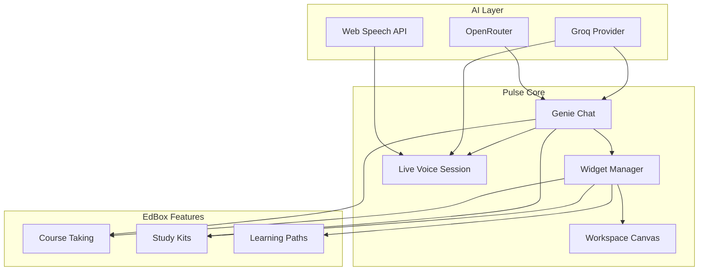
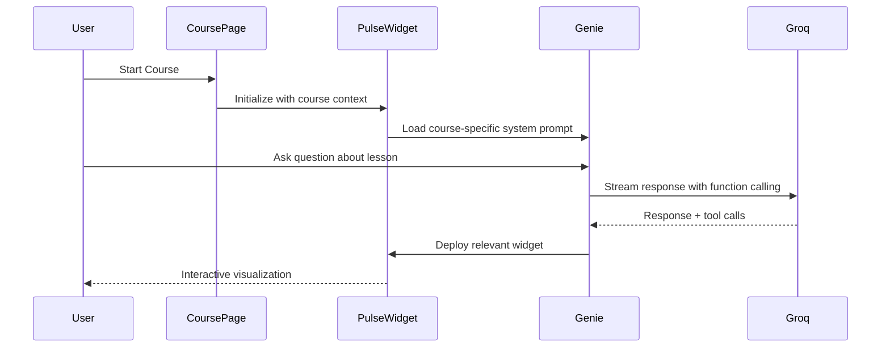
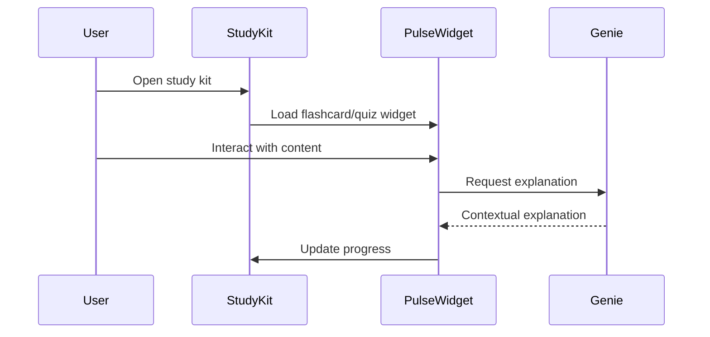
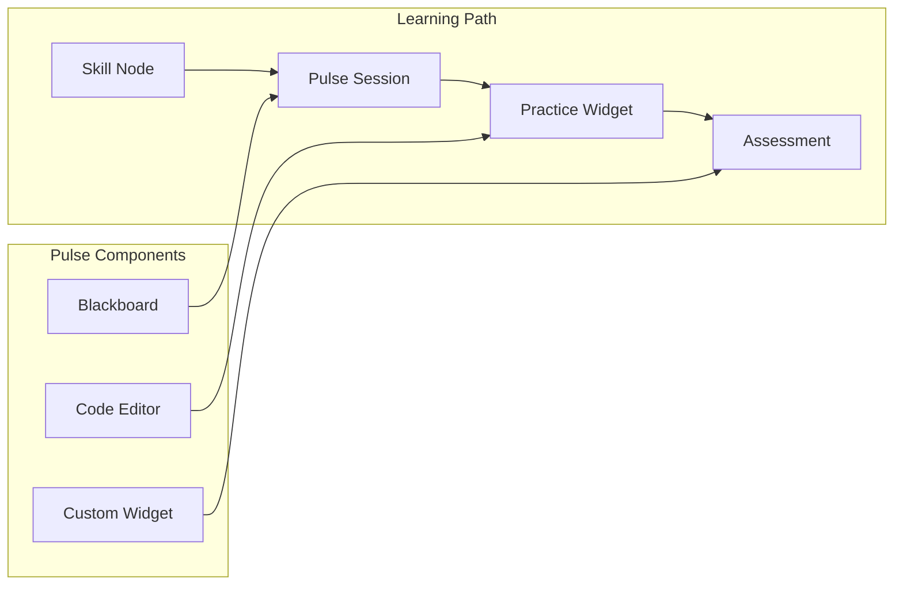

# Pulse Integration Plan

## Executive Summary

The Pulse application is a sophisticated AI-powered workspace with a Genie assistant, dynamic widgets, and live voice capabilities. This plan outlines how to integrate Pulse with EdBox's course-taking, study kits, and study experience, while replacing Gemini models with free alternatives like Groq Cloud.

---

## 1. Current Architecture Analysis

### 1.1 Pulse Application Structure

```
src/app/pulse/
├── App.tsx                    # Main orchestrator with window management
├── types.ts                   # WindowType enum (50+ widget types)
├── constants.ts               # Widget configurations
├── components/
│   ├── Genie/
│   │   ├── Chat.tsx          # AI chat interface with markdown/LaTeX
│   │   └── Orb.tsx           # Visual Genie avatar
│   ├── Widgets/
│   │   ├── Blackboard.tsx    # Drawing + markdown overlay
│   │   ├── CodeEditor.tsx    # Multi-file code editor
│   │   ├── DynamicWidget.tsx # AI-generated custom widgets
│   │   ├── NeuronVisualizer.tsx
│   │   └── NoteWriter.tsx
│   └── Workspace/
│       ├── Canvas.tsx        # Window management canvas
│       └── WindowFrame.tsx   # Draggable window frames
└── services/
    ├── genie-chat.ts         # Chat service (Gemini 3 Flash)
    ├── genie-tooling.ts      # Function calling definitions
    ├── live.ts               # Live voice session (Gemini 2.5 Audio)
    └── interaction-tracker.ts
```

### 1.2 Current AI Dependencies

| Service | Model | Purpose |
|---------|-------|---------|
| genie-chat.ts | gemini-3-flash-preview | Chat with function calling |
| live.ts | gemini-2.5-flash-native-audio-preview | Voice sessions |
| @google/genai | SDK | Google GenAI client |

### 1.3 Existing EdBox AI Providers

From ai-providers.ts:
- **Groq** (38 keys) - Primary, uses llama-3.3-70b-versatile
- **Gemini** (15 keys) - Fallback, uses gemini-1.5-flash
- **OpenRouter** (3 keys) - Vision requests
- **Voyage AI** - Embeddings

---

## 2. Free AI Model Alternatives

### 2.1 Groq Cloud Models (Recommended - Already Available)

| Model | Speed | Quality | Best For |
|-------|-------|---------|----------|
| llama-3.3-70b-versatile | Fast | Excellent | Complex reasoning, tutoring |
| llama-3.1-8b-instant | Ultra-fast | Good | Quick responses, simple tasks |
| mixtral-8x7b-32768 | Fast | Very Good | Multi-step reasoning |
| gemma2-9b-it | Fast | Good | Instruction following |

### 2.2 Additional Free Options

| Provider | Model | Free Tier | Notes |
|----------|-------|-----------|-------|
| Together AI | meta-llama/Llama-3-70b | Yes | Good fallback |
| Fireworks AI | accounts/fireworks/models/llama-v3-70b | Yes | Fast inference |
| DeepSeek | deepseek-chat | Yes | Strong reasoning |
| Hugging Face | Various | Limited | Open source models |

### 2.3 Voice/Audio Alternatives

Since Groq does not support native audio:

| Feature | Free Option | Quality |
|---------|-------------|---------|
| Speech-to-Text | Web Speech API | Good (browser-native) |
| Text-to-Speech | Web Speech API | Decent |
| STT Alternative | Whisper (OpenAI) | Excellent (paid but cheap) |
| TTS Alternative | ElevenLabs Free Tier | Excellent |

---

## 3. Integration Architecture

### 3.1 High-Level Integration Flow



### 3.2 Course-Taking Integration



**Integration Points:**
1. **Course Context Injection** - Pass course topic, current lesson, and learning objectives to Genie
2. **Widget Deployment** - Auto-deploy relevant widgets based on course content type
3. **Progress Tracking** - Sync widget interactions with course progress
4. **Challenge Integration** - Use Pulse widgets for challenge views

### 3.3 Study Kit Integration



**Integration Points:**
1. **Flashcard Widget** - Convert flashcards to interactive Pulse widgets
2. **Quiz Integration** - Use Quiz widget type for study kit quizzes
3. **Note Synchronization** - Blackboard/NoteWriter sync with study kit notes
4. **Mind Map Visualization** - Render mindmaps as interactive widgets

### 3.4 Study Experience Integration



---

## 4. Model Replacement Strategy

### 4.1 Chat Service Replacement

**Current:** genie-chat.ts uses Gemini 3 Flash Preview

**Proposed Changes:**

```typescript
// New unified service using existing ai-providers.ts
import { streamWithFallback, generateWithFallback } from '@/lib/ai-providers';

class GenieChatService {
  async sendMessage(message: string, windows: PulseWindow[], onToolCall: Function) {
    // Use Groq with fallback to Gemini
    const systemPrompt = this.buildSystemPrompt(windows);
    
    const stream = streamWithFallback({
      prompt: message,
      systemPrompt,
      temperature: 0.7,
      maxTokens: 4000,
    });
    
    for await (const chunk of stream) {
      // Process chunks and detect tool calls
    }
  }
}
```

### 4.2 Function Calling Adaptation

Groq supports OpenAI-compatible function calling:

```typescript
// Convert Gemini tool definitions to OpenAI format
const tools = [{
  type: 'function',
  function: {
    name: 'deploy_widget',
    description: 'Deploys a widget to the workspace',
    parameters: {
      type: 'object',
      properties: {
        widget_type: { type: 'string' },
        data_json: { type: 'string' }
      },
      required: ['widget_type']
    }
  }
}];
```

### 4.3 Voice Session Replacement

**Challenge:** Groq does not have native audio support

**Solution:** Hybrid approach

```typescript
class LiveGenieService {
  async connect(callbacks: LiveCallbacks) {
    // 1. Use Web Speech API for STT
    const recognition = new webkitSpeechRecognition();
    recognition.continuous = true;
    
    recognition.onresult = async (event) => {
      const transcript = event.results[event.results.length - 1][0].transcript;
      
      // 2. Send to Groq for processing
      const response = await generateWithFallback({
        prompt: transcript,
        systemPrompt: GENIE_SYSTEM_PROMPT,
      });
      
      // 3. Use Web Speech API for TTS
      const utterance = new SpeechSynthesisUtterance(response.text);
      speechSynthesis.speak(utterance);
    };
  }
}
```

---

## 5. Implementation Phases

### Phase 1: Core AI Migration
- [ ] Create PulseGenieService using existing ai-providers.ts
- [ ] Convert Gemini tool definitions to OpenAI format
- [ ] Implement streaming with Groq
- [ ] Add fallback chain: Groq to Gemini to OpenRouter

### Phase 2: Voice Session Refactor
- [ ] Implement Web Speech API wrapper
- [ ] Create hybrid STT to Groq to TTS pipeline
- [ ] Add pause/resume functionality
- [ ] Handle interruption gracefully

### Phase 3: Course Integration
- [ ] Create PulseCourseWrapper component
- [ ] Inject course context into Genie prompts
- [ ] Auto-deploy widgets based on content type
- [ ] Sync progress with course tracking

### Phase 4: Study Kit Integration
- [ ] Create widget adapters for flashcards/quizzes
- [ ] Implement note synchronization
- [ ] Add mindmap visualization widget
- [ ] Create study session persistence

### Phase 5: Learning Path Integration
- [ ] Create skill-node-specific widgets
- [ ] Implement practice widget system
- [ ] Add assessment widgets
- [ ] Create progress visualization

---

## 6. Technical Specifications

### 6.1 New Components to Create

| Component | Location | Purpose |
|-----------|----------|---------|
| PulseGenieService | src/lib/genie/ | Unified AI service |
| VoiceService | src/lib/genie/ | Web Speech API wrapper |
| PulseCourseWrapper | src/components/pulse/ | Course integration |
| PulseStudyKitAdapter | src/components/pulse/ | Study kit integration |
| WidgetRegistry | src/lib/pulse/ | Widget type registry |

### 6.2 Modified Files

| File | Changes |
|------|---------|
| src/app/pulse/services/genie-chat.ts | Replace Gemini with Groq |
| src/app/pulse/services/live.ts | Implement Web Speech API |
| src/app/pulse/services/genie-tooling.ts | Convert tool definitions |
| src/lib/ai-providers.ts | Add Pulse-specific functions |

### 6.3 Environment Variables

No new variables needed - use existing:
- GROQ_API_KEY_* (38 keys available)
- GEMINI_API_KEY_* (15 keys as fallback)
- OPEN_ROUTER_KEY_* (3 keys for vision)

---

## 7. Quality and Performance Considerations

### 7.1 Speed Optimization

| Aspect | Strategy |
|--------|----------|
| First Token Latency | Use llama-3.1-8b-instant for simple queries |
| Streaming | Implement progressive rendering |
| Widget Loading | Lazy load widget components |
| Voice Response | Pre-buffer TTS output |

### 7.2 Quality Assurance

| Aspect | Strategy |
|--------|----------|
| Response Quality | Use llama-3.3-70b-versatile for complex tasks |
| Function Calling | Validate tool arguments before execution |
| Widget Generation | Add error boundaries and validation |
| Voice Recognition | Implement confidence thresholds |

### 7.3 Fluidity Enhancements

| Feature | Implementation |
|---------|----------------|
| Smooth Transitions | Framer Motion animations |
| Progressive Loading | Skeleton states |
| Error Recovery | Graceful fallbacks |
| Context Preservation | Session persistence |

---

## 8. Testing Strategy

### 8.1 Unit Tests
- Tool definition conversion
- Widget rendering
- Service initialization

### 8.2 Integration Tests
- Course to Pulse flow
- Study Kit to Widget flow
- Voice session lifecycle

### 8.3 E2E Tests
- Complete learning session
- Multi-widget interaction
- Voice + chat combination

---

## 9. Risk Assessment

| Risk | Mitigation |
|------|------------|
| Groq rate limits | 38 keys with rotation |
| Voice quality | Web Speech API fallback to ElevenLabs |
| Widget errors | Error boundaries + graceful degradation |
| Context loss | Session persistence in localStorage |

---

## 10. Success Metrics

| Metric | Target |
|--------|--------|
| Response latency | Less than 500ms first token |
| Voice recognition accuracy | Greater than 90% |
| Widget load time | Less than 200ms |
| Error rate | Less than 1% |

---

## Next Steps

1. **Review this plan** with the team
2. **Prioritize phases** based on immediate needs
3. **Create detailed tickets** for Phase 1 tasks
4. **Set up testing environment** for new AI services

## Executive Summary

The Pulse application is a sophisticated AI-powered workspace with a Genie assistant, dynamic widgets, and live voice capabilities. This plan outlines how to integrate Pulse with EdBox's course-taking, study kits, and study experience, while replacing Gemini models with free alternatives like Groq Cloud.

---

## 1. Current Architecture Analysis

### 1.1 Pulse Application Structure

```
src/app/pulse/
├── App.tsx                    # Main orchestrator with window management
├── types.ts                   # WindowType enum (50+ widget types)
├── constants.ts               # Widget configurations
├── components/
│   ├── Genie/
│   │   ├── Chat.tsx          # AI chat interface with markdown/LaTeX
│   │   └── Orb.tsx           # Visual Genie avatar
│   ├── Widgets/
│   │   ├── Blackboard.tsx    # Drawing + markdown overlay
│   │   ├── CodeEditor.tsx    # Multi-file code editor
│   │   ├── DynamicWidget.tsx # AI-generated custom widgets
│   │   ├── NeuronVisualizer.tsx
│   │   └── NoteWriter.tsx
│   └── Workspace/
│       ├── Canvas.tsx        # Window management canvas
│       └── WindowFrame.tsx   # Draggable window frames
└── services/
    ├── genie-chat.ts         # Chat service (Gemini 3 Flash)
    ├── genie-tooling.ts      # Function calling definitions
    ├── live.ts               # Live voice session (Gemini 2.5 Audio)
    └── interaction-tracker.ts
```

### 1.2 Current AI Dependencies

| Service | Model | Purpose |
|---------|-------|---------|
| genie-chat.ts | gemini-3-flash-preview | Chat with function calling |
| live.ts | gemini-2.5-flash-native-audio-preview | Voice sessions |
| @google/genai | SDK | Google GenAI client |

### 1.3 Existing EdBox AI Providers

From ai-providers.ts:
- **Groq** (38 keys) - Primary, uses llama-3.3-70b-versatile
- **Gemini** (15 keys) - Fallback, uses gemini-1.5-flash
- **OpenRouter** (3 keys) - Vision requests
- **Voyage AI** - Embeddings

---

## 2. Free AI Model Alternatives

### 2.1 Groq Cloud Models (Recommended - Already Available)

| Model | Speed | Quality | Best For |
|-------|-------|---------|----------|
| llama-3.3-70b-versatile | Fast | Excellent | Complex reasoning, tutoring |
| llama-3.1-8b-instant | Ultra-fast | Good | Quick responses, simple tasks |
| mixtral-8x7b-32768 | Fast | Very Good | Multi-step reasoning |
| gemma2-9b-it | Fast | Good | Instruction following |

### 2.2 Additional Free Options

| Provider | Model | Free Tier | Notes |
|----------|-------|-----------|-------|
| Together AI | meta-llama/Llama-3-70b | Yes | Good fallback |
| Fireworks AI | accounts/fireworks/models/llama-v3-70b | Yes | Fast inference |
| DeepSeek | deepseek-chat | Yes | Strong reasoning |
| Hugging Face | Various | Limited | Open source models |

### 2.3 Voice/Audio Alternatives

Since Groq does not support native audio:

| Feature | Free Option | Quality |
|---------|-------------|---------|
| Speech-to-Text | Web Speech API | Good (browser-native) |
| Text-to-Speech | Web Speech API | Decent |
| STT Alternative | Whisper (OpenAI) | Excellent (paid but cheap) |
| TTS Alternative | ElevenLabs Free Tier | Excellent |

---

## 3. Integration Architecture

### 3.1 High-Level Integration Flow


### 3.2 Course-Taking Integration


**Integration Points:**
1. **Course Context Injection** - Pass course topic, current lesson, and learning objectives to Genie
2. **Widget Deployment** - Auto-deploy relevant widgets based on course content type
3. **Progress Tracking** - Sync widget interactions with course progress
4. **Challenge Integration** - Use Pulse widgets for challenge views

### 3.3 Study Kit Integration


**Integration Points:**
1. **Flashcard Widget** - Convert flashcards to interactive Pulse widgets
2. **Quiz Integration** - Use Quiz widget type for study kit quizzes
3. **Note Synchronization** - Blackboard/NoteWriter sync with study kit notes
4. **Mind Map Visualization** - Render mindmaps as interactive widgets

### 3.4 Study Experience Integration


---

## 4. Model Replacement Strategy

### 4.1 Chat Service Replacement

**Current:** genie-chat.ts uses Gemini 3 Flash Preview

**Proposed Changes:**

```typescript
// New unified service using existing ai-providers.ts
import { streamWithFallback, generateWithFallback } from '@/lib/ai-providers';

class GenieChatService {
  async sendMessage(message: string, windows: PulseWindow[], onToolCall: Function) {
    // Use Groq with fallback to Gemini
    const systemPrompt = this.buildSystemPrompt(windows);
    
    const stream = streamWithFallback({
      prompt: message,
      systemPrompt,
      temperature: 0.7,
      maxTokens: 4000,
    });
    
    for await (const chunk of stream) {
      // Process chunks and detect tool calls
    }
  }
}
```

### 4.2 Function Calling Adaptation

Groq supports OpenAI-compatible function calling:

```typescript
// Convert Gemini tool definitions to OpenAI format
const tools = [{
  type: 'function',
  function: {
    name: 'deploy_widget',
    description: 'Deploys a widget to the workspace',
    parameters: {
      type: 'object',
      properties: {
        widget_type: { type: 'string' },
        data_json: { type: 'string' }
      },
      required: ['widget_type']
    }
  }
}];
```

### 4.3 Voice Session Replacement

**Challenge:** Groq does not have native audio support

**Solution:** Hybrid approach

```typescript
class LiveGenieService {
  async connect(callbacks: LiveCallbacks) {
    // 1. Use Web Speech API for STT
    const recognition = new webkitSpeechRecognition();
    recognition.continuous = true;
    
    recognition.onresult = async (event) => {
      const transcript = event.results[event.results.length - 1][0].transcript;
      
      // 2. Send to Groq for processing
      const response = await generateWithFallback({
        prompt: transcript,
        systemPrompt: GENIE_SYSTEM_PROMPT,
      });
      
      // 3. Use Web Speech API for TTS
      const utterance = new SpeechSynthesisUtterance(response.text);
      speechSynthesis.speak(utterance);
    };
  }
}
```

---

## 5. Implementation Phases

### Phase 1: Core AI Migration
- [ ] Create PulseGenieService using existing ai-providers.ts
- [ ] Convert Gemini tool definitions to OpenAI format
- [ ] Implement streaming with Groq
- [ ] Add fallback chain: Groq to Gemini to OpenRouter

### Phase 2: Voice Session Refactor
- [ ] Implement Web Speech API wrapper
- [ ] Create hybrid STT to Groq to TTS pipeline
- [ ] Add pause/resume functionality
- [ ] Handle interruption gracefully

### Phase 3: Course Integration
- [ ] Create PulseCourseWrapper component
- [ ] Inject course context into Genie prompts
- [ ] Auto-deploy widgets based on content type
- [ ] Sync progress with course tracking

### Phase 4: Study Kit Integration
- [ ] Create widget adapters for flashcards/quizzes
- [ ] Implement note synchronization
- [ ] Add mindmap visualization widget
- [ ] Create study session persistence

### Phase 5: Learning Path Integration
- [ ] Create skill-node-specific widgets
- [ ] Implement practice widget system
- [ ] Add assessment widgets
- [ ] Create progress visualization

---

## 6. Technical Specifications

### 6.1 New Components to Create

| Component | Location | Purpose |
|-----------|----------|---------|
| PulseGenieService | src/lib/genie/ | Unified AI service |
| VoiceService | src/lib/genie/ | Web Speech API wrapper |
| PulseCourseWrapper | src/components/pulse/ | Course integration |
| PulseStudyKitAdapter | src/components/pulse/ | Study kit integration |
| WidgetRegistry | src/lib/pulse/ | Widget type registry |

### 6.2 Modified Files

| File | Changes |
|------|---------|
| src/app/pulse/services/genie-chat.ts | Replace Gemini with Groq |
| src/app/pulse/services/live.ts | Implement Web Speech API |
| src/app/pulse/services/genie-tooling.ts | Convert tool definitions |
| src/lib/ai-providers.ts | Add Pulse-specific functions |

### 6.3 Environment Variables

No new variables needed - use existing:
- GROQ_API_KEY_* (38 keys available)
- GEMINI_API_KEY_* (15 keys as fallback)
- OPEN_ROUTER_KEY_* (3 keys for vision)

---

## 7. Quality and Performance Considerations

### 7.1 Speed Optimization

| Aspect | Strategy |
|--------|----------|
| First Token Latency | Use llama-3.1-8b-instant for simple queries |
| Streaming | Implement progressive rendering |
| Widget Loading | Lazy load widget components |
| Voice Response | Pre-buffer TTS output |

### 7.2 Quality Assurance

| Aspect | Strategy |
|--------|----------|
| Response Quality | Use llama-3.3-70b-versatile for complex tasks |
| Function Calling | Validate tool arguments before execution |
| Widget Generation | Add error boundaries and validation |
| Voice Recognition | Implement confidence thresholds |

### 7.3 Fluidity Enhancements

| Feature | Implementation |
|---------|----------------|
| Smooth Transitions | Framer Motion animations |
| Progressive Loading | Skeleton states |
| Error Recovery | Graceful fallbacks |
| Context Preservation | Session persistence |

---

## 8. Testing Strategy

### 8.1 Unit Tests
- Tool definition conversion
- Widget rendering
- Service initialization

### 8.2 Integration Tests
- Course to Pulse flow
- Study Kit to Widget flow
- Voice session lifecycle

### 8.3 E2E Tests
- Complete learning session
- Multi-widget interaction
- Voice + chat combination

---

## 9. Risk Assessment

| Risk | Mitigation |
|------|------------|
| Groq rate limits | 38 keys with rotation |
| Voice quality | Web Speech API fallback to ElevenLabs |
| Widget errors | Error boundaries + graceful degradation |
| Context loss | Session persistence in localStorage |

---

## 10. Success Metrics

| Metric | Target |
|--------|--------|
| Response latency | Less than 500ms first token |
| Voice recognition accuracy | Greater than 90% |
| Widget load time | Less than 200ms |
| Error rate | Less than 1% |

---

## Next Steps

1. **Review this plan** with the team
2. **Prioritize phases** based on immediate needs
3. **Create detailed tickets** for Phase 1 tasks
4. **Set up testing environment** for new AI services

## Executive Summary

The Pulse application is a sophisticated AI-powered workspace with a Genie assistant, dynamic widgets, and live voice capabilities. This plan outlines how to integrate Pulse with EdBox's course-taking, study kits, and study experience, while replacing Gemini models with free alternatives like Groq Cloud.

---

## 1. Current Architecture Analysis

### 1.1 Pulse Application Structure

```
src/app/pulse/
├── App.tsx                    # Main orchestrator with window management
├── types.ts                   # WindowType enum (50+ widget types)
├── constants.ts               # Widget configurations
├── components/
│   ├── Genie/
│   │   ├── Chat.tsx          # AI chat interface with markdown/LaTeX
│   │   └── Orb.tsx           # Visual Genie avatar
│   ├── Widgets/
│   │   ├── Blackboard.tsx    # Drawing + markdown overlay
│   │   ├── CodeEditor.tsx    # Multi-file code editor
│   │   ├── DynamicWidget.tsx # AI-generated custom widgets
│   │   ├── NeuronVisualizer.tsx
│   │   └── NoteWriter.tsx
│   └── Workspace/
│       ├── Canvas.tsx        # Window management canvas
│       └── WindowFrame.tsx   # Draggable window frames
└── services/
    ├── genie-chat.ts         # Chat service (Gemini 3 Flash)
    ├── genie-tooling.ts      # Function calling definitions
    ├── live.ts               # Live voice session (Gemini 2.5 Audio)
    └── interaction-tracker.ts
```

### 1.2 Current AI Dependencies

| Service | Model | Purpose |
|---------|-------|---------|
| genie-chat.ts | `gemini-3-flash-preview` | Chat with function calling |
| live.ts | `gemini-2.5-flash-native-audio-preview` | Voice sessions |
| @google/genai | SDK | Google GenAI client |

### 1.3 Existing EdBox AI Providers

From [`ai-providers.ts`](src/lib/ai-providers.ts):
- **Groq** (38 keys) - Primary, uses `llama-3.3-70b-versatile`
- **Gemini** (15 keys) - Fallback, uses `gemini-1.5-flash`
- **OpenRouter** (3 keys) - Vision requests
- **Voyage AI** - Embeddings

---

## 2. Free AI Model Alternatives

### 2.1 Groq Cloud Models (Recommended - Already Available)

| Model | Speed | Quality | Best For |
|-------|-------|---------|----------|
| `llama-3.3-70b-versatile` | Fast | Excellent | Complex reasoning, tutoring |
| `llama-3.1-8b-instant` | Ultra-fast | Good | Quick responses, simple tasks |
| `mixtral-8x7b-32768` | Fast | Very Good | Multi-step reasoning |
| `gemma2-9b-it` | Fast | Good | Instruction following |

### 2.2 Additional Free Options

| Provider | Model | Free Tier | Notes |
|----------|-------|-----------|-------|
| Together AI | `meta-llama/Llama-3-70b` | Yes | Good fallback |
| Fireworks AI | `accounts/fireworks/models/llama-v3-70b` | Yes | Fast inference |
| DeepSeek | `deepseek-chat` | Yes | Strong reasoning |
| Hugging Face | Various | Limited | Open source models |

### 2.3 Voice/Audio Alternatives

Since Groq doesn't support native audio:

| Feature | Free Option | Quality |
|---------|-------------|---------|
| Speech-to-Text | Web Speech API | Good (browser-native) |
| Text-to-Speech | Web Speech API | Decent |
| STT Alternative | Whisper (OpenAI) | Excellent (paid but cheap) |
| TTS Alternative | ElevenLabs Free Tier | Excellent |

---

## 3. Integration Architecture

### 3.1 High-Level Integration Flow


### 3.2 Course-Taking Integration


**Integration Points:**
1. **Course Context Injection** - Pass course topic, current lesson, and learning objectives to Genie
2. **Widget Deployment** - Auto-deploy relevant widgets based on course content type
3. **Progress Tracking** - Sync widget interactions with course progress
4. **Challenge Integration** - Use Pulse widgets for challenge views

### 3.3 Study Kit Integration


**Integration Points:**
1. **Flashcard Widget** - Convert flashcards to interactive Pulse widgets
2. **Quiz Integration** - Use Quiz widget type for study kit quizzes
3. **Note Synchronization** - Blackboard/NoteWriter sync with study kit notes
4. **Mind Map Visualization** - Render mindmaps as interactive widgets

### 3.4 Study Experience Integration


---

## 4. Model Replacement Strategy

### 4.1 Chat Service Replacement

**Current:** `genie-chat.ts` uses Gemini 3 Flash Preview

**Proposed Changes:**

```typescript
// New unified service using existing ai-providers.ts
import { streamWithFallback, generateWithFallback } from '@/lib/ai-providers';

class GenieChatService {
  async sendMessage(message: string, windows: PulseWindow[], onToolCall: Function) {
    // Use Groq with fallback to Gemini
    const systemPrompt = this.buildSystemPrompt(windows);
    
    const stream = streamWithFallback({
      prompt: message,
      systemPrompt,
      temperature: 0.7,
      maxTokens: 4000,
    });
    
    for await (const chunk of stream) {
      // Process chunks and detect tool calls
    }
  }
}
```

### 4.2 Function Calling Adaptation

Groq supports OpenAI-compatible function calling:

```typescript
// Convert Gemini tool definitions to OpenAI format
const tools = [{
  type: 'function',
  function: {
    name: 'deploy_widget',
    description: 'Deploys a widget to the workspace',
    parameters: {
      type: 'object',
      properties: {
        widget_type: { type: 'string' },
        data_json: { type: 'string' }
      },
      required: ['widget_type']
    }
  }
}];
```

### 4.3 Voice Session Replacement

**Challenge:** Groq doesn't have native audio support

**Solution:** Hybrid approach

```typescript
class LiveGenieService {
  async connect(callbacks: LiveCallbacks) {
    // 1. Use Web Speech API for STT
    const recognition = new webkitSpeechRecognition();
    recognition.continuous = true;
    
    recognition.onresult = async (event) => {
      const transcript = event.results[event.results.length - 1][0].transcript;
      
      // 2. Send to Groq for processing
      const response = await generateWithFallback({
        prompt: transcript,
        systemPrompt: GENIE_SYSTEM_PROMPT,
      });
      
      // 3. Use Web Speech API for TTS
      const utterance = new SpeechSynthesisUtterance(response.text);
      speechSynthesis.speak(utterance);
    };
  }
}
```

---

## 5. Implementation Phases

### Phase 1: Core AI Migration
- [ ] Create `PulseGenieService` using existing `ai-providers.ts`
- [ ] Convert Gemini tool definitions to OpenAI format
- [ ] Implement streaming with Groq
- [ ] Add fallback chain: Groq → Gemini → OpenRouter

### Phase 2: Voice Session Refactor
- [ ] Implement Web Speech API wrapper
- [ ] Create hybrid STT → Groq → TTS pipeline
- [ ] Add pause/resume functionality
- [ ] Handle interruption gracefully

### Phase 3: Course Integration
- [ ] Create `PulseCourseWrapper` component
- [ ] Inject course context into Genie prompts
- [ ] Auto-deploy widgets based on content type
- [ ] Sync progress with course tracking

### Phase 4: Study Kit Integration
- [ ] Create widget adapters for flashcards/quizzes
- [ ] Implement note synchronization
- [ ] Add mindmap visualization widget
- [ ] Create study session persistence

### Phase 5: Learning Path Integration
- [ ] Create skill-node-specific widgets
- [ ] Implement practice widget system
- [ ] Add assessment widgets
- [ ] Create progress visualization

---

## 6. Technical Specifications

### 6.1 New Components to Create

| Component | Location | Purpose |
|-----------|----------|---------|
| `PulseGenieService` | `src/lib/genie/` | Unified AI service |
| `VoiceService` | `src/lib/genie/` | Web Speech API wrapper |
| `PulseCourseWrapper` | `src/components/pulse/` | Course integration |
| `PulseStudyKitAdapter` | `src/components/pulse/` | Study kit integration |
| `WidgetRegistry` | `src/lib/pulse/` | Widget type registry |

### 6.2 Modified Files

| File | Changes |
|------|---------|
| `src/app/pulse/services/genie-chat.ts` | Replace Gemini with Groq |
| `src/app/pulse/services/live.ts` | Implement Web Speech API |
| `src/app/pulse/services/genie-tooling.ts` | Convert tool definitions |
| `src/lib/ai-providers.ts` | Add Pulse-specific functions |

### 6.3 Environment Variables

No new variables needed - use existing:
- `GROQ_API_KEY_*` (38 keys available)
- `GEMINI_API_KEY_*` (15 keys as fallback)
- `OPEN_ROUTER_KEY_*` (3 keys for vision)

---

## 7. Quality & Performance Considerations

### 7.1 Speed Optimization

| Aspect | Strategy |
|--------|----------|
| First Token Latency | Use `llama-3.1-8b-instant` for simple queries |
| Streaming | Implement progressive rendering |
| Widget Loading | Lazy load widget components |
| Voice Response | Pre-buffer TTS output |

### 7.2 Quality Assurance

| Aspect | Strategy |
|--------|----------|
| Response Quality | Use `llama-3.3-70b-versatile` for complex tasks |
| Function Calling | Validate tool arguments before execution |
| Widget Generation | Add error boundaries and validation |
| Voice Recognition | Implement confidence thresholds |

### 7.3 Fluidity Enhancements

| Feature | Implementation |
|---------|----------------|
| Smooth Transitions | Framer Motion animations |
| Progressive Loading | Skeleton states |
| Error Recovery | Graceful fallbacks |
| Context Preservation | Session persistence |

---

## 8. Testing Strategy

### 8.1 Unit Tests
- Tool definition conversion
- Widget rendering
- Service initialization

### 8.2 Integration Tests
- Course → Pulse flow
- Study Kit → Widget flow
- Voice session lifecycle

### 8.3 E2E Tests
- Complete learning session
- Multi-widget interaction
- Voice + chat combination

---

## 9. Risk Assessment

| Risk | Mitigation |
|------|------------|
| Groq rate limits | 38 keys with rotation |
| Voice quality | Web Speech API fallback to ElevenLabs |
| Widget errors | Error boundaries + graceful degradation |
| Context loss | Session persistence in localStorage |

---

## 10. Success Metrics

| Metric | Target |
|--------|--------|
| Response latency | < 500ms first token |
| Voice recognition accuracy | > 90% |
| Widget load time | < 200ms |
| Error rate | < 1% |

---

## Next Steps

1. **Review this plan** with the team
2. **Prioritize phases** based on immediate needs
3. **Create detailed tickets** for Phase 1 tasks
4. **Set up testing environment** for new AI services

