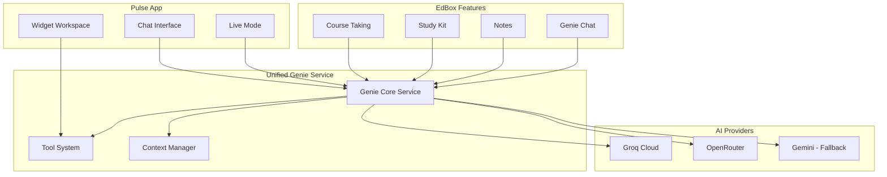
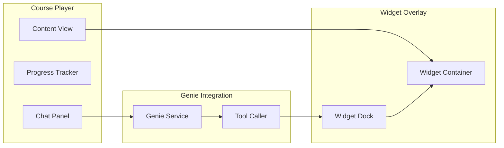
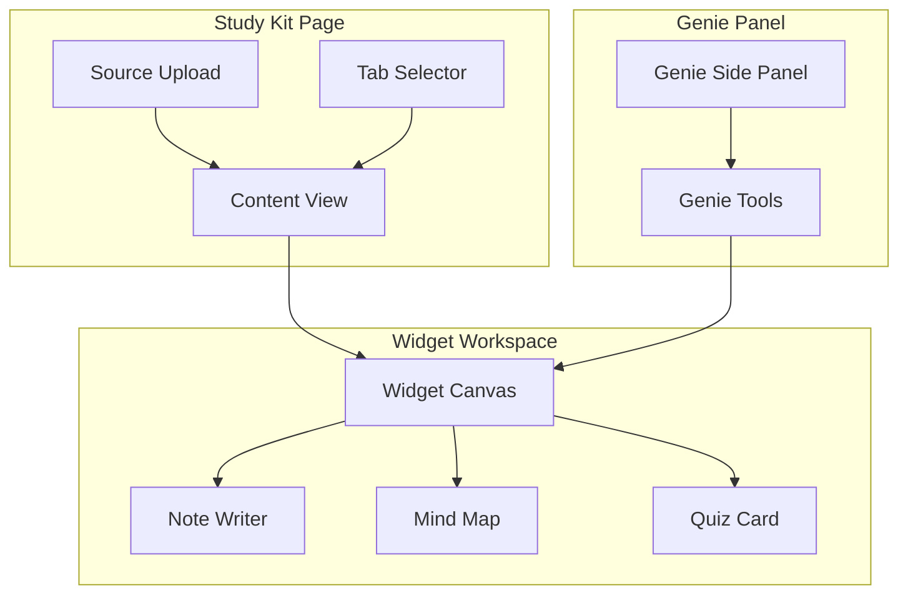

# Pulse Integration Plan

## Executive Summary

The Pulse folder is a standalone AI Studio application featuring a widget-based workspace with Genie chat capabilities. This plan outlines how to integrate Pulse with EdBox's course-taking, study-kit, and study experience, while replacing Gemini models with free alternatives like Groq Cloud.

---

## 1. Current Architecture Analysis

### 1.1 Pulse Folder Structure

```
src/app/pulse/
├── App.tsx                    # Main app with workspace + chat layout
├── types.ts                   # WindowType enum (50+ widget types)
├── constants.ts               # Widget configurations
├── components/
│   ├── Genie/
│   │   ├── Chat.tsx          # Chat interface with markdown/LaTeX
│   │   └── Orb.tsx           # Visual Genie avatar
│   ├── Widgets/
│   │   ├── Blackboard.tsx    # Drawing/writing canvas
│   │   ├── CodeEditor.tsx    # Multi-file code editor
│   │   ├── DynamicWidget.tsx # AI-generated custom widgets
│   │   ├── NeuronVisualizer.tsx
│   │   ├── NoteWriter.tsx
│   │   └── UniversalWidget.tsx
│   └── Workspace/
│       ├── Canvas.tsx        # Widget container
│       └── WindowFrame.tsx   # Draggable window wrapper
├── services/
│   ├── genie.ts              # Gemini chat service
│   ├── genie-chat.ts         # Enhanced chat with context
│   ├── genie-tooling.ts      # Tool definitions for function calling
│   ├── live.ts               # Real-time voice session
│   └── interaction-tracker.ts # User activity logging
└── utils/
    └── audioUtils.ts         # Audio processing for live mode
```

### 1.2 Key Features

| Feature | Description | Current Provider |
|---------|-------------|------------------|
| Chat Interface | Markdown + LaTeX rendering | Gemini 3 Flash Preview |
| Live Voice Mode | Real-time audio conversation | Gemini 2.5 Flash Native Audio |
| Widget System | 50+ specialized learning tools | N/A |
| Dynamic Widgets | AI-generated React components | Gemini |
| Tool Calling | Function calling for widget control | Gemini |

### 1.3 Widget Types Available

**Core Widgets:**
- `BLACKBOARD` - Interactive drawing/writing canvas
- `CODE_EDITOR` - Multi-file code execution
- `NOTE_WRITER` - Rich text notes
- `NEURON_VISUALIZER` - Interactive neural network visualization
- `QUIZ_CARD` - Knowledge checks

**Math Widgets (10):**
- Graphing Calculator, Geometry Board, Matrix Solver, Probability Sim, Unit Converter, Fractal Explorer, Prime Spiral, Fourier Series, Linear Algebra, Calculus Viz

**Code Widgets (10):**
- Regex Tester, JSON Formatter, Diff Viewer, Color Picker, Git Visualizer, Sorting Algorithm, Binary Tree, SQL Playground, REST Client, Markdown Preview

**Writing Widgets (10):**
- Kanban Board, Mind Map, Pomodoro Timer, Word Counter, Rhyme Finder, Thesaurus, Storyboard, Citation Generator, Character Profile, Plot Structure

**STEM Widgets (20):**
- Periodic Table, Molecule Viewer, Pendulum Lab, Optics Bench, Circuit Builder, DNA Model, Cell Structure, Solar System, Tectonic Plates, Weather Sim, Ecosystem, Wave Interference, Projectile Motion, Gas Laws, pH Scale, Atom Builder, Logic Gates, Engine Cycles, Fluid Dynamics, Rocket Launch

---

## 2. AI Model Replacement Strategy

### 2.1 Current Gemini Usage in Pulse

| Service | Model | Purpose |
|---------|-------|---------|
| `genie.ts` | `gemini-3-flash-preview` | Chat + tool calling |
| `genie-chat.ts` | `gemini-3-flash-preview` | Enhanced chat with context |
| `live.ts` | `gemini-2.5-flash-native-audio-preview` | Voice conversations |

### 2.2 Free Model Alternatives

#### Option A: Groq Cloud (Recommended - Already Integrated)

**Available Models:**
| Model | Speed | Quality | Best For |
|-------|-------|---------|----------|
| `llama-3.3-70b-versatile` | Fast | Excellent | Complex reasoning, tool calling |
| `llama-3.1-8b-instant` | Ultra-fast | Good | Quick responses, simple tasks |
| `llama-3.2-90b-vision-preview` | Fast | Excellent | Vision tasks |
| `mixtral-8x7b-32768` | Fast | Very Good | Long context tasks |

**Advantages:**
- Already integrated in `src/lib/ai-providers.ts`
- 38 API keys configured with rotation
- Sub-second latency
- Free tier available

**Limitations:**
- No native audio model (need alternative for live voice)

#### Option B: OpenRouter (Already Integrated)

**Free Models Available:**
| Model | Provider | Best For |
|-------|----------|----------|
| `meta-llama/llama-3.3-70b-instruct:free` | Meta | General purpose |
| `deepseek/deepseek-r1:free` | DeepSeek | Reasoning |
| `qwen/qwen-2.5-72b-instruct:free` | Qwen | Long context |
| `google/gemma-3-27b-it:free` | Google | Fast responses |

#### Option C: Cerebras (New Integration Needed)

**Models:**
- `llama-3.3-70b` - Ultra-fast inference
- `llama-3.1-8b` - Fastest option

### 2.3 Recommended Model Mapping

```typescript
// Proposed model mapping for Pulse services
const MODEL_CONFIG = {
  // Chat + Tool Calling - Use Groq
  chat: {
    provider: 'groq',
    model: 'llama-3.3-70b-versatile',
    fallback: 'llama-3.1-8b-instant'
  },
  
  // Code Generation - Use Groq
  code: {
    provider: 'groq',
    model: 'llama-3.3-70b-versatile'
  },
  
  // Quick Tasks - Use Groq Instant
  quick: {
    provider: 'groq',
    model: 'llama-3.1-8b-instant'
  },
  
  // Vision - Use OpenRouter or Groq Vision
  vision: {
    provider: 'openrouter',
    model: 'meta-llama/llama-3.2-11b-vision-instruct:free',
    fallback: 'llama-3.2-90b-vision-preview'
  },
  
  // Voice/Audio - Requires special handling
  voice: {
    // Option 1: Use Groq for transcription + TTS service
    provider: 'hybrid',
    stt: 'groq-whisper-large-v3', // Speech-to-text
    llm: 'llama-3.3-70b-versatile',
    tts: 'elevenlabs' // Or browser TTS
  }
};
```

### 2.4 Voice Mode Replacement Strategy

The live voice mode currently uses Gemini's native audio capabilities. For free alternatives:

**Option 1: Groq + TTS Hybrid**
```
User Speech → Groq Whisper (STT) → Groq Llama (LLM) → ElevenLabs/Browser TTS → Audio Output
```

**Option 2: Browser APIs + Groq**
```
User Speech → Web Speech API (STT) → Groq Llama (LLM) → Web Speech API (TTS) → Audio Output
```

**Option 3: DeepSeek R1 for Reasoning**
```
User Speech → Groq Whisper → DeepSeek R1 (reasoning) → Groq Llama (response) → TTS
```

---

## 3. Integration Architecture

### 3.1 Unified Genie Service Layer

Create a unified service that both Pulse and existing EdBox features can use:



### 3.2 Shared Context System

```typescript
interface GenieContext {
  // User context
  userId: string;
  currentCourse?: Course;
  currentStudyKit?: StudyKit;
  currentChapter?: Chapter;
  
  // Workspace context
  activeWidgets: Widget[];
  recentInteractions: Interaction[];
  
  // Learning context
  skillGraph?: SkillGraph;
  learningGoals: Goal[];
  progressMetrics: Metrics;
}
```

---

## 4. Course-Taking Integration

### 4.1 Widget Integration Points

**During Course Session:**
1. **Concept Explanation** → Deploy Blackboard widget for visual explanations
2. **Code Examples** → Deploy Code Editor widget with syntax highlighting
3. **Math Concepts** → Deploy Math widgets (Graphing Calculator, etc.)
4. **Science Topics** → Deploy STEM widgets (Molecule Viewer, etc.)
5. **Practice** → Deploy Quiz Card widget

### 4.2 Enhanced Course Player



### 4.3 Implementation Steps

1. **Create Widget Container Component**
   - Overlay system for widgets
   - Minimize/maximize functionality
   - Split-view with course content

2. **Extend InteractiveCourseSession**
   - Add widget deployment triggers
   - Connect to unified Genie service
   - Context-aware widget suggestions

3. **Add Tool Calling for Courses**
   - `deploy_course_widget` - Widget for current topic
   - `update_course_notes` - Sync with course notes
   - `generate_practice_question` - Create practice problems

---

## 5. Study Kit Integration

### 5.1 Widget Integration Points

**Study Kit Tabs → Widget Mapping:**
| Tab | Widget Integration |
|-----|-------------------|
| Quizzes | Quiz Card widget for interactive quizzes |
| Flashcards | Custom flashcard widget with animations |
| Notes | Note Writer widget with rich formatting |
| Mind Maps | Mind Map widget for visual connections |

### 5.2 Enhanced Study Experience



### 5.3 Implementation Steps

1. **Create Study Widget Container**
   - Integrate with existing tab system
   - Widget persistence per study kit
   - Export widget content to notes

2. **Add Genie Tools for Study Kit**
   - `generate_flashcard_widget` - Create interactive flashcards
   - `create_mindmap_widget` - Visual concept mapping
   - `deploy_practice_widget` - Practice problems

3. **Sync Widget State**
   - Save widget content to study kit
   - Restore widgets on page load
   - Share widgets via study circles

---

## 6. Unified Genie Experience

### 6.1 Consolidated Chat Architecture

Currently, there are multiple Genie implementations:
- `GenieChat.tsx` - Main chat component
- `GenieSidePanel.tsx` - Side panel for study kit
- `pulse/components/Genie/Chat.tsx` - Pulse chat

**Recommendation:** Create a unified `GenieCore` component:

```typescript
interface GenieCoreProps {
  mode: 'full' | 'panel' | 'minimal';
  context: GenieContext;
  tools?: GenieTool[];
  onToolCall?: (tool: string, args: any) => void;
  enableVoice?: boolean;
  enableWidgets?: boolean;
}
```

### 6.2 Shared Tool System

```typescript
// Core tools available everywhere
const CORE_TOOLS = {
  // Widget Management
  deploy_widget: deployWidgetTool,
  close_widget: closeWidgetTool,
  update_widget: updateWidgetTool,
  
  // Course Tools
  explain_concept: explainConceptTool,
  generate_practice: generatePracticeTool,
  
  // Study Tools
  create_flashcard: createFlashcardTool,
  summarize_content: summarizeContentTool,
  
  // Note Tools
  save_note: saveNoteTool,
  search_notes: searchNotesTool
};
```

---

## 7. Implementation Roadmap

### Phase 1: AI Provider Migration
- [ ] Create `GenieService` class using existing `ai-providers.ts`
- [ ] Replace Gemini SDK calls with Groq/OpenRouter
- [ ] Implement tool calling for Groq (different API than Gemini)
- [ ] Add fallback chain: Groq → OpenRouter → Gemini

### Phase 2: Voice Mode Replacement
- [ ] Integrate Groq Whisper for STT
- [ ] Add TTS service (ElevenLabs or browser TTS)
- [ ] Create hybrid voice pipeline
- [ ] Test latency and quality

### Phase 3: Widget System Integration
- [ ] Create `WidgetContainer` component for course player
- [ ] Add widget support to study kit
- [ ] Implement widget persistence
- [ ] Create widget-to-content sync

### Phase 4: Unified Genie
- [ ] Create `GenieCore` component
- [ ] Migrate existing Genie implementations
- [ ] Add context-aware tool suggestions
- [ ] Implement cross-feature memory

### Phase 5: Polish & Testing
- [ ] Performance optimization
- [ ] Error handling and fallbacks
- [ ] User testing
- [ ] Documentation

---

## 8. Technical Considerations

### 8.1 Tool Calling Differences

**Gemini Tool Calling:**
```typescript
const result = await chat.sendMessage({ message });
const toolCalls = result.functionCalls;
```

**Groq Tool Calling:**
```typescript
const response = await groq.chat.completions.create({
  model: 'llama-3.3-70b-versatile',
  messages,
  tools: [{ type: 'function', function: { ... } }],
  tool_choice: 'auto'
});
const toolCalls = response.choices[0].message.tool_calls;
```

### 8.2 Streaming Implementation

Both Groq and Gemini support streaming. The existing `streamWithFallback` in `ai-providers.ts` already handles this.

### 8.3 Context Window Management

| Model | Context Window |
|-------|---------------|
| Llama 3.3 70B | 128K tokens |
| Llama 3.1 8B | 128K tokens |
| Gemini 1.5 Flash | 1M tokens |

For most use cases, 128K is sufficient. For very long conversations, implement context summarization.

---

## 9. Cost Analysis

### 9.1 Current Gemini Costs
- Gemini 1.5 Flash: Free tier available with rate limits
- Gemini 2.5 Flash Native Audio: Limited free tier

### 9.2 Groq Free Tier
- ~14M tokens/month free
- Rate limits apply but generous

### 9.3 OpenRouter Free Models
- Various free models available
- Rate limits per model

### 9.4 Recommendation
Use Groq as primary (already have 38 keys), OpenRouter as fallback, Gemini as last resort.

---

## 10. Next Steps

1. **Review and approve this plan**
2. **Switch to Code mode to implement Phase 1**
3. **Test AI provider migration**
4. **Iterate on integration points**

---

## Appendix A: File Changes Required

### New Files to Create
- `src/lib/services/genie-service.ts` - Unified Genie service
- `src/lib/services/voice-service.ts` - Voice mode with Groq Whisper
- `src/components/widgets/WidgetContainer.tsx` - Reusable widget container
- `src/components/genie/GenieCore.tsx` - Unified Genie component
- `src/lib/services/tool-system.ts` - Shared tool definitions

### Files to Modify
- `src/app/pulse/services/genie.ts` - Replace Gemini with unified service
- `src/app/pulse/services/genie-chat.ts` - Replace Gemini with unified service
- `src/app/pulse/services/live.ts` - Implement hybrid voice
- `src/app/(main)/courses/[courseId]/page.tsx` - Add widget support
- `src/app/(main)/tools/study-kit/page.tsx` - Add widget support
- `src/components/GenieChat.tsx` - Use unified GenieCore

---

## Appendix B: Widget Priority for Integration

**High Priority (Implement First):**
1. Blackboard - Visual explanations
2. Code Editor - Code examples
3. Quiz Card - Practice questions
4. Note Writer - Rich notes

**Medium Priority:**
5. Mind Map - Concept connections
6. Graphing Calculator - Math visualization
7. Periodic Table - Chemistry
8. Molecule Viewer - Chemistry

**Low Priority (Future):**
9. Remaining STEM widgets
10. Writing widgets
11. Custom generated widgets

## Executive Summary

The Pulse folder is a standalone AI Studio application featuring a widget-based workspace with Genie chat capabilities. This plan outlines how to integrate Pulse with EdBox's course-taking, study-kit, and study experience, while replacing Gemini models with free alternatives like Groq Cloud.

---

## 1. Current Architecture Analysis

### 1.1 Pulse Folder Structure

```
src/app/pulse/
├── App.tsx                    # Main app with workspace + chat layout
├── types.ts                   # WindowType enum (50+ widget types)
├── constants.ts               # Widget configurations
├── components/
│   ├── Genie/
│   │   ├── Chat.tsx          # Chat interface with markdown/LaTeX
│   │   └── Orb.tsx           # Visual Genie avatar
│   ├── Widgets/
│   │   ├── Blackboard.tsx    # Drawing/writing canvas
│   │   ├── CodeEditor.tsx    # Multi-file code editor
│   │   ├── DynamicWidget.tsx # AI-generated custom widgets
│   │   ├── NeuronVisualizer.tsx
│   │   ├── NoteWriter.tsx
│   │   └── UniversalWidget.tsx
│   └── Workspace/
│       ├── Canvas.tsx        # Widget container
│       └── WindowFrame.tsx   # Draggable window wrapper
├── services/
│   ├── genie.ts              # Gemini chat service
│   ├── genie-chat.ts         # Enhanced chat with context
│   ├── genie-tooling.ts      # Tool definitions for function calling
│   ├── live.ts               # Real-time voice session
│   └── interaction-tracker.ts # User activity logging
└── utils/
    └── audioUtils.ts         # Audio processing for live mode
```

### 1.2 Key Features

| Feature | Description | Current Provider |
|---------|-------------|------------------|
| Chat Interface | Markdown + LaTeX rendering | Gemini 3 Flash Preview |
| Live Voice Mode | Real-time audio conversation | Gemini 2.5 Flash Native Audio |
| Widget System | 50+ specialized learning tools | N/A |
| Dynamic Widgets | AI-generated React components | Gemini |
| Tool Calling | Function calling for widget control | Gemini |

### 1.3 Widget Types Available

**Core Widgets:**
- `BLACKBOARD` - Interactive drawing/writing canvas
- `CODE_EDITOR` - Multi-file code execution
- `NOTE_WRITER` - Rich text notes
- `NEURON_VISUALIZER` - Interactive neural network visualization
- `QUIZ_CARD` - Knowledge checks

**Math Widgets (10):**
- Graphing Calculator, Geometry Board, Matrix Solver, Probability Sim, Unit Converter, Fractal Explorer, Prime Spiral, Fourier Series, Linear Algebra, Calculus Viz

**Code Widgets (10):**
- Regex Tester, JSON Formatter, Diff Viewer, Color Picker, Git Visualizer, Sorting Algorithm, Binary Tree, SQL Playground, REST Client, Markdown Preview

**Writing Widgets (10):**
- Kanban Board, Mind Map, Pomodoro Timer, Word Counter, Rhyme Finder, Thesaurus, Storyboard, Citation Generator, Character Profile, Plot Structure

**STEM Widgets (20):**
- Periodic Table, Molecule Viewer, Pendulum Lab, Optics Bench, Circuit Builder, DNA Model, Cell Structure, Solar System, Tectonic Plates, Weather Sim, Ecosystem, Wave Interference, Projectile Motion, Gas Laws, pH Scale, Atom Builder, Logic Gates, Engine Cycles, Fluid Dynamics, Rocket Launch

---

## 2. AI Model Replacement Strategy

### 2.1 Current Gemini Usage in Pulse

| Service | Model | Purpose |
|---------|-------|---------|
| `genie.ts` | `gemini-3-flash-preview` | Chat + tool calling |
| `genie-chat.ts` | `gemini-3-flash-preview` | Enhanced chat with context |
| `live.ts` | `gemini-2.5-flash-native-audio-preview` | Voice conversations |

### 2.2 Free Model Alternatives

#### Option A: Groq Cloud (Recommended - Already Integrated)

**Available Models:**
| Model | Speed | Quality | Best For |
|-------|-------|---------|----------|
| `llama-3.3-70b-versatile` | Fast | Excellent | Complex reasoning, tool calling |
| `llama-3.1-8b-instant` | Ultra-fast | Good | Quick responses, simple tasks |
| `llama-3.2-90b-vision-preview` | Fast | Excellent | Vision tasks |
| `mixtral-8x7b-32768` | Fast | Very Good | Long context tasks |

**Advantages:**
- Already integrated in `src/lib/ai-providers.ts`
- 38 API keys configured with rotation
- Sub-second latency
- Free tier available

**Limitations:**
- No native audio model (need alternative for live voice)

#### Option B: OpenRouter (Already Integrated)

**Free Models Available:**
| Model | Provider | Best For |
|-------|----------|----------|
| `meta-llama/llama-3.3-70b-instruct:free` | Meta | General purpose |
| `deepseek/deepseek-r1:free` | DeepSeek | Reasoning |
| `qwen/qwen-2.5-72b-instruct:free` | Qwen | Long context |
| `google/gemma-3-27b-it:free` | Google | Fast responses |

#### Option C: Cerebras (New Integration Needed)

**Models:**
- `llama-3.3-70b` - Ultra-fast inference
- `llama-3.1-8b` - Fastest option

### 2.3 Recommended Model Mapping

```typescript
// Proposed model mapping for Pulse services
const MODEL_CONFIG = {
  // Chat + Tool Calling - Use Groq
  chat: {
    provider: 'groq',
    model: 'llama-3.3-70b-versatile',
    fallback: 'llama-3.1-8b-instant'
  },
  
  // Code Generation - Use Groq
  code: {
    provider: 'groq',
    model: 'llama-3.3-70b-versatile'
  },
  
  // Quick Tasks - Use Groq Instant
  quick: {
    provider: 'groq',
    model: 'llama-3.1-8b-instant'
  },
  
  // Vision - Use OpenRouter or Groq Vision
  vision: {
    provider: 'openrouter',
    model: 'meta-llama/llama-3.2-11b-vision-instruct:free',
    fallback: 'llama-3.2-90b-vision-preview'
  },
  
  // Voice/Audio - Requires special handling
  voice: {
    // Option 1: Use Groq for transcription + TTS service
    provider: 'hybrid',
    stt: 'groq-whisper-large-v3', // Speech-to-text
    llm: 'llama-3.3-70b-versatile',
    tts: 'elevenlabs' // Or browser TTS
  }
};
```

### 2.4 Voice Mode Replacement Strategy

The live voice mode currently uses Gemini's native audio capabilities. For free alternatives:

**Option 1: Groq + TTS Hybrid**
```
User Speech → Groq Whisper (STT) → Groq Llama (LLM) → ElevenLabs/Browser TTS → Audio Output
```

**Option 2: Browser APIs + Groq**
```
User Speech → Web Speech API (STT) → Groq Llama (LLM) → Web Speech API (TTS) → Audio Output
```

**Option 3: DeepSeek R1 for Reasoning**
```
User Speech → Groq Whisper → DeepSeek R1 (reasoning) → Groq Llama (response) → TTS
```

---

## 3. Integration Architecture

### 3.1 Unified Genie Service Layer

Create a unified service that both Pulse and existing EdBox features can use:


### 3.2 Shared Context System

```typescript
interface GenieContext {
  // User context
  userId: string;
  currentCourse?: Course;
  currentStudyKit?: StudyKit;
  currentChapter?: Chapter;
  
  // Workspace context
  activeWidgets: Widget[];
  recentInteractions: Interaction[];
  
  // Learning context
  skillGraph?: SkillGraph;
  learningGoals: Goal[];
  progressMetrics: Metrics;
}
```

---

## 4. Course-Taking Integration

### 4.1 Widget Integration Points

**During Course Session:**
1. **Concept Explanation** → Deploy Blackboard widget for visual explanations
2. **Code Examples** → Deploy Code Editor widget with syntax highlighting
3. **Math Concepts** → Deploy Math widgets (Graphing Calculator, etc.)
4. **Science Topics** → Deploy STEM widgets (Molecule Viewer, etc.)
5. **Practice** → Deploy Quiz Card widget

### 4.2 Enhanced Course Player


### 4.3 Implementation Steps

1. **Create Widget Container Component**
   - Overlay system for widgets
   - Minimize/maximize functionality
   - Split-view with course content

2. **Extend InteractiveCourseSession**
   - Add widget deployment triggers
   - Connect to unified Genie service
   - Context-aware widget suggestions

3. **Add Tool Calling for Courses**
   - `deploy_course_widget` - Widget for current topic
   - `update_course_notes` - Sync with course notes
   - `generate_practice_question` - Create practice problems

---

## 5. Study Kit Integration

### 5.1 Widget Integration Points

**Study Kit Tabs → Widget Mapping:**
| Tab | Widget Integration |
|-----|-------------------|
| Quizzes | Quiz Card widget for interactive quizzes |
| Flashcards | Custom flashcard widget with animations |
| Notes | Note Writer widget with rich formatting |
| Mind Maps | Mind Map widget for visual connections |

### 5.2 Enhanced Study Experience


### 5.3 Implementation Steps

1. **Create Study Widget Container**
   - Integrate with existing tab system
   - Widget persistence per study kit
   - Export widget content to notes

2. **Add Genie Tools for Study Kit**
   - `generate_flashcard_widget` - Create interactive flashcards
   - `create_mindmap_widget` - Visual concept mapping
   - `deploy_practice_widget` - Practice problems

3. **Sync Widget State**
   - Save widget content to study kit
   - Restore widgets on page load
   - Share widgets via study circles

---

## 6. Unified Genie Experience

### 6.1 Consolidated Chat Architecture

Currently, there are multiple Genie implementations:
- `GenieChat.tsx` - Main chat component
- `GenieSidePanel.tsx` - Side panel for study kit
- `pulse/components/Genie/Chat.tsx` - Pulse chat

**Recommendation:** Create a unified `GenieCore` component:

```typescript
interface GenieCoreProps {
  mode: 'full' | 'panel' | 'minimal';
  context: GenieContext;
  tools?: GenieTool[];
  onToolCall?: (tool: string, args: any) => void;
  enableVoice?: boolean;
  enableWidgets?: boolean;
}
```

### 6.2 Shared Tool System

```typescript
// Core tools available everywhere
const CORE_TOOLS = {
  // Widget Management
  deploy_widget: deployWidgetTool,
  close_widget: closeWidgetTool,
  update_widget: updateWidgetTool,
  
  // Course Tools
  explain_concept: explainConceptTool,
  generate_practice: generatePracticeTool,
  
  // Study Tools
  create_flashcard: createFlashcardTool,
  summarize_content: summarizeContentTool,
  
  // Note Tools
  save_note: saveNoteTool,
  search_notes: searchNotesTool
};
```

---

## 7. Implementation Roadmap

### Phase 1: AI Provider Migration
- [ ] Create `GenieService` class using existing `ai-providers.ts`
- [ ] Replace Gemini SDK calls with Groq/OpenRouter
- [ ] Implement tool calling for Groq (different API than Gemini)
- [ ] Add fallback chain: Groq → OpenRouter → Gemini

### Phase 2: Voice Mode Replacement
- [ ] Integrate Groq Whisper for STT
- [ ] Add TTS service (ElevenLabs or browser TTS)
- [ ] Create hybrid voice pipeline
- [ ] Test latency and quality

### Phase 3: Widget System Integration
- [ ] Create `WidgetContainer` component for course player
- [ ] Add widget support to study kit
- [ ] Implement widget persistence
- [ ] Create widget-to-content sync

### Phase 4: Unified Genie
- [ ] Create `GenieCore` component
- [ ] Migrate existing Genie implementations
- [ ] Add context-aware tool suggestions
- [ ] Implement cross-feature memory

### Phase 5: Polish & Testing
- [ ] Performance optimization
- [ ] Error handling and fallbacks
- [ ] User testing
- [ ] Documentation

---

## 8. Technical Considerations

### 8.1 Tool Calling Differences

**Gemini Tool Calling:**
```typescript
const result = await chat.sendMessage({ message });
const toolCalls = result.functionCalls;
```

**Groq Tool Calling:**
```typescript
const response = await groq.chat.completions.create({
  model: 'llama-3.3-70b-versatile',
  messages,
  tools: [{ type: 'function', function: { ... } }],
  tool_choice: 'auto'
});
const toolCalls = response.choices[0].message.tool_calls;
```

### 8.2 Streaming Implementation

Both Groq and Gemini support streaming. The existing `streamWithFallback` in `ai-providers.ts` already handles this.

### 8.3 Context Window Management

| Model | Context Window |
|-------|---------------|
| Llama 3.3 70B | 128K tokens |
| Llama 3.1 8B | 128K tokens |
| Gemini 1.5 Flash | 1M tokens |

For most use cases, 128K is sufficient. For very long conversations, implement context summarization.

---

## 9. Cost Analysis

### 9.1 Current Gemini Costs
- Gemini 1.5 Flash: Free tier available with rate limits
- Gemini 2.5 Flash Native Audio: Limited free tier

### 9.2 Groq Free Tier
- ~14M tokens/month free
- Rate limits apply but generous

### 9.3 OpenRouter Free Models
- Various free models available
- Rate limits per model

### 9.4 Recommendation
Use Groq as primary (already have 38 keys), OpenRouter as fallback, Gemini as last resort.

---

## 10. Next Steps

1. **Review and approve this plan**
2. **Switch to Code mode to implement Phase 1**
3. **Test AI provider migration**
4. **Iterate on integration points**

---

## Appendix A: File Changes Required

### New Files to Create
- `src/lib/services/genie-service.ts` - Unified Genie service
- `src/lib/services/voice-service.ts` - Voice mode with Groq Whisper
- `src/components/widgets/WidgetContainer.tsx` - Reusable widget container
- `src/components/genie/GenieCore.tsx` - Unified Genie component
- `src/lib/services/tool-system.ts` - Shared tool definitions

### Files to Modify
- `src/app/pulse/services/genie.ts` - Replace Gemini with unified service
- `src/app/pulse/services/genie-chat.ts` - Replace Gemini with unified service
- `src/app/pulse/services/live.ts` - Implement hybrid voice
- `src/app/(main)/courses/[courseId]/page.tsx` - Add widget support
- `src/app/(main)/tools/study-kit/page.tsx` - Add widget support
- `src/components/GenieChat.tsx` - Use unified GenieCore

---

## Appendix B: Widget Priority for Integration

**High Priority (Implement First):**
1. Blackboard - Visual explanations
2. Code Editor - Code examples
3. Quiz Card - Practice questions
4. Note Writer - Rich notes

**Medium Priority:**
5. Mind Map - Concept connections
6. Graphing Calculator - Math visualization
7. Periodic Table - Chemistry
8. Molecule Viewer - Chemistry

**Low Priority (Future):**
9. Remaining STEM widgets
10. Writing widgets
11. Custom generated widgets

