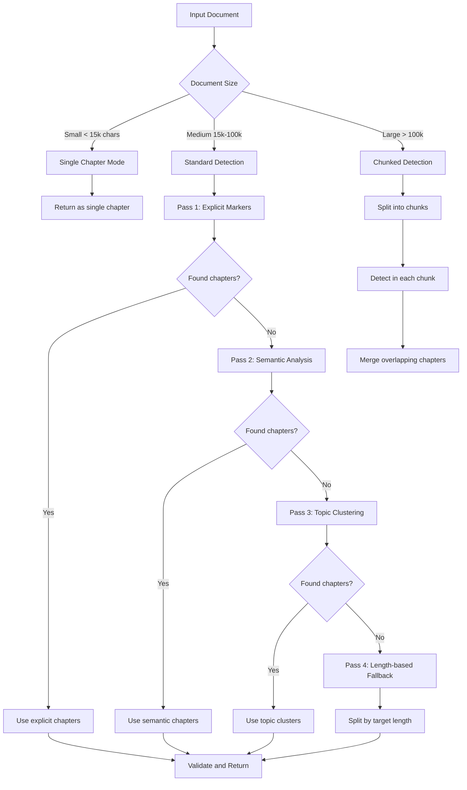
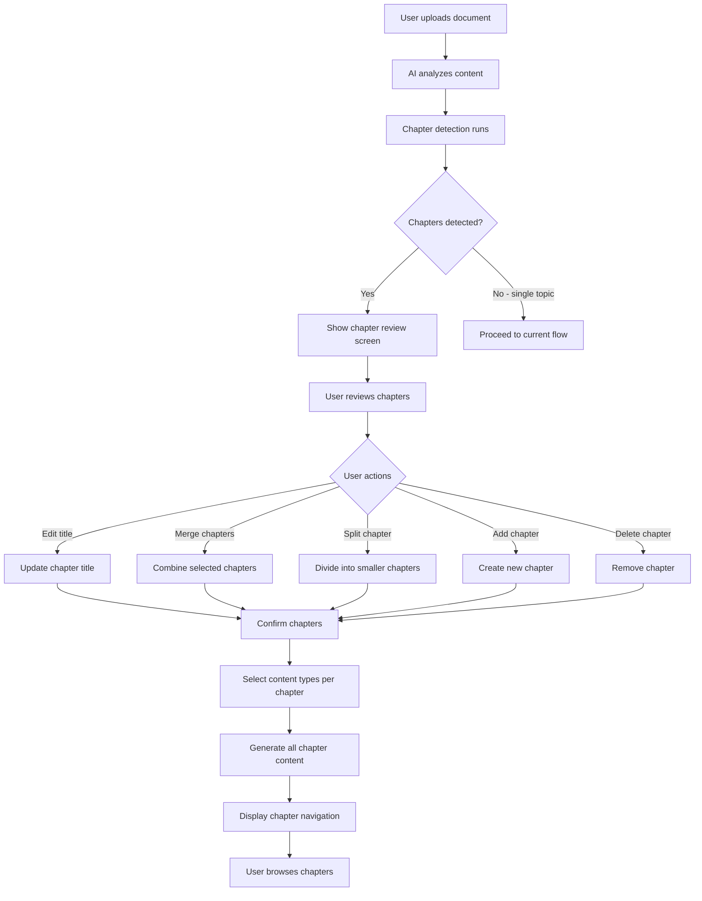

# StudyKit Chapters Feature - Architecture Plan

## Overview

Upgrade the existing StudyKit system to support a "Chapters" feature that segments uploaded documents into logical chapters using LlamaCloud context analysis. Each chapter will have its own complete set of study materials (quizzes, flashcards, mindmaps, and all 4 note templates).

## Current State Analysis

### Existing Structure
- **Content Types**: quizzes, flashcards, notes, mindmaps
- **Note Templates**: deepExplanation, cheatsheet, application, tables
- **Database Table**: `study_kit_content` with JSONB `generated_content` field
- **Context Extraction**: `extractContextFromText()` in [`ai-providers.ts`](src/lib/ai-providers.ts:693) already chunks large documents

### Current Flow
1. User uploads file or enters text
2. Content processed via `processFileContent()` 
3. Context extracted via `extractContextFromText()` - already returns array of chunks
4. AI generates content for selected types
5. Results stored in `generated_content` JSONB field

---

## Proposed Architecture

### 1. Database Schema Changes

#### Option A: Extend `generated_content` JSONB Structure (Recommended)

No schema migration required - leverage existing JSONB flexibility:

```typescript
// Current structure
{
  quizzes: [...],
  flashcards: [...],
  notes: {
    deepExplanation: "...",
    cheatsheet: "...",
    application: "...",
    tables: "..."
  },
  mindmaps: {...}
}

// New chapters-enabled structure
{
  chapters: [
    {
      id: "ch_1",
      title: "Chapter 1: Introduction to...",
      summary: "Brief overview of chapter content",
      sourceContext: "Extracted context for this chapter...",
      quizzes: [...],
      flashcards: [...],
      notes: {
        deepExplanation: "...",
        cheatsheet: "...",
        application: "...",
        tables: "..."
      },
      mindmaps: {...}
    },
    {
      id: "ch_2",
      title: "Chapter 2: Advanced Concepts",
      // ... same structure
    }
  ],
  // Keep global content for backward compatibility
  globalQuizzes: [...],
  globalFlashcards: [...],
  // Metadata
  chaptersMeta: {
    detectedAt: "2026-02-12T...",
    detectionModel: "llama-3.3-70b",
    userModified: true
  }
}
```

#### Option B: New `study_kit_chapters` Table (Alternative)

```sql
CREATE TABLE study_kit_chapters (
  id UUID PRIMARY KEY DEFAULT gen_random_uuid(),
  study_kit_id UUID REFERENCES study_kit_content(id) ON DELETE CASCADE,
  chapter_number INT NOT NULL,
  title TEXT NOT NULL,
  summary TEXT,
  source_context TEXT,
  generated_content JSONB NOT NULL,
  created_at TIMESTAMP WITH TIME ZONE DEFAULT NOW()
);

CREATE INDEX idx_chapters_study_kit ON study_kit_chapters(study_kit_id);
```

**Recommendation**: Use Option A (JSONB extension) for faster implementation and backward compatibility.

---

### 2. API Endpoint Modifications

#### A. New Endpoint: `/api/study-kit/detect-chapters`

```typescript
// POST /api/study-kit/detect-chapters
// Request
{
  fileContent?: string,  // Base64 encoded file
  fileName?: string,
  fileType?: string,
  textPrompt?: string
}

// Response
{
  chapters: [
    {
      id: "temp_ch_1",
      title: "Suggested Title",
      summary: "What this chapter covers",
      estimatedPages: "1-15",
      keyTopics: ["topic1", "topic2"],
      sourceContext: "Extracted text segment..."
    },
    // ... more chapters
  ],
  totalChapters: 3,
  documentTitle: "Inferred Document Title"
}
```

#### B. Modified Endpoint: `/api/study-kit/generate`

Add chapter support to existing generation:

```typescript
// Extended request body
{
  prompt?: string,
  contentTypes: string[],
  fileName?: string,
  fileContent?: string,
  fileType?: string,
  
  // NEW: Chapter-specific fields
  chapters?: [
    {
      id: "ch_1",
      title: "Chapter Title",
      sourceContext: "Context for generation...",
      userModified: boolean  // Track if user changed AI suggestion
    }
  ],
  generatePerChapter: boolean,  // Toggle for chapter vs global generation
  contentTypesPerChapter: string[]  // Which types to generate per chapter
}
```

#### C. New Endpoint: `/api/study-kit/generate-chapter`

For generating content for a single chapter (on-demand):

```typescript
// POST /api/study-kit/generate-chapter
{
  kitId: string,
  chapterId: string,
  contentTypes: string[]  // Which types to generate
}
```

---

### 3. Chapter Detection Logic

#### Enhanced `extractContextFromText()` Function

```typescript
// In src/lib/ai-providers.ts

interface DetectedChapter {
  id: string;
  title: string;
  summary: string;
  keyTopics: string[];
  sourceContext: string;
  startOffset: number;
  endOffset: number;
  confidence: number;  // 0-1 score for detection quality
  detectionMethod: 'explicit' | 'semantic' | 'fallback';  // How chapter was detected
}

export async function detectChaptersFromText(
  text: string,
  documentTitle?: string
): Promise<DetectedChapter[]> {
  // Step 1: Use AI to identify chapter boundaries
  const chapterDetectionPrompt = `
    Analyze this document and identify logical chapter/section divisions.
    
    For each chapter, provide:
    1. A descriptive title
    2. A brief summary (2-3 sentences)
    3. Key topics covered
    4. The text segment that belongs to this chapter
    
    Document text:
    ${text}
    
    Output as JSON array:
    [{
      "title": "Chapter Title",
      "summary": "Brief summary",
      "keyTopics": ["topic1", "topic2"],
      "textSegment": "The actual text content..."
    }]
  `;
  
  // Step 2: Parse AI response into structured chapters
  // Step 3: Validate and clean chapter boundaries
  // Step 4: Return structured chapter data
}
```

---

### Chapter Detection Algorithm - Detailed Specification

#### Detection Strategy Overview

The chapter detection algorithm uses a **multi-pass approach** with fallback strategies:



#### Pass 1: Explicit Chapter Markers Detection

Detects formal chapter/section headings using pattern matching:

```typescript
interface ExplicitMarkerConfig {
  patterns: RegExp[];
  confidence: number;
}

const EXPLICIT_MARKERS: ExplicitMarkerConfig[] = [
  // Standard chapter headings
  {
    patterns: [
      /^chapter\s+\d+[.:]?\s*.+$/gim,
      /^unit\s+\d+[.:]?\s*.+$/gim,
      /^module\s+\d+[.:]?\s*.+$/gim,
      /^part\s+\d+[.:]?\s*.+$/gim,
      /^section\s+\d+[.:]?\s*.+$/gim,
    ],
    confidence: 0.95
  },
  // Numbered sections
  {
    patterns: [
      /^\d+\.\s+[A-Z][^.]+$/gm,           // "1. Introduction"
      /^\d+\.\d+\s+[A-Z][^.]+$/gm,        // "1.1 Background"
      /^Step\s+\d+[.:]?\s*.+$/gim,        // "Step 1: Setup"
    ],
    confidence: 0.85
  },
  // Semantic headings (common in textbooks)
  {
    patterns: [
      /^introduction\s*$/gim,
      /^conclusion\s*$/gim,
      /^summary\s*$/gim,
      /^overview\s*$/gim,
      /^background\s*$/gim,
      /^methodology\s*$/gim,
      /^results\s*$/gim,
      /^discussion\s*$/gim,
      /^references\s*$/gim,
      /^appendix\s*.*/gim,
    ],
    confidence: 0.75
  }
];

function detectExplicitMarkers(text: string): DetectedChapter[] | null {
  const matches: Array<{ pattern: RegExp; match: RegExpMatchArray; confidence: number }> = [];
  
  for (const config of EXPLICIT_MARKERS) {
    for (const pattern of config.patterns) {
      const found = [...text.matchAll(pattern)];
      if (found.length >= 2) {  // Need at least 2 markers for valid segmentation
        matches.push(...found.map(m => ({
          pattern,
          match: m,
          confidence: config.confidence
        })));
      }
    }
  }
  
  if (matches.length < 2) return null;
  
  // Sort by position and create chapters
  matches.sort((a, b) => a.match.index! - b.match.index!);
  
  return matches.map((m, i) => {
    const startPos = m.match.index!;
    const endPos = matches[i + 1]?.match.index ?? text.length;
    return {
      id: `ch_${i + 1}`,
      title: m.match[0].trim(),
      summary: '',  // Extracted in post-processing
      keyTopics: [],
      sourceContext: text.slice(startPos, endPos),
      startOffset: startPos,
      endOffset: endPos,
      confidence: m.confidence,
      detectionMethod: 'explicit' as const
    };
  });
}
```

#### Pass 2: Semantic Analysis (AI-Powered)

When explicit markers aren't found, use AI to identify semantic boundaries with a sophisticated prompt:

```typescript
interface SemanticBoundary {
  position: number;
  reason: string;
  confidence: number;
}

async function detectSemanticBoundaries(
  text: string,
  maxChapters: number = 8
): Promise<DetectedChapter[] | null> {
  // For large documents, analyze in chunks
  const chunkSize = 20000;
  const chunks: string[] = [];
  
  for (let i = 0; i < text.length; i += chunkSize) {
    chunks.push(text.slice(i, i + chunkSize));
  }
  
  const boundaryPrompt = buildSophisticatedDetectionPrompt(text, chunks, maxChapters);
  
  try {
    const result = await generateWithRetry({
      prompt: boundaryPrompt,
      systemPrompt: SEMANTIC_DETECTION_SYSTEM_PROMPT,
      temperature: 0.2,
      maxTokens: 4000,
      model: 'llama-3.3-70b-versatile'
    });
    
    const parsed = parseDetectionResponse(result.text);
    
    if (!parsed?.chapters || parsed.chapters.length < 1) {
      return null;
    }
    
    return parsed.chapters.map((ch: any, i: number) => ({
      id: `ch_${i + 1}`,
      title: ch.title,
      summary: ch.summary,
      keyTopics: ch.keyTopics || [],
      sourceContext: ch.contentPreview || text.slice(ch.startPosition, ch.endPosition),
      startOffset: ch.startPosition || 0,
      endOffset: ch.endPosition || text.length,
      confidence: ch.confidence || 0.7,
      detectionMethod: 'semantic' as const
    }));
  } catch (error) {
    console.error('Semantic detection failed:', error);
    return null;
  }
}

const SEMANTIC_DETECTION_SYSTEM_PROMPT = `
You are an expert Document Structure Analyst with deep expertise in:
- Academic writing conventions and structures
- Technical documentation organization
- Pedagogical content sequencing
- Information architecture and taxonomy

Your specialty is analyzing unstructured or semi-structured documents and identifying 
logical knowledge boundaries that would help learners organize their study.

You think like a master educator who understands how students learn and how 
information should be chunked for optimal comprehension and retention.
`;

function buildSophisticatedDetectionPrompt(
  fullText: string,
  chunks: string[],
  maxChapters: number
): string {
  const documentStats = analyzeDocumentStatistics(fullText);
  
  return `
# DOCUMENT STRUCTURE ANALYSIS TASK

You are analyzing a document to identify optimal chapter/section boundaries for educational purposes.

## DOCUMENT METADATA
- Total Length: ${fullText.length.toLocaleString()} characters
- Estimated Pages: ${Math.ceil(fullText.length / 3000)}
- Document Type: ${detectDocumentType(fullText)}
- Chunk Count: ${chunks.length}

## DOCUMENT STATISTICS
${documentStats}

## YOUR ANALYTICAL FRAMEWORK

### Step 1: Document Type Identification
First, determine what kind of document this is:
- **Textbook/Educational**: Structured for learning, usually has clear progression
- **Research Paper**: IMRaD structure (Introduction, Methods, Results, Discussion)
- **Technical Guide**: Task-oriented, often procedural
- **Article/Essay**: Argument-driven, thematic organization
- **Reference Material**: Alphabetical or categorical organization
- **Narrative/Case Study**: Story-driven with plot points
- **Mixed/Hybrid**: Multiple document types combined

### Step 2: Structural Pattern Recognition
Identify the underlying structure:
- **Hierarchical**: Main topics with subtopics (tree structure)
- **Sequential**: Step-by-step progression (linear)
- **Comparative**: Multiple perspectives compared (parallel)
- **Problem-Solution**: Issues followed by resolutions
- **Chronological**: Time-based organization
- **Spiral**: Topics revisited with increasing depth

### Step 3: Boundary Detection Criteria
Mark chapter boundaries where you identify ANY of these signals:

**STRONG SIGNALS (Confidence 0.8-1.0):**
- Explicit section headers or numbered divisions
- Complete topic shift with new terminology
- Transition between theoretical and practical content
- New case study, example, or scenario introduction
- Methodology change in technical content
- Shift from exposition to analysis

**MODERATE SIGNALS (Confidence 0.5-0.7):**
- Paragraph clusters with cohesive sub-theme
- Introduction of new key terms or concepts
- Change in writing style or tone
- Transition from general to specific (or vice versa)
- New argument or perspective in persuasive content

**WEAK SIGNALS (Confidence 0.3-0.4):**
- Minor topic pivots within larger themes
- Brief tangential discussions
- Transitional paragraphs

### Step 4: Chapter Quality Validation
For each proposed chapter, verify:
1. **Coherence**: Does the content form a unified whole?
2. **Completeness**: Does it have a clear beginning, middle, and end?
3. **Independence**: Can it be understood without other chapters?
4. **Educational Value**: Does it represent a learnable unit?
5. **Appropriate Size**: Is it neither too brief nor too extensive?

## DOCUMENT CONTENT

${chunks.map((chunk, i) => `
=== CHUNK ${i + 1} of ${chunks.length} (Characters ${i * 20000} - ${Math.min((i + 1) * 20000, fullText.length)}) ===
${chunk}
`).join('\n')}

## REQUIRED OUTPUT FORMAT

Provide your analysis as a JSON object with this exact structure:

\`\`\`json
{
  "documentAnalysis": {
    "detectedType": "textbook|research|technical|article|reference|narrative|mixed",
    "structuralPattern": "hierarchical|sequential|comparative|problem-solution|chronological|spiral",
    "overallTheme": "One sentence describing the document's main subject",
    "targetAudience": "Who this document is written for",
    "complexity": "beginner|intermediate|advanced|mixed"
  },
  
  "chapters": [
    {
      "chapterNumber": 1,
      "title": "Descriptive Chapter Title (Not generic like 'Introduction')",
      "summary": "2-3 sentences explaining what this chapter covers and why it matters",
      "keyTopics": ["topic1", "topic2", "topic3"],
      "learningObjectives": ["What the reader will learn 1", "What the reader will learn 2"],
      "startPosition": 0,
      "endPosition": 5000,
      "contentPreview": "First 200 characters of this chapter's content...",
      "confidence": 0.95,
      "boundaryReason": "Why this is a chapter boundary",
      "relationshipToPrevious": null,
      "relationshipToNext": "Builds foundation for [next chapter topic]"
    },
    {
      "chapterNumber": 2,
      "title": "Next Chapter Title",
      "summary": "...",
      "keyTopics": ["..."],
      "learningObjectives": ["..."],
      "startPosition": 5000,
      "endPosition": 12000,
      "contentPreview": "...",
      "confidence": 0.85,
      "boundaryReason": "Topic shifts from X to Y",
      "relationshipToPrevious": "Extends the concepts from Chapter 1 by...",
      "relationshipToNext": "..."
    }
  ],
  
  "chapterRelationships": {
    "overallFlow": "Describe how chapters connect to form a coherent learning path",
    "prerequisites": {
      "chapter2": ["chapter1"],
      "chapter3": ["chapter1", "chapter2"]
    }
  },
  
  "recommendations": {
    "suggestedStudyOrder": [1, 2, 3, 4],
    "optionalChapters": [],
    "coreChapters": [1, 2, 3],
    "estimatedStudyTime": {
      "chapter1": "30 minutes",
      "chapter2": "45 minutes"
    }
  }
}
\`\`\`

## CRITICAL RULES

1. **Position Accuracy**: startPosition and endPosition must be accurate character positions
2. **No Overlaps**: Chapters must not overlap - each position belongs to exactly one chapter
3. **Complete Coverage**: All document content must be assigned to a chapter
4. **Meaningful Divisions**: Each chapter should represent a coherent, learnable unit
5. **Educational Focus**: Optimize for student comprehension, not just document structure
6. **Title Quality**: Titles should be descriptive and engaging, not generic
7. **Relationship Mapping**: Show how chapters build on each other
8. **Confidence Honesty**: Only assign high confidence to clear, unambiguous boundaries

## EDGE CASE HANDLING

- If document is too short for multiple chapters, return single chapter with confidence 1.0
- If no clear boundaries exist, create 2-3 balanced chapters based on content themes
- If document has explicit sections, respect them but validate they make educational sense
- If chapters would be very unbalanced, note this in recommendations

Analyze the document now and provide your structured output.
`;
}

function analyzeDocumentStatistics(text: string): string {
  const paragraphs = text.split(/\n\n+/).length;
  const sentences = text.split(/[.!?]+/).length;
  const words = text.split(/\s+/).length;
  const avgWordLength = text.replace(/\s/g, '').length / words;
  const uniqueWords = new Set(text.toLowerCase().split(/\s+/)).size;
  const vocabularyRichness = uniqueWords / words;
  
  // Detect potential section headers
  const potentialHeaders = text.match(/^[A-Z][A-Za-z\s]+$/gm) || [];
  const numberedSections = text.match(/^\d+\.\s+.+$/gm) || [];
  
  return `
- Paragraphs: ${paragraphs}
- Sentences: ${sentences}
- Words: ${words.toLocaleString()}
- Average Word Length: ${avgWordLength.toFixed(1)} characters
- Unique Words: ${uniqueWords.toLocaleString()}
- Vocabulary Richness: ${(vocabularyRichness * 100).toFixed(1)}%
- Potential Headers Detected: ${potentialHeaders.length}
- Numbered Sections: ${numberedSections.length}
`;
}

function detectDocumentType(text: string): string {
  const indicators = {
    textbook: /chapter|unit|lesson|exercise|learning objective|key terms|review questions/gi,
    research: /abstract|methodology|literature review|hypothesis|findings|discussion|references/gi,
    technical: /step 1|installation|configuration|troubleshooting|api|usage|example/gi,
    article: /introduction|conclusion|furthermore|moreover|in conclusion|to summarize/gi,
    reference: /see also|related topics|alphabetical|index|appendix|glossary/gi
  };
  
  const scores: Record<string, number> = {};
  
  for (const [type, pattern] of Object.entries(indicators)) {
    const matches = text.match(pattern) || [];
    scores[type] = matches.length;
  }
  
  const maxType = Object.entries(scores).reduce((a, b) => 
    a[1] > b[1] ? a : b
  )[0];
  
  return scores[maxType] > 5 ? maxType : 'unknown';
}

function parseDetectionResponse(responseText: string): any {
  try {
    // Try direct JSON parse
    const jsonMatch = responseText.match(/```json\s*([\s\S]*?)\s*```/);
    if (jsonMatch) {
      return JSON.parse(jsonMatch[1]);
    }
    
    // Try finding JSON object directly
    const objectStart = responseText.indexOf('{');
    const objectEnd = responseText.lastIndexOf('}');
    if (objectStart !== -1 && objectEnd !== -1) {
      return JSON.parse(responseText.slice(objectStart, objectEnd + 1));
    }
    
    return null;
  } catch (error) {
    console.error('Failed to parse detection response:', error);
    return null;
  }
}
```

---

### Example Detection Outputs

#### Example 1: Machine Learning Textbook

**Input Document (Excerpt):**
```
Chapter 1: Introduction to Machine Learning

Machine learning is a subset of artificial intelligence that enables 
systems to learn and improve from experience without being explicitly 
programmed. In this chapter, we explore the fundamental concepts...

[15 pages of content about ML basics, history, types of learning]

Chapter 2: Supervised Learning Algorithms

Supervised learning is the most common type of machine learning. 
In this paradigm, the algorithm learns from labeled training data...

[25 pages about regression, classification, decision trees, SVMs]

Chapter 3: Neural Networks and Deep Learning

Neural networks are computing systems inspired by biological neural 
networks in the human brain. These systems learn to perform tasks...

[30 pages about perceptrons, backpropagation, CNNs, RNNs]

Chapter 4: Practical Applications

Having established the theoretical foundations, we now turn to 
real-world applications. Machine learning powers countless 
applications we use daily...

[20 pages about deployment, ethics, case studies]
```

**Expected AI Output:**
```json
{
  "documentAnalysis": {
    "detectedType": "textbook",
    "structuralPattern": "hierarchical",
    "overallTheme": "Comprehensive introduction to machine learning concepts, algorithms, and applications",
    "targetAudience": "Students and practitioners new to machine learning",
    "complexity": "intermediate"
  },
  
  "chapters": [
    {
      "chapterNumber": 1,
      "title": "Foundations of Machine Learning",
      "summary": "Establishes the conceptual groundwork for machine learning, covering its definition, historical development, and the three main paradigms: supervised, unsupervised, and reinforcement learning. This chapter provides essential context for understanding subsequent material.",
      "keyTopics": [
        "Definition and scope of ML",
        "Historical evolution",
        "Types of machine learning",
        "Key terminology",
        "When to use ML"
      ],
      "learningObjectives": [
        "Define machine learning and distinguish it from traditional programming",
        "Identify appropriate use cases for different ML paradigms",
        "Understand the historical context and major milestones in ML development"
      ],
      "startPosition": 0,
      "endPosition": 45000,
      "contentPreview": "Chapter 1: Introduction to Machine Learning\n\nMachine learning is a subset of artificial intelligence...",
      "confidence": 0.98,
      "boundaryReason": "Explicit chapter heading with clear topic introduction",
      "relationshipToPrevious": null,
      "relationshipToNext": "Establishes foundational concepts needed for understanding specific algorithms in Chapter 2"
    },
    {
      "chapterNumber": 2,
      "title": "Supervised Learning: Theory and Algorithms",
      "summary": "Deep dive into supervised learning, the most widely used ML paradigm. Covers regression and classification algorithms including linear models, decision trees, and support vector machines, with practical examples and mathematical foundations.",
      "keyTopics": [
        "Regression algorithms",
        "Classification techniques",
        "Decision trees",
        "Support Vector Machines",
        "Model evaluation metrics"
      ],
      "learningObjectives": [
        "Implement basic regression and classification algorithms",
        "Choose appropriate algorithms for different problem types",
        "Evaluate model performance using appropriate metrics"
      ],
      "startPosition": 45000,
      "endPosition": 120000,
      "contentPreview": "Chapter 2: Supervised Learning Algorithms\n\nSupervised learning is the most common type...",
      "confidence": 0.97,
      "boundaryReason": "Explicit chapter heading marking shift from general concepts to specific algorithm families",
      "relationshipToPrevious": "Builds on the ML paradigm introduction from Chapter 1 to explore supervised learning in depth",
      "relationshipToNext": "Provides algorithmic foundation that Chapter 3 extends to neural architectures"
    },
    {
      "chapterNumber": 3,
      "title": "Neural Networks and Deep Learning",
      "summary": "Introduces neural network architectures from basic perceptrons to deep learning models. Covers the mathematical principles of backpropagation, convolutional neural networks for image processing, and recurrent networks for sequential data.",
      "keyTopics": [
        "Perceptrons and activation functions",
        "Backpropagation algorithm",
        "Convolutional Neural Networks",
        "Recurrent Neural Networks",
        "Deep learning frameworks"
      ],
      "learningObjectives": [
        "Explain how neural networks learn through backpropagation",
        "Design appropriate network architectures for different data types",
        "Implement basic neural networks using modern frameworks"
      ],
      "startPosition": 120000,
      "endPosition": 210000,
      "contentPreview": "Chapter 3: Neural Networks and Deep Learning\n\nNeural networks are computing systems...",
      "confidence": 0.97,
      "boundaryReason": "Explicit chapter heading with transition to advanced architectures",
      "relationshipToPrevious": "Extends supervised learning concepts to neural network implementations",
      "relationshipToNext": "Provides theoretical knowledge applied in practical scenarios in Chapter 4"
    },
    {
      "chapterNumber": 4,
      "title": "Real-World Applications and Deployment",
      "summary": "Bridges theory and practice by examining how machine learning is deployed in production systems. Covers the ML pipeline, ethical considerations, bias mitigation, and detailed case studies from healthcare, finance, and technology sectors.",
      "keyTopics": [
        "ML pipeline and MLOps",
        "Model deployment strategies",
        "Ethics and bias in ML",
        "Case studies: Healthcare, Finance, Tech",
        "Future trends and challenges"
      ],
      "learningObjectives": [
        "Design an end-to-end ML pipeline for production",
        "Identify and mitigate common sources of bias in ML systems",
        "Apply ML techniques to real-world problems across industries"
      ],
      "startPosition": 210000,
      "endPosition": 270000,
      "contentPreview": "Chapter 4: Practical Applications\n\nHaving established the theoretical foundations...",
      "confidence": 0.96,
      "boundaryReason": "Explicit chapter heading marking transition from theory to practice",
      "relationshipToPrevious": "Applies the neural network and ML knowledge from previous chapters to real scenarios",
      "relationshipToNext": null
    }
  ],
  
  "chapterRelationships": {
    "overallFlow": "The textbook follows a progressive structure: foundational concepts → core algorithms → advanced architectures → practical applications. Each chapter builds systematically on previous material, creating a complete learning path from novice to practitioner.",
    "prerequisites": {
      "chapter2": ["chapter1"],
      "chapter3": ["chapter1", "chapter2"],
      "chapter4": ["chapter1", "chapter2", "chapter3"]
    }
  },
  
  "recommendations": {
    "suggestedStudyOrder": [1, 2, 3, 4],
    "optionalChapters": [],
    "coreChapters": [1, 2, 3, 4],
    "estimatedStudyTime": {
      "chapter1": "2-3 hours",
      "chapter2": "4-5 hours",
      "chapter3": "5-6 hours",
      "chapter4": "3-4 hours"
    }
  }
}
```

---

#### Example 2: Research Paper (IMRaD Structure)

**Input Document (Excerpt):**
```
Abstract

This study investigates the impact of remote work on employee 
productivity and well-being during the COVID-19 pandemic...

Introduction

The global shift to remote work represents one of the most 
significant changes to work arrangements in modern history...

Literature Review

Previous research on remote work has produced mixed findings...

Methodology

Study Design and Participants
We conducted a longitudinal survey of 1,500 knowledge workers...

Data Collection
Online surveys were administered at three time points...

Results

Productivity Measures
Our analysis revealed a significant increase in self-reported...

Well-being Indicators
Contrary to expectations, we found that...

Discussion

The findings of this study challenge conventional assumptions...

Limitations and Future Research
Several limitations should be acknowledged...

Conclusion

This research contributes to our understanding of...

References

Anderson, J. (2020). Remote work trends...
```

**Expected AI Output:**
```json
{
  "documentAnalysis": {
    "detectedType": "research",
    "structuralPattern": "sequential",
    "overallTheme": "Empirical investigation of remote work's effects on employee productivity and well-being",
    "targetAudience": "Academic researchers, HR professionals, organizational leaders",
    "complexity": "advanced"
  },
  
  "chapters": [
    {
      "chapterNumber": 1,
      "title": "Introduction and Literature Review",
      "summary": "Establishes the research context by examining the global shift to remote work, reviewing prior literature with mixed findings, and identifying the research gap this study addresses. Combines traditional introduction and literature review sections.",
      "keyTopics": [
        "Remote work trends",
        "COVID-19 impact on work",
        "Prior research findings",
        "Research gap identification",
        "Study objectives"
      ],
      "learningObjectives": [
        "Understand the context and significance of remote work research",
        "Identify gaps in existing literature that this study addresses"
      ],
      "startPosition": 0,
      "endPosition": 15000,
      "contentPreview": "Abstract\n\nThis study investigates the impact of remote work...",
      "confidence": 0.92,
      "boundaryReason": "Standard research paper opening sections (Abstract through Literature Review)",
      "relationshipToPrevious": null,
      "relationshipToNext": "Sets up the research questions that the methodology section addresses"
    },
    {
      "chapterNumber": 2,
      "title": "Research Methodology",
      "summary": "Details the longitudinal survey design, participant recruitment (1,500 knowledge workers), data collection procedures across three time points, and analytical approaches. Provides full transparency for replication studies.",
      "keyTopics": [
        "Longitudinal survey design",
        "Participant sampling",
        "Data collection procedures",
        "Measurement instruments",
        "Statistical analysis methods"
      ],
      "learningObjectives": [
        "Understand the methodological approach used in this study",
        "Evaluate the validity and reliability of the research design"
      ],
      "startPosition": 15000,
      "endPosition": 28000,
      "contentPreview": "Methodology\n\nStudy Design and Participants\nWe conducted a longitudinal survey...",
      "confidence": 0.95,
      "boundaryReason": "Standard IMRaD methodology section with clear heading",
      "relationshipToPrevious": "Implements the research approach foreshadowed in the introduction",
      "relationshipToNext": "Explains how data was collected for the results presented next"
    },
    {
      "chapterNumber": 3,
      "title": "Findings and Results",
      "summary": "Presents quantitative findings on productivity measures (significant increase) and well-being indicators (unexpected findings). Includes statistical analyses, tables, and effect sizes for all major hypotheses.",
      "keyTopics": [
        "Productivity analysis",
        "Well-being measurements",
        "Statistical significance",
        "Effect sizes",
        "Subgroup analyses"
      ],
      "learningObjectives": [
        "Interpret the key findings on productivity and well-being",
        "Understand the statistical evidence supporting the conclusions"
      ],
      "startPosition": 28000,
      "endPosition": 45000,
      "contentPreview": "Results\n\nProductivity Measures\nOur analysis revealed...",
      "confidence": 0.95,
      "boundaryReason": "Standard IMRaD results section with clear heading",
      "relationshipToPrevious": "Reports findings from the methodology implementation",
      "relationshipToNext": "Provides data that the discussion section interprets"
    },
    {
      "chapterNumber": 4,
      "title": "Discussion, Implications, and Conclusion",
      "summary": "Interts findings in context of prior research, discusses theoretical and practical implications, acknowledges limitations, proposes future research directions, and summarizes key contributions. Challenges conventional assumptions about remote work.",
      "keyTopics": [
        "Findings interpretation",
        "Theoretical implications",
        "Practical recommendations",
        "Study limitations",
        "Future research directions"
      ],
      "learningObjectives": [
        "Understand how findings relate to existing knowledge",
        "Apply insights to organizational remote work policies"
      ],
      "startPosition": 45000,
      "endPosition": 58000,
      "contentPreview": "Discussion\n\nThe findings of this study challenge conventional...",
      "confidence": 0.94,
      "boundaryReason": "Standard IMRaD discussion and conclusion sections",
      "relationshipToPrevious": "Interprets and contextualizes the results from Chapter 3",
      "relationshipToNext": null
    }
  ],
  
  "chapterRelationships": {
    "overallFlow": "Follows standard IMRaD (Introduction, Methods, Results, Discussion) structure typical of empirical research papers. Each section builds logically: context → method → findings → interpretation.",
    "prerequisites": {
      "chapter2": ["chapter1"],
      "chapter3": ["chapter2"],
      "chapter4": ["chapter1", "chapter3"]
    }
  },
  
  "recommendations": {
    "suggestedStudyOrder": [1, 2, 3, 4],
    "optionalChapters": [],
    "coreChapters": [1, 3, 4],
    "estimatedStudyTime": {
      "chapter1": "20-30 minutes",
      "chapter2": "15-20 minutes",
      "chapter3": "25-35 minutes",
      "chapter4": "20-30 minutes"
    }
  }
}
```

---

#### Example 3: Technical Documentation (API Guide)

**Input Document (Excerpt):**
```
Getting Started with the EdBox API

Welcome to the EdBox API documentation. This guide will help you 
integrate EdBox's AI-powered learning features into your application...

Authentication

All API requests require authentication using Bearer tokens...
API keys can be generated from your dashboard...

Making Your First Request

Let's start with a simple example. To generate a study kit...

curl -X POST https://api.edbox.ai/v1/study-kit \
  -H "Authorization: Bearer YOUR_TOKEN" \
  -H "Content-Type: application/json" \
  -d '{"topic": "Machine Learning"}'

Study Kit Endpoints

Create Study Kit
POST /v1/study-kit
Creates a new study kit with AI-generated content...

Request Parameters:
- topic (required): The subject matter
- contentTypes (optional): Array of content types to generate

Response:
{
  "id": "kit_abc123",
  "status": "generating",
  ...
}

Get Study Kit
GET /v1/study-kit/:id
Retrieves a study kit by ID...

Flashcard Endpoints

Create Flashcards
POST /v1/flashcards
Generate flashcards from content...

Error Handling

The API uses standard HTTP status codes...
Rate limiting is applied at 100 requests per minute...

Best Practices

When integrating with EdBox API, consider these recommendations...
```

**Expected AI Output:**
```json
{
  "documentAnalysis": {
    "detectedType": "technical",
    "structuralPattern": "hierarchical",
    "overallTheme": "Comprehensive API reference for integrating EdBox learning features into third-party applications",
    "targetAudience": "Software developers and technical integrators",
    "complexity": "intermediate"
  },
  
  "chapters": [
    {
      "chapterNumber": 1,
      "title": "Getting Started and Authentication",
      "summary": "Introduction to the EdBox API with quickstart guide. Covers authentication using Bearer tokens, API key generation, and making your first API request with a practical curl example.",
      "keyTopics": [
        "API overview",
        "Authentication methods",
        "Bearer token usage",
        "API key management",
        "First request example"
      ],
      "learningObjectives": [
        "Set up authentication for API requests",
        "Make your first successful API call",
        "Understand the basic request/response pattern"
      ],
      "startPosition": 0,
      "endPosition": 8000,
      "contentPreview": "Getting Started with the EdBox API\n\nWelcome to the EdBox API documentation...",
      "confidence": 0.93,
      "boundaryReason": "Introductory section with authentication - natural starting point",
      "relationshipToPrevious": null,
      "relationshipToNext": "Provides foundation needed before using specific endpoints"
    },
    {
      "chapterNumber": 2,
      "title": "Study Kit API Reference",
      "summary": "Complete reference for Study Kit endpoints including create, retrieve, update, and delete operations. Documents all request parameters, response formats, and provides examples for each operation.",
      "keyTopics": [
        "Create Study Kit endpoint",
        "Get Study Kit endpoint",
        "Request parameters",
        "Response schemas",
        "Example requests"
      ],
      "learningObjectives": [
        "Create study kits programmatically",
        "Retrieve and manage generated content",
        "Handle study kit API responses correctly"
      ],
      "startPosition": 8000,
      "endPosition": 22000,
      "contentPreview": "Study Kit Endpoints\n\nCreate Study Kit\nPOST /v1/study-kit...",
      "confidence": 0.96,
      "boundaryReason": "Clear section header for specific endpoint group",
      "relationshipToPrevious": "Uses authentication from Chapter 1 for actual API calls",
      "relationshipToNext": "Documents core functionality that other endpoints complement"
    },
    {
      "chapterNumber": 3,
      "title": "Flashcard and Additional Endpoints",
      "summary": "Reference documentation for flashcard generation endpoints and other supplementary API features. Includes request/response specifications and integration patterns.",
      "keyTopics": [
        "Flashcard generation",
        "Additional endpoints",
        "Request formats",
        "Response handling",
        "Integration patterns"
      ],
      "learningObjectives": [
        "Generate flashcards from content",
        "Integrate multiple endpoint types",
        "Build comprehensive learning workflows"
      ],
      "startPosition": 22000,
      "endPosition": 35000,
      "contentPreview": "Flashcard Endpoints\n\nCreate Flashcards\nPOST /v1/flashcards...",
      "confidence": 0.91,
      "boundaryReason": "Distinct endpoint category with clear section header",
      "relationshipToPrevious": "Extends API capabilities beyond Study Kit endpoints",
      "relationshipToNext": "Requires error handling knowledge from Chapter 4"
    },
    {
      "chapterNumber": 4,
      "title": "Error Handling and Best Practices",
      "summary": "Comprehensive guide to API error handling, HTTP status codes, rate limiting policies, and recommended integration patterns. Essential reference for building robust applications.",
      "keyTopics": [
        "HTTP status codes",
        "Error response formats",
        "Rate limiting",
        "Retry strategies",
        "Integration best practices"
      ],
      "learningObjectives": [
        "Handle API errors gracefully",
        "Implement proper rate limit handling",
        "Follow best practices for production integrations"
      ],
      "startPosition": 35000,
      "endPosition": 42000,
      "contentPreview": "Error Handling\n\nThe API uses standard HTTP status codes...",
      "confidence": 0.89,
      "boundaryReason": "Transition from endpoint documentation to operational guidance",
      "relationshipToPrevious": "Applies to all endpoints documented in previous chapters",
      "relationshipToNext": null
    }
  ],
  
  "chapterRelationships": {
    "overallFlow": "Follows standard API documentation structure: authentication → core endpoints → additional endpoints → error handling and best practices. Designed for both sequential learning and as a reference.",
    "prerequisites": {
      "chapter2": ["chapter1"],
      "chapter3": ["chapter1"],
      "chapter4": ["chapter1"]
    }
  },
  
  "recommendations": {
    "suggestedStudyOrder": [1, 2, 3, 4],
    "optionalChapters": [3],
    "coreChapters": [1, 2, 4],
    "estimatedStudyTime": {
      "chapter1": "15-20 minutes",
      "chapter2": "30-40 minutes",
      "chapter3": "20-30 minutes",
      "chapter4": "15-20 minutes"
    }
  }
}
```

---

#### Example 4: Short/Single-Topic Document

**Input Document:**
```
The Water Cycle

The water cycle, also known as the hydrologic cycle, describes the 
continuous movement of water on, above, and below the surface of the Earth.

Water can exist in three states: liquid, solid (ice), and gas (water vapor).
The water cycle involves several key processes:

Evaporation: When the sun heats water in rivers, lakes, and oceans,
it turns into water vapor and rises into the atmosphere.

Condensation: As water vapor rises, it cools and turns back into 
liquid water droplets, forming clouds.

Precipitation: When clouds become too heavy with water droplets,
the water falls back to Earth as rain, snow, or hail.

Collection: Water collects in rivers, lakes, and oceans, where 
the cycle begins again.

This continuous process is essential for life on Earth, providing
fresh water to plants, animals, and humans.
```

**Expected AI Output:**
```json
{
  "documentAnalysis": {
    "detectedType": "article",
    "structuralPattern": "sequential",
    "overallTheme": "Educational overview of the water cycle and its key processes",
    "targetAudience": "Students learning about Earth science and natural cycles",
    "complexity": "beginner"
  },
  
  "chapters": [
    {
      "chapterNumber": 1,
      "title": "The Water Cycle: Complete Overview",
      "summary": "A concise educational piece explaining the hydrologic cycle, covering the three states of water and the four main processes: evaporation, condensation, precipitation, and collection. Suitable for introductory Earth science learning.",
      "keyTopics": [
        "Water cycle definition",
        "Three states of water",
        "Evaporation",
        "Condensation",
        "Precipitation",
        "Collection"
      ],
      "learningObjectives": [
        "Define the water cycle and explain its importance",
        "Identify and describe the four main processes of the water cycle",
        "Understand how water changes between different states"
      ],
      "startPosition": 0,
      "endPosition": 850,
      "contentPreview": "The Water Cycle\n\nThe water cycle, also known as the hydrologic cycle...",
      "confidence": 1.0,
      "boundaryReason": "Single cohesive topic - document is too short and unified to warrant division",
      "relationshipToPrevious": null,
      "relationshipToNext": null
    }
  ],
  
  "chapterRelationships": {
    "overallFlow": "Single-topic document that presents a complete, self-contained explanation of the water cycle without natural division points.",
    "prerequisites": {}
  },
  
  "recommendations": {
    "suggestedStudyOrder": [1],
    "optionalChapters": [],
    "coreChapters": [1],
    "estimatedStudyTime": {
      "chapter1": "5-10 minutes"
    }
  }
}
```

---

#### Example 5: Unstructured/Mixed Content Document

**Input Document (Excerpt):**
```
Meeting Notes - Q3 Planning Session

Attendees: Sarah, Mike, Jennifer, Carlos
Date: October 15, 2024

Agenda items discussed:
- Budget allocation for new features
- Timeline for Q4 release
- Hiring needs

Sarah mentioned that user feedback has been positive on the new UI.
The team agreed to prioritize mobile responsiveness.

---

Personal Notes

Remember to:
- Call dentist
- Pick up dry cleaning
- Review quarterly report

---

Project Alpha Technical Specification

1. Overview
Project Alpha aims to revolutionize how users interact with...

2. Architecture
The system will use a microservices architecture with...

2.1 Frontend
React-based SPA with TypeScript...

2.2 Backend
Node.js services with PostgreSQL database...

3. API Design
All endpoints will follow RESTful conventions...

---

Random Thoughts on AI

I've been thinking about how AI is changing education. The potential
for personalized learning is enormous. Imagine every student having
a tutor that adapts to their learning style...

---

Recipe: Grandma's Apple Pie

Ingredients:
- 6 cups sliced apples
- 3/4 cup sugar
...

Instructions:
1. Preheat oven to 425°F
...
```

**Expected AI Output:**
```json
{
  "documentAnalysis": {
    "detectedType": "mixed",
    "structuralPattern": "hierarchical",
    "overallTheme": "Collection of unrelated content including meeting notes, personal notes, technical specifications, essays, and recipes",
    "targetAudience": "Mixed - varies by section",
    "complexity": "mixed"
  },
  
  "chapters": [
    {
      "chapterNumber": 1,
      "title": "Meeting Notes: Q3 Planning Session",
      "summary": "Professional meeting documentation covering Q3 planning discussion including budget allocation, Q4 timeline, and hiring needs. Contains attendee list and action items related to UI improvements.",
      "keyTopics": [
        "Budget planning",
        "Q4 timeline",
        "Hiring discussion",
        "UI feedback",
        "Mobile responsiveness"
      ],
      "learningObjectives": [
        "Understand the key decisions from the Q3 planning session",
        "Identify action items and priorities for the team"
      ],
      "startPosition": 0,
      "endPosition": 450,
      "contentPreview": "Meeting Notes - Q3 Planning Session\n\nAttendees: Sarah, Mike, Jennifer, Carlos...",
      "confidence": 0.88,
      "boundaryReason": "Clear document boundary with header and separator following",
      "relationshipToPrevious": null,
      "relationshipToNext": "No relationship - distinct document type"
    },
    {
      "chapterNumber": 2,
      "title": "Personal Notes and Tasks",
      "summary": "Brief personal task list including appointments, errands, and work items. Self-contained reference note.",
      "keyTopics": [
        "Personal tasks",
        "Appointments",
        "Errands",
        "Work items"
      ],
      "learningObjectives": [
        "Track personal tasks and reminders"
      ],
      "startPosition": 450,
      "endPosition": 600,
      "contentPreview": "Personal Notes\n\nRemember to:\n- Call dentist...",
      "confidence": 0.82,
      "boundaryReason": "Clear section header with distinct content type (personal vs professional)",
      "relationshipToPrevious": "No relationship - distinct document type",
      "relationshipToNext": "No relationship - distinct document type"
    },
    {
      "chapterNumber": 3,
      "title": "Project Alpha Technical Specification",
      "summary": "Comprehensive technical specification document for Project Alpha. Covers system overview, microservices architecture (frontend and backend), and API design conventions. Professional software documentation.",
      "keyTopics": [
        "System architecture",
        "Microservices design",
        "React frontend",
        "Node.js backend",
        "PostgreSQL database",
        "RESTful API design"
      ],
      "learningObjectives": [
        "Understand Project Alpha's architectural decisions",
        "Implement frontend and backend components as specified",
        "Follow API design conventions for the project"
      ],
      "startPosition": 600,
      "endPosition": 2500,
      "contentPreview": "Project Alpha Technical Specification\n\n1. Overview\nProject Alpha aims to...",
      "confidence": 0.94,
      "boundaryReason": "Clear technical document header with numbered sections",
      "relationshipToPrevious": "No relationship - distinct document type",
      "relationshipToNext": "No relationship - distinct document type"
    },
    {
      "chapterNumber": 4,
      "title": "Reflections on AI in Education",
      "summary": "Personal essay exploring the transformative potential of AI in education, particularly around personalized learning and adaptive tutoring systems. Philosophical and forward-looking perspective.",
      "keyTopics": [
        "AI in education",
        "Personalized learning",
        "Adaptive tutoring",
        "Future of education",
        "Learning styles"
      ],
      "learningObjectives": [
        "Consider the potential impacts of AI on educational practices",
        "Reflect on personalized learning opportunities"
      ],
      "startPosition": 2500,
      "endPosition": 2900,
      "contentPreview": "Random Thoughts on AI\n\nI've been thinking about how AI is changing education...",
      "confidence": 0.79,
      "boundaryReason": "Topic shift from technical to philosophical/essay content",
      "relationshipToPrevious": "No relationship - distinct document type",
      "relationshipToNext": "No relationship - distinct document type"
    },
    {
      "chapterNumber": 5,
      "title": "Recipe: Grandma's Apple Pie",
      "summary": "Traditional apple pie recipe with complete ingredients list and step-by-step baking instructions. Practical cooking reference.",
      "keyTopics": [
        "Apple pie recipe",
        "Baking instructions",
        "Ingredients list",
        "Cooking steps"
      ],
      "learningObjectives": [
        "Follow the recipe to bake a traditional apple pie"
      ],
      "startPosition": 2900,
      "endPosition": 3200,
      "contentPreview": "Recipe: Grandma's Apple Pie\n\nIngredients:\n- 6 cups sliced apples...",
      "confidence": 0.91,
      "boundaryReason": "Clear recipe header with distinct content type",
      "relationshipToPrevious": "No relationship - distinct document type",
      "relationshipToNext": null
    }
  ],
  
  "chapterRelationships": {
    "overallFlow": "This is a mixed-content document with no coherent overall narrative. Each section is independent and unrelated. Users should treat each chapter as a standalone document.",
    "prerequisites": {}
  },
  
  "recommendations": {
    "suggestedStudyOrder": [1, 2, 3, 4, 5],
    "optionalChapters": [2, 4, 5],
    "coreChapters": [1, 3],
    "estimatedStudyTime": {
      "chapter1": "5 minutes",
      "chapter2": "2 minutes",
      "chapter3": "15-20 minutes",
      "chapter4": "5 minutes",
      "chapter5": "10 minutes"
    },
    "notes": "Document contains mixed content types with no thematic connection. Consider separating into distinct study kits for better organization."
  }
}
```

#### Pass 3: Topic Clustering (Statistical Approach)

When AI detection fails or returns low confidence, use statistical topic clustering:

```typescript
interface TopicCluster {
  keywords: string[];
  centroid: number;
  segments: TextSegment[];
}

interface TextSegment {
  text: string;
  position: number;
  keywords: string[];
}

async function detectTopicClusters(text: string): Promise<DetectedChapter[] | null> {
  // Step 1: Split text into paragraphs/segments
  const segments = text
    .split(/\n\n+/)
    .filter(s => s.trim().length > 100)
    .map((s, i, arr) => ({
      text: s,
      position: arr.slice(0, i).join('\n\n').length,
      keywords: [] as string[]
    }));
  
  if (segments.length < 5) return null;
  
  // Step 2: Extract keywords for each segment using TF-IDF-like scoring
  const allWords = segments.flatMap(s => 
    s.text.toLowerCase().split(/\s+/).filter(w => w.length > 4)
  );
  const wordFreq = new Map<string, number>();
  allWords.forEach(w => wordFreq.set(w, (wordFreq.get(w) ?? 0) + 1));
  
  segments.forEach(seg => {
    const words = seg.text.toLowerCase().split(/\s+/).filter(w => w.length > 4);
    const uniqueWords = [...new Set(words)];
    // Score by uniqueness to this segment
    seg.keywords = uniqueWords
      .filter(w => (wordFreq.get(w) ?? 0) < allWords.length * 0.1)  // Not too common
      .slice(0, 10);
  });
  
  // Step 3: Detect topic shifts using keyword overlap
  const topicShifts: number[] = [];
  
  for (let i = 1; i < segments.length; i++) {
    const prevKeywords = new Set(segments[i - 1].keywords);
    const currKeywords = new Set(segments[i].keywords);
    const overlap = [...prevKeywords].filter(k => currKeywords.has(k)).length;
    const overlapRatio = overlap / Math.max(prevKeywords.size, currKeywords.size);
    
    // Low overlap indicates topic shift
    if (overlapRatio < 0.3) {
      topicShifts.push(segments[i].position);
    }
  }
  
  if (topicShifts.length < 1) return null;
  
  // Step 4: Create chapters from topic shifts
  const boundaries = [0, ...topicShifts, text.length];
  
  return boundaries.slice(0, -1).map((start, i) => {
    const end = boundaries[i + 1];
    const chapterSegments = segments.filter(s => s.position >= start && s.position < end);
    const allKeywords = [...new Set(chapterSegments.flatMap(s => s.keywords))].slice(0, 5);
    
    return {
      id: `ch_${i + 1}`,
      title: `Topic: ${allKeywords.slice(0, 3).join(', ')}`,
      summary: `Covers topics related to: ${allKeywords.join(', ')}`,
      keyTopics: allKeywords,
      sourceContext: text.slice(start, end),
      startOffset: start,
      endOffset: end,
      confidence: 0.5,
      detectionMethod: 'semantic' as const
    };
  });
}
```

#### Pass 4: Length-Based Fallback

When all other methods fail, create balanced chapters by length:

```typescript
function createLengthBasedChapters(
  text: string,
  targetChapterLength: number = 15000
): DetectedChapter[] {
  const totalLength = text.length;
  const numChapters = Math.max(1, Math.ceil(totalLength / targetChapterLength));
  const chapterLength = Math.ceil(totalLength / numChapters);
  
  const chapters: DetectedChapter[] = [];
  
  for (let i = 0; i < numChapters; i++) {
    const start = i * chapterLength;
    const end = Math.min((i + 1) * chapterLength, totalLength);
    
    // Try to find a good break point (paragraph boundary)
    let adjustedEnd = end;
    if (end < totalLength) {
      const searchStart = Math.max(start, end - 500);
      const searchText = text.slice(searchStart, end + 500);
      const paragraphBreak = searchText.lastIndexOf('\n\n');
      if (paragraphBreak > 0) {
        adjustedEnd = searchStart + paragraphBreak;
      }
    }
    
    chapters.push({
      id: `ch_${i + 1}`,
      title: `Section ${i + 1}`,
      summary: `Content from document section ${i + 1}`,
      keyTopics: [],
      sourceContext: text.slice(start, adjustedEnd),
      startOffset: start,
      endOffset: adjustedEnd,
      confidence: 0.3,
      detectionMethod: 'fallback' as const
    });
  }
  
  return chapters;
}
```

#### Main Detection Orchestrator

```typescript
export async function detectChapters(
  text: string,
  options: {
    minChapters?: number;
    maxChapters?: number;
    minChapterLength?: number;
    preferExplicit?: boolean;
  } = {}
): Promise<DetectedChapter[]> {
  const {
    minChapters = 1,
    maxChapters = 10,
    minChapterLength = 3000,
    preferExplicit = true
  } = options;
  
  // Edge Case 1: Empty or very short text
  if (!text?.trim() || text.length < minChapterLength) {
    return [{
      id: 'ch_1',
      title: 'Complete Document',
      summary: 'The entire document content',
      keyTopics: [],
      sourceContext: text,
      startOffset: 0,
      endOffset: text.length,
      confidence: 1.0,
      detectionMethod: 'fallback'
    }];
  }
  
  // Edge Case 2: Very long document - use chunked detection
  if (text.length > 100000) {
    return detectChaptersForLargeDocument(text, options);
  }
  
  // Pass 1: Try explicit markers
  if (preferExplicit) {
    const explicitChapters = detectExplicitMarkers(text);
    if (explicitChapters && explicitChapters.length >= minChapters) {
      return postProcessChapters(explicitChapters, text, minChapterLength);
    }
  }
  
  // Pass 2: Try semantic analysis
  const semanticChapters = await detectSemanticBoundaries(text, maxChapters);
  if (semanticChapters && semanticChapters.length >= minChapters) {
    return postProcessChapters(semanticChapters, text, minChapterLength);
  }
  
  // Pass 3: Try topic clustering
  const clusterChapters = await detectTopicClusters(text);
  if (clusterChapters && clusterChapters.length >= minChapters) {
    return postProcessChapters(clusterChapters, text, minChapterLength);
  }
  
  // Pass 4: Fallback to length-based
  const fallbackChapters = createLengthBasedChapters(text);
  return postProcessChapters(fallbackChapters, text, minChapterLength);
}
```

#### Edge Cases Handling

| Edge Case | Detection | Resolution |
|-----------|-----------|------------|
| **Empty document** | `text.length === 0` | Return error, no chapters |
| **Very short document** | `text.length < 3000` | Single chapter with full content |
| **No clear structure** | All passes return null/low confidence | Length-based fallback |
| **Too many detected chapters** | `> maxChapters` | Merge smallest adjacent chapters |
| **Too few detected chapters** | `< minChapters` | Return as single chapter |
| **Overlapping chapters** | Boundary positions conflict | Adjust boundaries to midpoints |
| **Very long single chapter** | `> 50% of document` | Re-run detection on that segment |
| **Unbalanced chapters** | Smallest `< 10% of largest` | Merge small chapters with neighbors |
| **Non-text content** | Code, tables, formulas dominant | Detect by content type, treat as single |
| **Multi-language document** | Language detection varies | Split by language boundaries |
| **Corrupted AI response** | JSON parse fails | Fall through to next detection pass |

#### Post-Processing Functions

```typescript
function postProcessChapters(
  chapters: DetectedChapter[],
  fullText: string,
  minLength: number
): DetectedChapter[] {
  // 1. Merge too-small chapters
  let merged = mergeSmallChapters(chapters, minLength);
  
  // 2. Extract summaries for chapters missing them
  merged = await enrichChapterSummaries(merged);
  
  // 3. Extract key topics using AI
  merged = await extractChapterTopics(merged);
  
  // 4. Validate chapter boundaries don't overlap
  merged = fixOverlappingBoundaries(merged, fullText);
  
  // 5. Assign final IDs
  return merged.map((ch, i) => ({
    ...ch,
    id: `ch_${i + 1}`
  }));
}

function mergeSmallChapters(
  chapters: DetectedChapter[],
  minLength: number
): DetectedChapter[] {
  const result: DetectedChapter[] = [];
  
  for (const chapter of chapters) {
    const lastChapter = result[result.length - 1];
    
    if (lastChapter && chapter.sourceContext.length < minLength) {
      // Merge with previous chapter
      lastChapter.sourceContext += '\n\n' + chapter.sourceContext;
      lastChapter.endOffset = chapter.endOffset;
      lastChapter.confidence = Math.min(lastChapter.confidence, chapter.confidence);
    } else {
      result.push(chapter);
    }
  }
  
  return result;
}

async function enrichChapterSummaries(
  chapters: DetectedChapter[]
): Promise<DetectedChapter[]> {
  const needsSummary = chapters.filter(c => !c.summary);
  
  if (needsSummary.length === 0) return chapters;
  
  // Batch summarize in parallel
  const summaries = await Promise.all(
    needsSummary.map(async (ch) => {
      try {
        const result = await generateWithRetry({
          prompt: `Summarize this text in 2-3 sentences:\n\n${ch.sourceContext.slice(0, 2000)}`,
          systemPrompt: 'You are a concise summarizer. Output only the summary.',
          temperature: 0.3,
          maxTokens: 150
        });
        return { id: ch.id, summary: result.text };
      } catch {
        return { id: ch.id, summary: 'Content from this section of the document.' };
      }
    })
  );
  
  const summaryMap = new Map(summaries.map(s => [s.id, s.summary]));
  
  return chapters.map(ch => ({
    ...ch,
    summary: ch.summary || summaryMap.get(ch.id) || ''
  }));
}
```

#### Large Document Handling

```typescript
async function detectChaptersForLargeDocument(
  text: string,
  options: { maxChapters?: number; minChapterLength?: number }
): Promise<DetectedChapter[]> {
  const CHUNK_SIZE = 50000;
  const chunks: string[] = [];
  
  // Split into manageable chunks
  for (let i = 0; i < text.length; i += CHUNK_SIZE) {
    chunks.push(text.slice(i, i + CHUNK_SIZE));
  }
  
  // Detect chapters in each chunk
  const chunkChapters = await Promise.all(
    chunks.map(chunk => detectSemanticBoundaries(chunk, 3))
  );
  
  // Merge all detected chapters
  const allChapters: DetectedChapter[] = [];
  let offset = 0;
  
  for (let i = 0; i < chunkChapters.length; i++) {
    const chapters = chunkChapters[i] || [{
      id: `temp_${i}`,
      title: `Section ${i + 1}`,
      summary: '',
      keyTopics: [],
      sourceContext: chunks[i],
      startOffset: 0,
      endOffset: chunks[i].length,
      confidence: 0.5,
      detectionMethod: 'fallback' as const
    }];
    
    for (const ch of chapters) {
      allChapters.push({
        ...ch,
        startOffset: ch.startOffset + offset,
        endOffset: ch.endOffset + offset,
        sourceContext: text.slice(ch.startOffset + offset, ch.endOffset + offset)
      });
    }
    offset += chunks[i].length;
  }
  
  // Post-process to merge similar adjacent chapters
  return postProcessChapters(allChapters, text, options.minChapterLength ?? 3000);
}
```

---

### 4. UI/UX Flow

#### Step-by-Step User Journey



#### Chapter Review Screen Design

```
┌─────────────────────────────────────────────────────────────────┐
│  📚 Chapter Detection Results                          [Edit All] │
├─────────────────────────────────────────────────────────────────┤
│                                                                 │
│  We detected 4 chapters from your document. Review and adjust:  │
│                                                                 │
│  ┌─────────────────────────────────────────────────────────┐   │
│  │ 📖 Chapter 1: Introduction to Machine Learning    [Edit] │   │
│  │ Summary: Covers fundamental concepts, history, and...    │   │
│  │ Key Topics: ML basics, history, applications             │   │
│  │ Pages: 1-12                                    [↑↓][🗑️]  │   │
│  └─────────────────────────────────────────────────────────┘   │
│                                                                 │
│  ┌─────────────────────────────────────────────────────────┐   │
│  │ 📖 Chapter 2: Supervised Learning Algorithms     [Edit] │   │
│  │ Summary: Deep dive into classification and regression... │   │
│  │ Key Topics: Linear regression, decision trees, SVMs      │   │
│  │ Pages: 13-35                                    [↑↓][🗑️]  │   │
│  └─────────────────────────────────────────────────────────┘   │
│                                                                 │
│  ┌─────────────────────────────────────────────────────────┐   │
│  │ 📖 Chapter 3: Neural Networks                    [Edit] │   │
│  │ Summary: Architecture, training, and optimization...     │   │
│  │ Key Topics: Perceptrons, backpropagation, CNNs           │   │
│  │ Pages: 36-58                                    [↑↓][🗑️]  │   │
│  └─────────────────────────────────────────────────────────┘   │
│                                                                 │
│  ┌─────────────────────────────────────────────────────────┐   │
│  │ 📖 Chapter 4: Practical Applications             [Edit] │   │
│  │ Summary: Real-world implementation and case studies...   │   │
│  │ Key Topics: Model deployment, ethics, future trends      │   │
│  │ Pages: 59-72                                    [↑↓][🗑️]  │   │
│  └─────────────────────────────────────────────────────────┘   │
│                                                                 │
│  [+ Add Chapter]                    [Merge Selected Chapters]    │
│                                                                 │
│  ─────────────────────────────────────────────────────────────  │
│                                                                 │
│  Content to generate per chapter:                               │
│  [✓] Quizzes    [✓] Flashcards    [✓] Notes    [✓] Mind Maps   │
│                                                                 │
│                          [Generate Study Kit] ──────────────►   │
│                                                                 │
└─────────────────────────────────────────────────────────────────┘
```

#### Chapter Navigation in Generated Kit

```
┌─────────────────────────────────────────────────────────────────┐
│  📚 Machine Learning Study Kit                                  │
├─────────────────────────────────────────────────────────────────┤
│                                                                 │
│  Chapters:                                                      │
│  [1. Intro to ML] [2. Supervised] [3. Neural Nets] [4. Apps]   │
│      ▼ active        ○            ○               ○            │
│                                                                 │
│  ─────────────────────────────────────────────────────────────  │
│                                                                 │
│  Content Types:                                                 │
│  [📝 Notes] [🧠 Quizzes] [⚡ Flashcards] [🗺️ Mind Map]         │
│      ▼ active                                                   │
│                                                                 │
│  ─────────────────────────────────────────────────────────────  │
│                                                                 │
│  Note Templates:                                                │
│  [📖 Deep Explanation] [🎯 Cheatsheet] [🔧 Application] [📊 Tables]│
│        ▼ active                                                 │
│                                                                 │
│  ─────────────────────────────────────────────────────────────  │
│                                                                 │
│  [Chapter 1: Introduction to Machine Learning - Deep Explanation]│
│                                                                 │
│  # 📖 Introduction to Machine Learning: The Complete Breakdown  │
│                                                                 │
│  ## 🧠 The Big Picture                                          │
│  Machine learning is a subset of artificial intelligence...    │
│  ...                                                            │
│                                                                 │
└─────────────────────────────────────────────────────────────────┘
```

---

### 5. Component Structure

#### New Components

```
src/components/study-kit/
├── ChapterDetector.tsx       # Handles chapter detection API call
├── ChapterReviewScreen.tsx   # UI for reviewing/editing chapters
├── ChapterEditor.tsx         # Edit individual chapter details
├── ChapterNavigation.tsx     # Tab-like navigation for chapters
├── ChapterContentTabs.tsx    # Content type tabs within chapter
├── ChapterProgress.tsx       # Progress indicator for chapter generation
└── ChapterMergeModal.tsx     # Modal for merging chapters
```

#### Modified Components

```
src/app/(main)/tools/study-kit/page.tsx
├── Add chapter detection state
├── Add chapter review step in generation flow
├── Modify content display to support chapter navigation
└── Update generation logic to handle per-chapter content
```

---

### 6. Generation Flow Changes

#### Current Flow
```
Upload → Process → Generate All → Display
```

#### New Flow with Chapters
```
Upload → Process → Detect Chapters → Review Chapters → 
Generate Per Chapter → Display with Chapter Navigation
```

#### Parallel Generation Strategy

```typescript
// Generate content for all chapters in parallel
async function generateAllChapterContent(
  chapters: DetectedChapter[],
  contentTypes: ContentType[]
): Promise<ChapterContent[]> {
  
  const generationPromises = chapters.map(async (chapter) => {
    const chapterContent: ChapterContent = {
      id: chapter.id,
      title: chapter.title
    };
    
    // Generate each content type for this chapter
    const typePromises = contentTypes.map(async (type) => {
      if (type === 'notes') {
        // Generate all 4 note templates in parallel
        const noteTypes = ['deepExplanation', 'cheatsheet', 'application', 'tables'];
        const notes = await Promise.all(
          noteTypes.map(nt => generateNote(chapter.sourceContext, nt))
        );
        return { notes: Object.fromEntries(notes) };
      }
      return { [type]: await generateContent(type, chapter.sourceContext) };
    });
    
    const results = await Promise.all(typePromises);
    Object.assign(chapterContent, ...results);
    return chapterContent;
  });
  
  return Promise.all(generationPromises);
}
```

---

### 7. State Management

#### New State Variables

```typescript
// In StudyKitContent component
const [detectedChapters, setDetectedChapters] = useState<DetectedChapter[]>([]);
const [isDetectingChapters, setIsDetectingChapters] = useState(false);
const [chapterReviewStep, setChapterReviewStep] = useState<'detecting' | 'reviewing' | 'generating' | 'complete'>('detecting');
const [activeChapterId, setActiveChapterId] = useState<string | null>(null);
const [selectedChaptersForMerge, setSelectedChaptersForMerge] = useState<string[]>([]);
const [chapterGenerationProgress, setChapterGenerationProgress] = useState<Record<string, number>>({});
```

---

### 8. Backward Compatibility

- Existing study kits without chapters continue to work
- Add `hasChapters` flag to differentiate old vs new format
- UI detects content structure and renders accordingly
- Migration script optional - can convert old kits on-demand

---

## Implementation Phases

### Phase 1: Foundation
1. Create chapter detection API endpoint
2. Implement `detectChaptersFromText()` function
3. Add chapter-related types/interfaces

### Phase 2: UI Components
1. Build ChapterReviewScreen component
2. Build ChapterEditor component
3. Build ChapterNavigation component
4. Integrate into existing page flow

### Phase 3: Generation Logic
1. Modify generate endpoint to accept chapters
2. Implement parallel per-chapter generation
3. Add progress tracking for multi-chapter generation

### Phase 4: Polish
1. Add chapter merge/split functionality
2. Add chapter reordering (drag-and-drop)
3. Add progress indicators
4. Error handling and recovery

---

## Technical Considerations

### Performance
- Chapter detection should complete in < 10 seconds
- Use streaming for long chapter content generation
- Implement caching for detected chapters

### Error Handling
- Graceful fallback if chapter detection fails
- Retry logic for individual chapter generation failures
- Partial success handling (some chapters succeed, others fail)

### Token Limits
- Large documents may need chunking before chapter detection
- Each chapter's content should fit within model context limits
- Consider summarization for very long chapters

---

## Files to Modify/Create

### New Files
- `src/app/api/study-kit/detect-chapters/route.ts`
- `src/app/api/study-kit/generate-chapter/route.ts`
- `src/components/study-kit/ChapterDetector.tsx`
- `src/components/study-kit/ChapterReviewScreen.tsx`
- `src/components/study-kit/ChapterEditor.tsx`
- `src/components/study-kit/ChapterNavigation.tsx`
- `src/types/chapters.ts`

### Modified Files
- `src/app/(main)/tools/study-kit/page.tsx` - Add chapter flow
- `src/app/api/study-kit/generate/route.ts` - Add chapter support
- `src/lib/ai-providers.ts` - Add chapter detection function
- `src/lib/utils/fileProcessing.ts` - Enhance for chapter extraction
