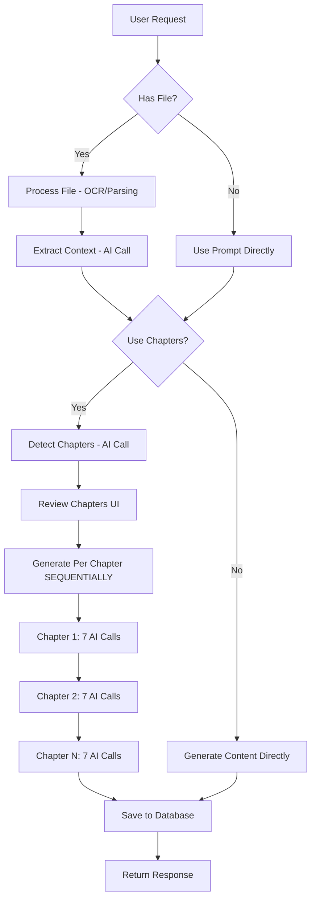
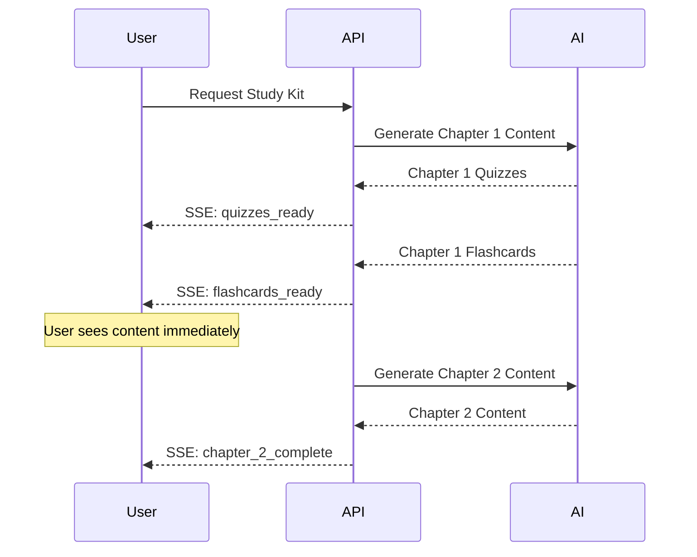

# Study Kit Generation Speed Optimization Plan

## Problem Statement
Study kit generation is critically slow, causing competitive disadvantage against faster AI tools like Turbo AI. We need to dramatically improve speed while maintaining quality.

---

## Current Architecture Analysis

### Generation Flow


### Identified Bottlenecks

| Bottleneck | Impact | Root Cause |
|------------|--------|------------|
| Sequential chapter processing | **CRITICAL** | Chapters processed one-by-one, each waiting for previous |
| 7 AI calls per chapter | **HIGH** | Quizzes, Flashcards, Mindmaps, 4 Note types = 7 calls |
| No streaming response | **HIGH** | User waits for ALL content before seeing anything |
| Large prompt templates | **MEDIUM** | Verbose templates add token overhead |
| Chapter detection overhead | **MEDIUM** | Extra AI call for structure analysis |
| No caching utilization | **MEDIUM** | Cache exists but underutilized |

### Performance Math
- **Current**: 10 chapters × 7 calls × ~3s per call = **~210 seconds** (3.5 minutes)
- **Target**: Parallel processing + streaming = **~15-20 seconds** to first content

---

## Optimization Strategies

### Strategy 1: Parallel Chapter Processing [CRITICAL]

**Current Code** - [`generate/route.ts:749-757`](src/app/api/study-kit/generate/route.ts:749):
```typescript
for (let i = 0; i < confirmedChapters.length; i++) {
  const chapter = confirmedChapters[i];
  const chapterContent = await generateChapterContent(chapter, ...);
  chapterContents.push(chapterContent);
}
```

**Optimized Approach**:
```typescript
const chapterPromises = confirmedChapters.map(chapter => 
  generateChapterContent(chapter, ...)
);
const chapterContents = await Promise.all(chapterPromises);
```

**Impact**: 10 chapters processed simultaneously instead of sequentially
- Before: 10 × 20s = 200s
- After: 1 × 20s = 20s (theoretical max, limited by rate limits)

### Strategy 2: Streaming Response [HIGH IMPACT]

Implement Server-Sent Events (SSE) to return content as generated:



**Implementation**:
- Create new endpoint: `/api/study-kit/generate-stream`
- Use `ReadableStream` with SSE format
- Client displays content progressively

### Strategy 3: Reduce AI Calls Per Chapter [HIGH IMPACT]

**Current**: 7 separate AI calls per chapter
- Quizzes (1)
- Flashcards (1)
- Mindmaps (1)
- Notes: deepExplanation (1)
- Notes: cheatsheet (1)
- Notes: application (1)
- Notes: tables (1)

**Optimized Options**:

#### Option A: Batch Generation
Combine related content into single AI calls:
```typescript
const batchPrompt = `Generate for topic: ${topic}
1. 5 quiz questions as JSON array
2. 5 flashcards as JSON array
3. A mindmap structure as JSON

Output format: { quizzes: [...], flashcards: [...], mindmap: {...} }
`;
```
**Reduces**: 7 calls → 3 calls (quizzes+flashcards+mindmap, notes batched by 2)

#### Option B: Lazy Generation
Generate core content first, defer notes to background:
```typescript
// Immediate: quizzes, flashcards, mindmap (3 calls)
// Background: all 4 note types (queued)
```
**User sees core content in ~10s, notes load progressively**

### Strategy 4: Smart Caching [MEDIUM IMPACT]

Extend [`ai-cache.ts`](src/lib/ai-cache.ts) for study kit generation:

```typescript
// Cache key based on content hash
const cacheKey = {
  requestType: 'study_kit_generation',
  requestData: {
    contentHash: hashContent(sourceContent),
    contentTypes: ['quizzes', 'flashcards'],
    itemCount: 10
  }
};

// Check cache before generating
const cached = await checkCache(cacheKey);
if (cached) return cached;

// Generate and cache
const result = await generateContent(...);
await saveToCache(cacheKey, result);
```

### Strategy 5: Background Job Queue [MEDIUM IMPACT]

Leverage existing [`BackgroundChallengeGenerator`](src/lib/services/background-challenge-generator.ts) pattern:

```typescript
// New: BackgroundStudyKitGenerator
class BackgroundStudyKitGenerator {
  private queue: GenerationJob[] = [];
  
  async queueStudyKitGeneration(kitId: string, chapters: Chapter[]) {
    // Queue all chapters for parallel processing
    chapters.forEach(chapter => {
      this.queue.push({
        kitId,
        chapterId: chapter.id,
        status: 'pending'
      });
    });
  }
  
  async processQueue() {
    // Process up to 5 chapters in parallel
    const batch = this.queue.splice(0, 5);
    await Promise.all(batch.map(job => this.generateChapter(job)));
  }
}
```

### Strategy 6: Prompt Optimization [LOW IMPACT]

Reduce template verbosity while maintaining quality:

**Current Template** (~500 tokens):
```
Act as a World-Class Learning Architect. Create a **Deep Explanation Note**...
[Long template with many sections]
```

**Optimized Template** (~200 tokens):
```
Create comprehensive study notes for: {topic}
Include: Big Picture, Core Concepts with analogies, Key Connections, Insights.
Format: Markdown with emojis. Be thorough but concise.
```

---

## Implementation Priority

### Phase 1: Quick Wins (Immediate)
1. **Parallel chapter processing** - Single line change, massive impact
2. **Reduce note types generated by default** - Only generate 2 instead of 4

### Phase 2: Streaming (Week 1)
3. **Implement SSE streaming endpoint** - Progressive content display
4. **Client-side streaming handler** - Real-time UI updates

### Phase 3: Architecture (Week 2)
5. **Batch AI calls** - Combine quizzes+flashcards+mindmap
6. **Background job queue** - Async processing with status polling

### Phase 4: Optimization (Ongoing)
7. **Smart caching** - Reduce redundant generations
8. **Prompt optimization** - Reduce token overhead

---

## Expected Performance Improvement

| Metric | Current | After Phase 1 | After Phase 2 | After Phase 3 |
|--------|---------|---------------|---------------|---------------|
| Time to first content | 60-180s | 20-30s | 3-5s | 2-3s |
| Full 10-chapter kit | 3-5 min | 30-45s | 25-35s | 15-25s |
| Perceived speed | Slow | Moderate | Fast | Instant |
| AI calls per kit | 70+ | 30 | 30 | 20 |

---

## Quality Preservation Measures

1. **Maintain prompt quality** - Keep educational structure, reduce verbosity only
2. **Parallel processing maintains isolation** - Each chapter gets full attention
3. **Streaming shows progress** - User sees quality content arriving
4. **Background notes** - Full notes still generated, just deferred
5. **Caching only for identical content** - No quality degradation

---

## Technical Implementation Details

### File Changes Required

| File | Change |
|------|--------|
| `src/app/api/study-kit/generate/route.ts` | Parallel processing, batch calls |
| `src/app/api/study-kit/generate-stream/route.ts` | New SSE streaming endpoint |
| `src/lib/ai-providers.ts` | Add batch generation function |
| `src/lib/ai-cache.ts` | Extend for study kit caching |
| `src/lib/services/background-study-kit-generator.ts` | New background processor |
| `src/app/(main)/tools/study-kit/page.tsx` | Streaming UI updates |

### API Rate Limit Considerations

With 38 Groq keys and 15 Gemini keys:
- **Current sequential**: 1 key used at a time
- **Parallel processing**: Key rotation spreads load
- **Max parallelism**: 10-15 concurrent requests (safe with key pool)

---

## Questions for Discussion

1. **Note generation priority**: Should we generate all 4 note types by default, or let users request specific ones?

2. **Streaming vs Background**: Do you prefer SSE streaming (real-time) or background jobs with polling?

3. **Caching granularity**: Cache per chapter or per full study kit?

4. **Quality vs Speed tradeoff**: Accept slightly shorter notes for 50% speed improvement?

---

## Next Steps

1. Review and approve this plan
2. Switch to Code mode for implementation
3. Start with Phase 1 quick wins
4. Measure performance improvements
5. Iterate based on results

## Problem Statement
Study kit generation is critically slow, causing competitive disadvantage against faster AI tools like Turbo AI. We need to dramatically improve speed while maintaining quality.

---

## Current Architecture Analysis

### Generation Flow


### Identified Bottlenecks

| Bottleneck | Impact | Root Cause |
|------------|--------|------------|
| Sequential chapter processing | **CRITICAL** | Chapters processed one-by-one, each waiting for previous |
| 7 AI calls per chapter | **HIGH** | Quizzes, Flashcards, Mindmaps, 4 Note types = 7 calls |
| No streaming response | **HIGH** | User waits for ALL content before seeing anything |
| Large prompt templates | **MEDIUM** | Verbose templates add token overhead |
| Chapter detection overhead | **MEDIUM** | Extra AI call for structure analysis |
| No caching utilization | **MEDIUM** | Cache exists but underutilized |

### Performance Math
- **Current**: 10 chapters × 7 calls × ~3s per call = **~210 seconds** (3.5 minutes)
- **Target**: Parallel processing + streaming = **~15-20 seconds** to first content

---

## Optimization Strategies

### Strategy 1: Parallel Chapter Processing [CRITICAL]

**Current Code** - [`generate/route.ts:749-757`](src/app/api/study-kit/generate/route.ts:749):
```typescript
for (let i = 0; i < confirmedChapters.length; i++) {
  const chapter = confirmedChapters[i];
  const chapterContent = await generateChapterContent(chapter, ...);
  chapterContents.push(chapterContent);
}
```

**Optimized Approach**:
```typescript
const chapterPromises = confirmedChapters.map(chapter => 
  generateChapterContent(chapter, ...)
);
const chapterContents = await Promise.all(chapterPromises);
```

**Impact**: 10 chapters processed simultaneously instead of sequentially
- Before: 10 × 20s = 200s
- After: 1 × 20s = 20s (theoretical max, limited by rate limits)

### Strategy 2: Streaming Response [HIGH IMPACT]

Implement Server-Sent Events (SSE) to return content as generated:


**Implementation**:
- Create new endpoint: `/api/study-kit/generate-stream`
- Use `ReadableStream` with SSE format
- Client displays content progressively

### Strategy 3: Reduce AI Calls Per Chapter [HIGH IMPACT]

**Current**: 7 separate AI calls per chapter
- Quizzes (1)
- Flashcards (1)
- Mindmaps (1)
- Notes: deepExplanation (1)
- Notes: cheatsheet (1)
- Notes: application (1)
- Notes: tables (1)

**Optimized Options**:

#### Option A: Batch Generation
Combine related content into single AI calls:
```typescript
const batchPrompt = `Generate for topic: ${topic}
1. 5 quiz questions as JSON array
2. 5 flashcards as JSON array
3. A mindmap structure as JSON

Output format: { quizzes: [...], flashcards: [...], mindmap: {...} }
`;
```
**Reduces**: 7 calls → 3 calls (quizzes+flashcards+mindmap, notes batched by 2)

#### Option B: Lazy Generation
Generate core content first, defer notes to background:
```typescript
// Immediate: quizzes, flashcards, mindmap (3 calls)
// Background: all 4 note types (queued)
```
**User sees core content in ~10s, notes load progressively**

### Strategy 4: Smart Caching [MEDIUM IMPACT]

Extend [`ai-cache.ts`](src/lib/ai-cache.ts) for study kit generation:

```typescript
// Cache key based on content hash
const cacheKey = {
  requestType: 'study_kit_generation',
  requestData: {
    contentHash: hashContent(sourceContent),
    contentTypes: ['quizzes', 'flashcards'],
    itemCount: 10
  }
};

// Check cache before generating
const cached = await checkCache(cacheKey);
if (cached) return cached;

// Generate and cache
const result = await generateContent(...);
await saveToCache(cacheKey, result);
```

### Strategy 5: Background Job Queue [MEDIUM IMPACT]

Leverage existing [`BackgroundChallengeGenerator`](src/lib/services/background-challenge-generator.ts) pattern:

```typescript
// New: BackgroundStudyKitGenerator
class BackgroundStudyKitGenerator {
  private queue: GenerationJob[] = [];
  
  async queueStudyKitGeneration(kitId: string, chapters: Chapter[]) {
    // Queue all chapters for parallel processing
    chapters.forEach(chapter => {
      this.queue.push({
        kitId,
        chapterId: chapter.id,
        status: 'pending'
      });
    });
  }
  
  async processQueue() {
    // Process up to 5 chapters in parallel
    const batch = this.queue.splice(0, 5);
    await Promise.all(batch.map(job => this.generateChapter(job)));
  }
}
```

### Strategy 6: Prompt Optimization [LOW IMPACT]

Reduce template verbosity while maintaining quality:

**Current Template** (~500 tokens):
```
Act as a World-Class Learning Architect. Create a **Deep Explanation Note**...
[Long template with many sections]
```

**Optimized Template** (~200 tokens):
```
Create comprehensive study notes for: {topic}
Include: Big Picture, Core Concepts with analogies, Key Connections, Insights.
Format: Markdown with emojis. Be thorough but concise.
```

---

## Implementation Priority

### Phase 1: Quick Wins (Immediate)
1. **Parallel chapter processing** - Single line change, massive impact
2. **Reduce note types generated by default** - Only generate 2 instead of 4

### Phase 2: Streaming (Week 1)
3. **Implement SSE streaming endpoint** - Progressive content display
4. **Client-side streaming handler** - Real-time UI updates

### Phase 3: Architecture (Week 2)
5. **Batch AI calls** - Combine quizzes+flashcards+mindmap
6. **Background job queue** - Async processing with status polling

### Phase 4: Optimization (Ongoing)
7. **Smart caching** - Reduce redundant generations
8. **Prompt optimization** - Reduce token overhead

---

## Expected Performance Improvement

| Metric | Current | After Phase 1 | After Phase 2 | After Phase 3 |
|--------|---------|---------------|---------------|---------------|
| Time to first content | 60-180s | 20-30s | 3-5s | 2-3s |
| Full 10-chapter kit | 3-5 min | 30-45s | 25-35s | 15-25s |
| Perceived speed | Slow | Moderate | Fast | Instant |
| AI calls per kit | 70+ | 30 | 30 | 20 |

---

## Quality Preservation Measures

1. **Maintain prompt quality** - Keep educational structure, reduce verbosity only
2. **Parallel processing maintains isolation** - Each chapter gets full attention
3. **Streaming shows progress** - User sees quality content arriving
4. **Background notes** - Full notes still generated, just deferred
5. **Caching only for identical content** - No quality degradation

---

## Technical Implementation Details

### File Changes Required

| File | Change |
|------|--------|
| `src/app/api/study-kit/generate/route.ts` | Parallel processing, batch calls |
| `src/app/api/study-kit/generate-stream/route.ts` | New SSE streaming endpoint |
| `src/lib/ai-providers.ts` | Add batch generation function |
| `src/lib/ai-cache.ts` | Extend for study kit caching |
| `src/lib/services/background-study-kit-generator.ts` | New background processor |
| `src/app/(main)/tools/study-kit/page.tsx` | Streaming UI updates |

### API Rate Limit Considerations

With 38 Groq keys and 15 Gemini keys:
- **Current sequential**: 1 key used at a time
- **Parallel processing**: Key rotation spreads load
- **Max parallelism**: 10-15 concurrent requests (safe with key pool)

---

## Questions for Discussion

1. **Note generation priority**: Should we generate all 4 note types by default, or let users request specific ones?

2. **Streaming vs Background**: Do you prefer SSE streaming (real-time) or background jobs with polling?

3. **Caching granularity**: Cache per chapter or per full study kit?

4. **Quality vs Speed tradeoff**: Accept slightly shorter notes for 50% speed improvement?

---

## Next Steps

1. Review and approve this plan
2. Switch to Code mode for implementation
3. Start with Phase 1 quick wins
4. Measure performance improvements
5. Iterate based on results

## Problem Statement
Study kit generation is critically slow, causing competitive disadvantage against faster AI tools like Turbo AI. We need to dramatically improve speed while maintaining quality.

---

## Current Architecture Analysis

### Generation Flow


### Identified Bottlenecks

| Bottleneck | Impact | Root Cause |
|------------|--------|------------|
| Sequential chapter processing | **CRITICAL** | Chapters processed one-by-one, each waiting for previous |
| 7 AI calls per chapter | **HIGH** | Quizzes, Flashcards, Mindmaps, 4 Note types = 7 calls |
| No streaming response | **HIGH** | User waits for ALL content before seeing anything |
| Large prompt templates | **MEDIUM** | Verbose templates add token overhead |
| Chapter detection overhead | **MEDIUM** | Extra AI call for structure analysis |
| No caching utilization | **MEDIUM** | Cache exists but underutilized |

### Performance Math
- **Current**: 10 chapters × 7 calls × ~3s per call = **~210 seconds** (3.5 minutes)
- **Target**: Parallel processing + streaming = **~15-20 seconds** to first content

---

## Optimization Strategies

### Strategy 1: Parallel Chapter Processing [CRITICAL]

**Current Code** ([`generate/route.ts:749-757`](src/app/api/study-kit/generate/route.ts:749)):
```typescript
for (let i = 0; i < confirmedChapters.length; i++) {
  const chapter = confirmedChapters[i];
  const chapterContent = await generateChapterContent(chapter, ...);
  chapterContents.push(chapterContent);
}
```

**Optimized Approach**:
```typescript
const chapterPromises = confirmedChapters.map(chapter => 
  generateChapterContent(chapter, ...)
);
const chapterContents = await Promise.all(chapterPromises);
```

**Impact**: 10 chapters processed simultaneously instead of sequentially
- Before: 10 × 20s = 200s
- After: 1 × 20s = 20s (theoretical max, limited by rate limits)

### Strategy 2: Streaming Response [HIGH IMPACT]

Implement Server-Sent Events (SSE) to return content as generated:


**Implementation**:
- Create new endpoint: `/api/study-kit/generate-stream`
- Use `ReadableStream` with SSE format
- Client displays content progressively

### Strategy 3: Reduce AI Calls Per Chapter [HIGH IMPACT]

**Current**: 7 separate AI calls per chapter
- Quizzes (1)
- Flashcards (1)
- Mindmaps (1)
- Notes: deepExplanation (1)
- Notes: cheatsheet (1)
- Notes: application (1)
- Notes: tables (1)

**Optimized Options**:

#### Option A: Batch Generation
Combine related content into single AI calls:
```typescript
const batchPrompt = `Generate for topic: ${topic}
1. 5 quiz questions as JSON array
2. 5 flashcards as JSON array
3. A mindmap structure as JSON

Output format: { quizzes: [...], flashcards: [...], mindmap: {...} }
`;
```
**Reduces**: 7 calls → 3 calls (quizzes+flashcards+mindmap, notes batched by 2)

#### Option B: Lazy Generation
Generate core content first, defer notes to background:
```typescript
// Immediate: quizzes, flashcards, mindmap (3 calls)
// Background: all 4 note types (queued)
```
**User sees core content in ~10s, notes load progressively**

### Strategy 4: Smart Caching [MEDIUM IMPACT]

Extend [`ai-cache.ts`](src/lib/ai-cache.ts) for study kit generation:

```typescript
// Cache key based on content hash
const cacheKey = {
  requestType: 'study_kit_generation',
  requestData: {
    contentHash: hashContent(sourceContent),
    contentTypes: ['quizzes', 'flashcards'],
    itemCount: 10
  }
};

// Check cache before generating
const cached = await checkCache(cacheKey);
if (cached) return cached;

// Generate and cache
const result = await generateContent(...);
await saveToCache(cacheKey, result);
```

### Strategy 5: Background Job Queue [MEDIUM IMPACT]

Leverage existing [`BackgroundChallengeGenerator`](src/lib/services/background-challenge-generator.ts) pattern:

```typescript
// New: BackgroundStudyKitGenerator
class BackgroundStudyKitGenerator {
  private queue: GenerationJob[] = [];
  
  async queueStudyKitGeneration(kitId: string, chapters: Chapter[]) {
    // Queue all chapters for parallel processing
    chapters.forEach(chapter => {
      this.queue.push({
        kitId,
        chapterId: chapter.id,
        status: 'pending'
      });
    });
  }
  
  async processQueue() {
    // Process up to 5 chapters in parallel
    const batch = this.queue.splice(0, 5);
    await Promise.all(batch.map(job => this.generateChapter(job)));
  }
}
```

### Strategy 6: Prompt Optimization [LOW IMPACT]

Reduce template verbosity while maintaining quality:

**Current Template** (~500 tokens):
```
Act as a World-Class Learning Architect. Create a **Deep Explanation Note**...
[Long template with many sections]
```

**Optimized Template** (~200 tokens):
```
Create comprehensive study notes for: {topic}
Include: Big Picture, Core Concepts with analogies, Key Connections, Insights.
Format: Markdown with emojis. Be thorough but concise.
```

---

## Implementation Priority

### Phase 1: Quick Wins (Immediate)
1. **Parallel chapter processing** - Single line change, massive impact
2. **Reduce note types generated by default** - Only generate 2 instead of 4

### Phase 2: Streaming (Week 1)
3. **Implement SSE streaming endpoint** - Progressive content display
4. **Client-side streaming handler** - Real-time UI updates

### Phase 3: Architecture (Week 2)
5. **Batch AI calls** - Combine quizzes+flashcards+mindmap
6. **Background job queue** - Async processing with status polling

### Phase 4: Optimization (Ongoing)
7. **Smart caching** - Reduce redundant generations
8. **Prompt optimization** - Reduce token overhead

---

## Expected Performance Improvement

| Metric | Current | After Phase 1 | After Phase 2 | After Phase 3 |
|--------|---------|---------------|---------------|---------------|
| Time to first content | 60-180s | 20-30s | 3-5s | 2-3s |
| Full 10-chapter kit | 3-5 min | 30-45s | 25-35s | 15-25s |
| Perceived speed | Slow | Moderate | Fast | Instant |
| AI calls per kit | 70+ | 30 | 30 | 20 |

---

## Quality Preservation Measures

1. **Maintain prompt quality** - Keep educational structure, reduce verbosity only
2. **Parallel processing maintains isolation** - Each chapter gets full attention
3. **Streaming shows progress** - User sees quality content arriving
4. **Background notes** - Full notes still generated, just deferred
5. **Caching only for identical content** - No quality degradation

---

## Technical Implementation Details

### File Changes Required

| File | Change |
|------|--------|
| `src/app/api/study-kit/generate/route.ts` | Parallel processing, batch calls |
| `src/app/api/study-kit/generate-stream/route.ts` | New SSE streaming endpoint |
| `src/lib/ai-providers.ts` | Add batch generation function |
| `src/lib/ai-cache.ts` | Extend for study kit caching |
| `src/lib/services/background-study-kit-generator.ts` | New background processor |
| `src/app/(main)/tools/study-kit/page.tsx` | Streaming UI updates |

### API Rate Limit Considerations

With 38 Groq keys and 15 Gemini keys:
- **Current sequential**: 1 key used at a time
- **Parallel processing**: Key rotation spreads load
- **Max parallelism**: 10-15 concurrent requests (safe with key pool)

---

## Questions for Discussion

1. **Note generation priority**: Should we generate all 4 note types by default, or let users request specific ones?

2. **Streaming vs Background**: Do you prefer SSE streaming (real-time) or background jobs with polling?

3. **Caching granularity**: Cache per chapter or per full study kit?

4. **Quality vs Speed tradeoff**: Accept slightly shorter notes for 50% speed improvement?

---

## Next Steps

1. Review and approve this plan
2. Switch to Code mode for implementation
3. Start with Phase 1 quick wins
4. Measure performance improvements
5. Iterate based on results

