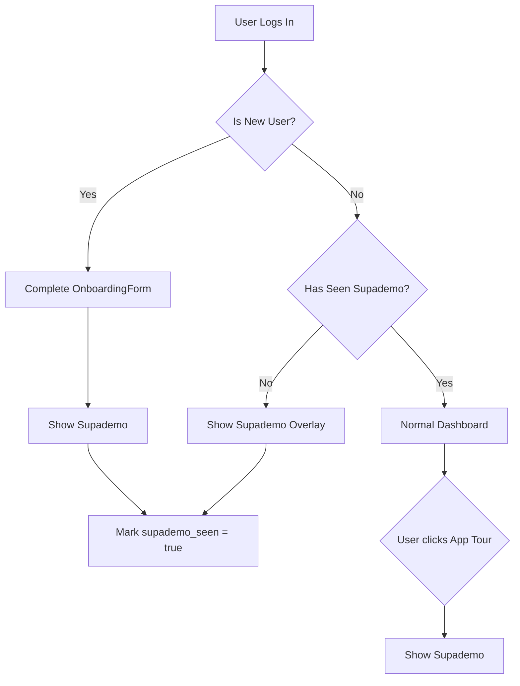

# Supademo Integration Plan

## Overview
Replace the current driver.js tour with Supademo for a better onboarding experience.

## Supademo Details
- **Demo ID**: `cmllhfspu2bdt5yi35o3fmqi8`
- **Script URL**: `https://script.supademo.com/supademo.js`

## Requirements

### User Scenarios
1. **New Users**: Show Supademo immediately after completing OnboardingForm
2. **Existing Users**: Show Supademo overlay once on next login (if not seen before)
3. **Manual Tour**: "App Tour" menu click triggers Supademo

### Tracking
- Add `supademo_seen` boolean field to `user_preferences` table
- Track when users complete the Supademo tour

## Implementation Plan

### 1. Database Migration
Add `supademo_seen` column to `user_preferences` table:

```sql
ALTER TABLE user_preferences 
ADD COLUMN supademo_seen BOOLEAN DEFAULT FALSE;
```

### 2. Load Supademo Script
Add Supademo script to the main layout using Next.js Script component:

```tsx
// src/app/(main)/layout.tsx
import Script from 'next/script';

// In the component:
<Script 
  src="https://script.supademo.com/supademo.js" 
  strategy="afterInteractive"
/>
```

### 3. Create SupademoTour Component
Replace [`AppTour.tsx`](src/components/AppTour.tsx) with Supademo integration:

```tsx
// Key functionality:
// - Check if user has seen Supademo
// - Auto-show for users who haven't seen it
// - Listen for 'restart-tour' event for manual trigger
// - Mark as seen after completion
```

### 4. Update UserMenu
The existing "App Tour" menu item already dispatches `restart-tour` event - no changes needed.

## Architecture Flow



## Files to Modify

| File | Changes |
|------|---------|
| [`src/components/AppTour.tsx`](src/components/AppTour.tsx) | Replace driver.js with Supademo integration |
| [`src/app/(main)/layout.tsx`](src/app/(main)/layout.tsx) | Add Supademo script |
| [`src/services/userPreferencesService.ts`](src/services/userPreferencesService.ts) | Add supademo_seen field handling |
| [`supabase/migrations/`](supabase/migrations/) | Add migration for supademo_seen column |

## Supademo API Usage

```tsx
// Open Supademo programmatically
window.Supademo.open('cmllhfspu2bdt5yi35o3fmqi8');

// Check if Supademo is loaded
if (window.Supademo) {
  window.Supademo.open('cmllhfspu2bdt5yi35o3fmqi8');
}
```

## Notes
- Remove driver.js dependency completely
- Keep the `data-tour` attributes for now (may be used by other features)
- Ensure Supademo script loads before attempting to use it
